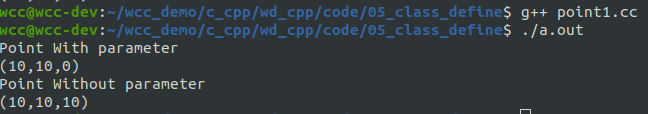

# 类的定义
C++当中使用class来定义一个类，基本形式如下：
```cpp
class 类名
{
public:
//公有数据成员和成员函数
protected:
//保护数据成员和成员函数
private:
//私有数据成员和成员函数
};

```
<!--more-->
class内部可以拥有的是**数据成员**(属性)和**成员函数**(行为)，他们可以分别用三个不同的关键字进行修饰，public、protected、private. 其中public进行修饰的成员表示的是该类可以提供的接口、功能、或者服务；protected进行修饰的成员，其访问权限是开放给其子类；private进行修饰的成员是不可以在类之外进行访问的，只能在类内部访问，可以说封装性就是由该关键字来体现。

下面是一个简单的例子来介绍类的定义和对象的创建。

```cpp
#include <iostream>
#include <string.h>
using std::cout;
using std::endl;

class computer{
public:
    void set_brand(const char * brand){
        strcpy(_brand, brand);
    }
    
    void set_price(float price){
        _price = price;
    }

    void print_info(){
        cout << "brand: " << _brand << endl;
        cout << "price: " << _price << endl;
    }

private:
    char _brand[20];
    float _price;
};

void test(){
    computer c1;
    c1.set_brand("lenovo");
    c1.set_price(2000);
    c1.print_info();

}

int main(int argc, char* argv[])
{
    test();
    return 0;
}
```

在上面的这段简单的代码当中，首先声明了一个类，然后在类中实现了三个成员函数和两个成员变量。
在test函数当中，我们创建了一个对象，并且调用了成员函数。通过公共的成员函数，我们可以去修改私有的成员变量。

## 类的定义与声明的区别

类的定义过程就是类的所有成员函数实现的过程，在类中只要有一个成员函数没有实现都称为类的声明，而不能称为类的定义。
下面是一个例子：
```cpp
#include <iostream>
#include <string.h>
using std::cout;
using std::endl;

class computer{
public:
    void set_brand(const char * brand){
        strcpy(_brand, brand);
    }
    void set_price(float price);

    void print_info(){
        cout << "brand: " << _brand << endl;
        cout << "price: " << _price << endl;
    }

private:
    char _brand[20];
    float _price;
};


void computer::set_price(float price){
    _price = price;
}

void test(){
    computer c1;
    c1.set_brand("lenovo");
    c1.set_price(2000);
    c1.print_info();

}

int main(int argc, char* argv[])
{
    test();


    return 0;
}

```
在类当中，我们值声明了成员函数set_price，但是并没有给出该函数的具体实现，因此这里还没有完成类的定义。如果我们不在类的外部完成该成员函数的定义，那么编译器在编译阶段会报错。


# C++ 当中struct和class的区别
在C++中，与C相比，struct的功能已经进行了扩展。class能做的事儿，struct一样能做，他们之间唯一的区别，就是默认访问权限不同。class的默认访问权限是private，struct的默认访问权限是public。
```cpp
struct Computer
{
//成员函数, 其访问权限是public
void setBrand(const char *brand)
{
strcpy(_brand, brand);
}
void setPrice(float price)
{
_price = price;
}
//数据成员, 其访问权限是public
char _brand[20];
float _price;
};
```

# 对象的创建
在之前的例子当中，我们已经通过computer这个类创建了一个对象，可以看到创建对象的过程和定义变量是比较类似的，其实类就可以看做是一个特殊的数据结构。
实际上，C++为类提供了一种特殊的成员函数----构造函数来完成相同的工作。构造函数有一些独特的地方：
- 函数的名字与类名相同
- 没有返回值
- 没有返回类型，即使是void也不能有

构造函数在对象创建时自动调用，用以完成对象成员变量等的初始化及其他操作(如为指针成员动态申请内存等)；
- 如果程序没有显式定义构造函数，系统会提供一个**默认构造函数(无参)**。
- 一旦类当中显式地提供了有参构造函数时，系统就不会在自动提供一个**默认的无参构造函数**
- 如果用户还希望通过默认构造函数的方式创建对象，那么需要手动创建一个默认构造函数。
- 构造函数可以重载

下面是一个关于构造函数的例子。
```cpp
#include <iostream>
#include <string.h>
using std::cout;
using std::endl;

class Point{
public:
    Point(int x, int y, int z){
        cout << "Point With parameter" << endl;
        _x = x;
        _y = y;
        _z = z;
    }

    Point(){
        cout << "Point Without parameter" << endl;
    }

    void set_loc(int x, int y, int z){
        _x = x;
        _y = y;
        _z = z;
    }

    void print_info(){
        cout << "(" << _x
             <<"," << _y
             <<"," << _z
             <<")" << endl;
    }

private:
    int _x;
    int _y;
    int _z;
};


void test(){
    Point p1(0,1,1);
    p1.print_info();

    Point p2;
    p2.set_loc(10, 10, 10);
    p2.print_info();

}

int main(int argc, char* argv[])
{
    test();


    return 0;
}

```
## 对象的数据成员的初始化问题
在C++中，对于类中数据成员的初始化，需要使用初始化列表完成
初始化列表的形式：
- 在构造函数的头与构造函数体之间的位置，
- 开始用冒号进行分隔,
- 如果有多个数据成员需要初始化，则用逗号分隔
形式如下：
```cpp
class Point
{
public:
//...
Point(int ix = 0, int iy = 0)
: _ix(ix)
, _iy(iy)
{
cout << "Point(int = 0,int = 0)" << endl;
}
//...
};

```

### 数据成员的初始化顺序
数据成员的初始化顺序只与其在类中被声明的顺序有关，而与初始化列表当中的顺序无关。下面的代码可以解释这一点：
```cpp
#include <iostream>
#include <string.h>
using std::cout;
using std::endl;

class Point{
public:
    Point(int x, int y, int z)
    :_x(x)
    ,_y(_x)
    ,_z(_x){
        cout << "Point With parameter" << endl;
    }

    Point(){
        cout << "Point Without parameter" << endl;
    }

    void set_loc(int x, int y, int z){
        _x = x;
        _y = y;
        _z = z;
    }

    void print_info(){
        cout << "(" << _x
             <<"," << _y
             <<"," << _z
             <<")" << endl;
    }

private:
    int _z;
    int _x;
    int _y;

};


void test(){
    Point p1(10,1,1);
    p1.print_info();

    Point p2;
    p2.set_loc(10, 10, 10);
    p2.print_info();

}

int main(int argc, char* argv[])
{
    test();


    return 0;
}


```

可以看到在类内部，成员变量的生命顺序是\_z, \_x,\_y。在构造函数当中的初始化列表的顺序是 \_y \_x \_z。
最终输出结果来看，输出的结果是(10,10,0)。
如果按照初始化列表的顺序进行初始化的话，那么第一个点的坐标应该是(10,10,10)。而最终结果与初始化列表不同，这里可以看出，初始化列表的作用顺序，只与类中变量声明的顺序有关。
首先进行初始化的是_z,然后是_x,_y。
所以在使用_x对_z进行初始化的时候，_x的值还买有确定，所以该值是一个不定值。在之后对_x初始化为10，在对_y进行初始化。

