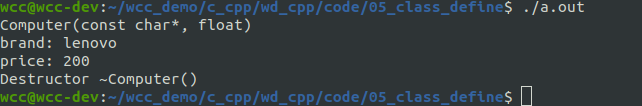
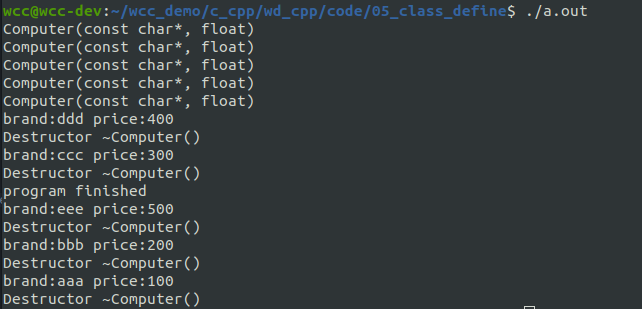
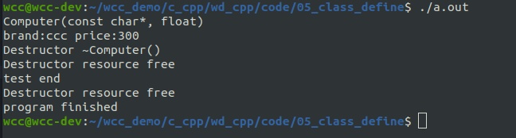

# 析构函数
构造函数(constructor)在创建对象时被系统自动调用，而析构函数(Destructor)在对象被撤销时被自动调用，相比构造函数，析构函数要简单的多。析构函数有如下特点：
- 与类同名，之前冠以波浪号，以区别于构造函数。
- 析构函数没有返回类型，也不能指定参数。因此，析构函数只能有一个，不能被重载。
- 对象超出其作用域被销毁时，析构函数会被自动调用。
<!--more-->
析构函数在对**象撤销时**自动调用，用以执行一些清理任务，如**释放成员函数中动态申请的内存**等。如果程序员没有显式的定义它，系统也会提供一个默认的析构函数。
下面以一个具体的例子来说明，构造函数与析构函数的进一步功能。
```cpp
#include <iostream>
#include <string.h>
using std::cout;
using std::endl;

class Computer{
public:
    Computer(char * brand, float price)
    :_brand(new char[strlen(brand)+1]())
    ,_price(price){
        cout << "Computer(const char*, float)" << endl;
	    strcpy(_brand, brand);
    }
    ~Computer(){
        if (_brand) {
            delete [] _brand;
            _brand=nullptr;
            cout << "Destructor ~Computer()" << endl;
        }

    }

    void set_price(float price);

    void print_info();

private:
    char * _brand;
    float _price;
};


void Computer::set_price(float price){
    _price = price;
}

void Computer::print_info(){
    cout << "brand: " << _brand << endl;
    cout << "price: " << _price << endl;
}

void test(){
    Computer c1("lenovo", 200);
    c1.print_info();

}

int main(int argc, char* argv[])
{
    test();

    return 0;
}

```
在上面的代码当中，我们定义的类当中有一个指针类型的变量。在构造函数的初始化列表当中，对该指针变量进行初始化的时候，使用new方法，开辟了一段堆空间,new表达式申请数组空间时，最后不加() 不会进行初始化.new表达式申请数组空间时，加上() 就会进行初始化然

后在构造函数当中对该指针变量指向的空间进行了赋值。

在析构函数当中，我们需要释放堆空间上申请的变量。
可以看到在该对象的生命周期结束的时候，自动调用了析构函数。


## 析构函数调用的时机
1. 对于全局定义的对象，每当程序开始运行，在主函数main接受程序控制权之前，就调用构造函数创建全局对象，整个程序结束时，自动调用全局对象的析构函数。
2. 对于局部定义的对象，每当程序流程到达该对象的定义处就调用构造函数，在程序离开局部对象的作用域时调用对象的析构函数。
3. 对于关键字static定义的静态局部变量，当程序流程第一次到达该对象定义处调用构造函数，在整个程序结束时调用析构函数。
4. 对于用new运算符创建的对象，每当创建该对象时调用构造函数，当用delete删除该对象时，调用析构函数

下面使用一个例子来说明析构函数的调用时机。

```cpp
#include <iostream>
#include <string.h>
using std::cout;
using std::endl;

class Computer{
public:
    Computer(const char * brand, float price)
    :_brand(new char[strlen(brand)+1]())
    ,_price(price){
        cout << "Computer(const char*, float)" << endl;
	    strcpy(_brand, brand);
    }

    ~Computer(){
        if (_brand) {
            cout << "brand:" <<_brand <<" price:" << _price << endl;
            delete [] _brand;
            _brand=nullptr;
            cout << "Destructor ~Computer()" << endl;
        }

    }

    void set_price(float price);

    void print_info();

private:
    char * _brand;
    float _price;
};


void Computer::set_price(float price){
    _price = price;
}

void Computer::print_info(){
    cout << "brand: " << _brand << endl;
    cout << "price: " << _price << endl;
}

Computer c0("aaa", 100);
static Computer c1("bbb", 200);

void test(){
    Computer c2("ccc", 300);

    Computer * c3 = new Computer("ddd", 400);

    static Computer c4("eee", 500);


    delete c3;

}

int main(int argc, char* argv[])
{
    test();
    cout << "program finished" <<endl;

    return 0;
}

```

可以看到，我们一共创建了c0~c4 一共5个对象。通过析构函数调用的时机，我们可以看到，析构函数调用的顺序大体如下：
- 使用delete 删除的对象,堆对象生命周期结束
- 在局部作用范围结束，栈对象生命周期结束
- 静态对象在main函数执行退出的时候
- 全局对象在main函数执行退出的时候


## 析构函数的调用与对象的销毁是一回事吗？

不是一回事，对象销毁的时候，一定会调用析构函数。但是调用析构函数不一定会销毁对象。
析构函数作为一个成员函数，可以被显式地调用。
虽然析构函数可以被显示调用，但是一般情况下不会这么做，也被建议不这样做。
下面的例子当中显式地调用了析构函数：
```cpp
#include <iostream>
#include <string.h>
using std::cout;
using std::endl;

class Computer{
public:
    Computer(const char * brand, float price)
    :_brand(new char[strlen(brand)+1]())
    ,_price(price){
        cout << "Computer(const char*, float)" << endl;
	    strcpy(_brand, brand);
    }

    ~Computer(){
        if (_brand) {
            cout << "brand:" <<_brand <<" price:" << _price << endl;
            delete [] _brand;
            _brand=nullptr;
            cout << "Destructor ~Computer()" << endl;
        }
        cout << "Destructor resource free" << endl;

    }

    void set_price(float price);

    void print_info();

private:
    char * _brand;
    float _price;
};


void Computer::set_price(float price){
    _price = price;
}

void Computer::print_info(){
    cout << "brand: " << _brand << endl;
    cout << "price: " << _price << endl;
}

void test(){
    Computer c2("ccc", 300);
    c2.~Computer();
    cout << "test end" << endl;

}

int main(int argc, char* argv[])
{
    test();
    cout << "program finished" <<endl;

    return 0;
}

```

可以看到，显式地调用析构函数后，完成了资源的回收。当对象生命周期结束的时候，再次执行了析构函数。