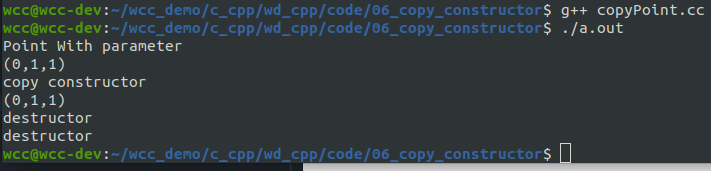
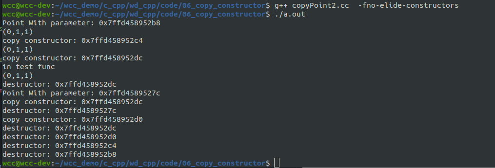
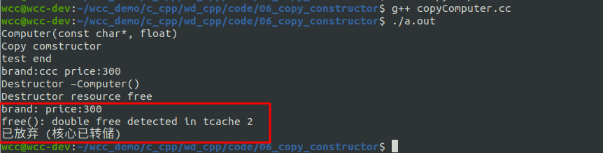
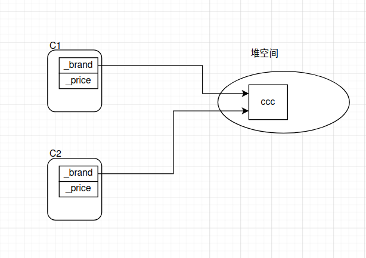
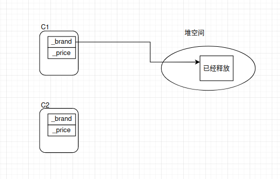
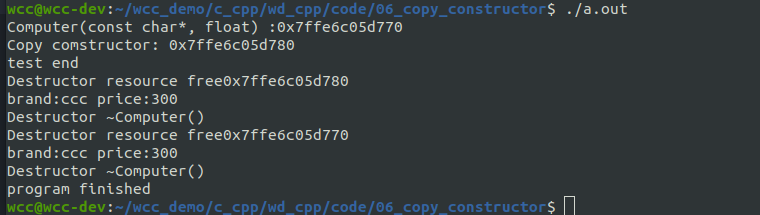
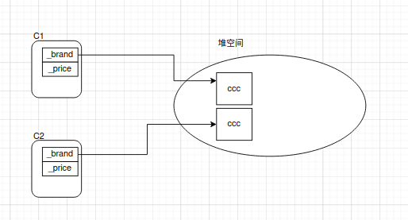
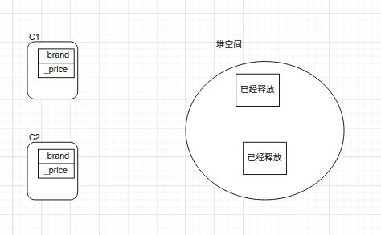

# 拷贝构造函数
C++中经常会使用一个变量初始化另一个变量，如
```cpp
int x = 1;
int y = x;
```

我们希望这样的操作也能作用于自定义类类型，如
```cpp
Point pt1(1, 2);
Point pt2 = pt1;
```
这两组操作是不是一致的呢？第一组好说，而第二组只是将类型换成了Poin类型，执行Point pt2 = pt1;语句时，pt1对象已经存在，而**pt2对象还不存在**，所以也是这句创建了pt2对象，既然涉及到**对象的创建**，就必然需要调用构造函数，而这里会调用的就是**复制构造函数**，又称为**拷贝构造函数**。
<!--more-->
当我们进行测试时，会发现我们不需要显式给出拷贝构造函数，就可以执行第二组测试。这是因为如果类中没有显式定义拷贝构造函数时，编译器会自动提供一个缺省的拷贝构造函数。其原型是:
```cpp
类名::类名(const 类名 &);
```

拷贝构造函数的使用方法如下：
```cpp
#include <iostream>
#include <string.h>
using std::cout;
using std::endl;

class Point{
public:
    Point(int x, int y, int z){
        cout << "Point With parameter" << endl;
        _x = x;
        _y = y;
        _z = z;
    }

    Point(){
        cout << "Point Without parameter" << endl;
    }

    Point(const Point& p)
    :_x(p._x)
    ,_y(p._y)
    ,_z(p._z){
        cout << "copy constructor" << endl;
    }

    ~Point(){
        cout << "destructor" << endl;
    }


    void set_loc(int x, int y, int z){
        _x = x;
        _y = y;
        _z = z;
    }

    void print_info(){
        cout << "(" << _x
             <<"," << _y
             <<"," << _z
             <<")" << endl;
    }

private:
    int _x;
    int _y;
    int _z;
};


void test(){
    Point p1(0,1,1);
    p1.print_info();

    Point p2 = p1;
    p2.print_info();
}

int main(int argc, char* argv[])
{
    test();


    return 0;
}
```

在成员函数当中，定义了一个与拷贝构造函数。
```cpp
Point(const Point& p)
```
在test函数当中，当使用对象p1对对象p2进行赋值的时候，会自动调用拷贝构造函数。

## 拷贝构造函数的调用时机
拷贝构造函数的调用时机分为以下三种情况：
- 当用一个已经存在的对象初始化另外一个新的对象
- 当函数的参数是对象，使用实参初始化新参
- 当函数的返回值是对象，执行return语句的时候

```cpp
#include <iostream>
#include <string.h>
using std::cout;
using std::endl;

class Point{
public:
    Point(int x, int y, int z){
        cout << "Point With parameter: " << this << endl;
        _x = x;
        _y = y;
        _z = z;
    }

    Point(){
        cout << "Point Without parameter: " << this <<endl;
    }

    Point(const Point& p)
    :_x(p._x)
    ,_y(p._y)
    ,_z(p._z){
        cout << "copy constructor: " << this << endl;
    }

    ~Point(){
        cout << "destructor: " << this << endl;
    }


    void set_loc(int x, int y, int z){
        _x = x;
        _y = y;
        _z = z;
    }

    void print_info(){
        cout << "(" << _x
             <<"," << _y
             <<"," << _z
             <<")" << endl;
    }

private:
    int _x;
    int _y;
    int _z;
};

void test_func(Point p){
    cout << "in test func" << endl;
    p.print_info();
}

Point test_func1(){
    Point p(10,10,10);

    return p;
}


void test(){
    Point p1(0,1,1);
    p1.print_info();

    Point p2(p1);
    p2.print_info();

    test_func(p1);
    Point p3 = test_func1();

}

int main(int argc, char* argv[])
{
    test();


    return 0;
}
```

通过上面的代码，可以来分析一下上面的拷贝构造函数执行的时机：
首先使用类生成了一个对象，在这里先调用了**构造函数**，生成对象p1.
然后创建一个对象p2并用p1进行初始化.这里会调用一次**拷贝构造函数**。
在接下来，调用了test_func函数，该函数的需要传递一个Point类型的参数，形参的初始化的过程当中会调用一次**拷贝构造函数**。
在test_func函数结束的时候，函数内部形参会调用一次**析构函数**。
在接下来调用了test_func1函数，在函数累不，首先生成了栈对象，在这里会先调用**构造函数**。
然后返回值传递的时候进行了一次**拷贝构造函数**的调用。
test_func1结束的时候，会执行一次**析构函数**。
在test函数当中，创建一个对象p3并且使用test_func1返回的对象进行初始化，这里会进行一次**拷贝构造函数**。


## 浅拷贝与深拷贝
前面举例子的时候，使用的都是比较简单的拷贝构造函数的例子，基本上是使用值传递的方式。在实际使用的时候，可能会遇到需要在堆上开辟空间的情况，这个时候默认构造函数就不一定适用了。下面举一个简单的例子：
```cpp
#include <iostream>
#include <string.h>
using std::cout;
using std::endl;

class Computer{
public:
    Computer(const char * brand, float price)
    :_brand(new char[strlen(brand)+1]())
    ,_price(price){
        cout << "Computer(const char*, float)" << endl;
	    strcpy(_brand, brand);
    }

    Computer(const Computer & p)
    :_brand(p._brand)
    ,_price(p._price){
        cout << "Copy comstructor" << endl;
    }

    ~Computer(){
        if (_brand) {
            cout << "brand:" <<_brand <<" price:" << _price << endl;
            delete [] _brand;
            _brand=nullptr;
            cout << "Destructor ~Computer()" << endl;
        }
        cout << "Destructor resource free" << endl;
    }

    void set_price(float price);

    void print_info();

private:
    char * _brand;
    float _price;
};


void Computer::set_price(float price){
    _price = price;
}

void Computer::print_info(){
    cout << "brand: " << _brand << endl;
    cout << "price: " << _price << endl;
}

void test(){
    Computer c1("ccc", 300);

    Computer c2(c1);
    cout << "test end" << endl;

}

int main(int argc, char* argv[])
{
    test();
    cout << "program finished" <<endl;

    return 0;
}

```


在上面的代码当中，在test函数当中创建了两个对象。类的成员变量_brand是一个指针，且在生成对象的时候动态申请。
在使用c1对对象c2进行初始化的时候，由于默认的拷贝构造函数当中使用了值传递的方式，因此将c2的_brand的指向，指向了和c1的_brand相同。
如下图所示：

当函数test结束的时候,c2对象先出栈，并且执行析构函数，因此会释放指针指向的空间,但是此时对象C1的_brand还是指向该空间。

然后在对象c1执行析构函数的时候，再次去释放该空间，从而导致上前面图中出现的两次释放的问题。

从这里可以看出，只是进行值传递的浅拷贝不适合我们的目的，因此我们需要对拷贝构造函数进行修改：
```cpp
#include <iostream>
#include <string.h>
using std::cout;
using std::endl;

class Computer{
public:
    Computer(const char * brand, float price)
    :_brand(new char[strlen(brand)+1]())
    ,_price(price){
        cout << "Computer(const char*, float) :" <<  this << endl;
	    strcpy(_brand, brand);
    }

    Computer(const Computer & p)
    :_brand(new char[strlen(p._brand)+1]())
    ,_price(p._price){
        cout << "Copy comstructor: " <<  this << endl;
        strcpy(_brand, p._brand);
    }

    ~Computer(){
        cout << "Destructor resource free" << this << endl;
        if (_brand) {
            cout << "brand:" <<_brand <<" price:" << _price << endl;
            delete [] _brand;
            _brand=nullptr;
            cout << "Destructor ~Computer()" << endl;
        }
       
    }

    void set_price(float price);

    void print_info();

private:
    char * _brand;
    float _price;
};


void Computer::set_price(float price){
    _price = price;
}

void Computer::print_info(){
    cout << "brand: " << _brand << endl;
    cout << "price: " << _price << endl;
}

void test(){
    Computer c2("ccc", 300);

    Computer c3(c2);
    cout << "test end" << endl;

}

int main(int argc, char* argv[])
{
    test();
    cout << "program finished" <<endl;

    return 0;
}

```

该拷贝构造的过程如下：


