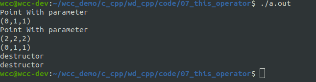
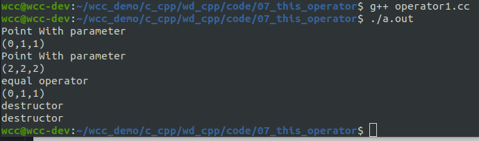
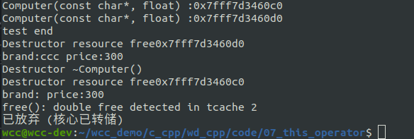
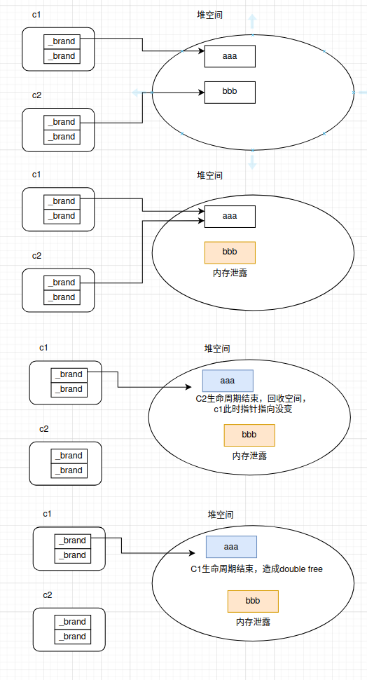
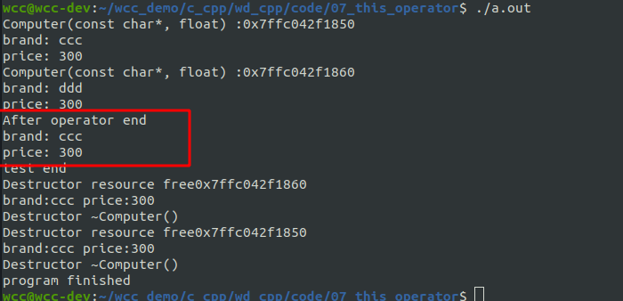

# This 指针

我们通过创建的对象调用成员函数之后，每个对象都能正确地访问相应的数据成员，就是通过this指针实现的。
在类中定义的**非静态**成员函数都有一个隐含的this指针，代表当前对象本身，作为成员函数的第一个参数，由编译器自动不全。如下：
```cpp
void Point::print(Point *const this)
{
cout << "(" << this->_ix
<< "," << this->_iy
<< ")" << endl;
}
```
<!--more-->
对于类成员函数而言，并不是一个对象对应一个单独的成员函数体，而是此类的**所有对象共用这个成员函数体**。 当程序被编译之后，此成员函数地址即已确定。而成员函数之所以能把属于此类的各个对象的数据区别开, 就是靠这个this指针。函数体内所有对类数据成员的访问， 都会被转化为this->数据成员的方式。
具体而言，在使用对象调用方法的时候，类似于下面的操作：
```cpp
Point p1(1,1,1);
p1.print()
//Point::print(Point &p1)
```
在调用类方法时，传递的第一个参数是该对象的地址。这样在成员函数当中，该函数就能够根据this指针访问到该对象自己的数据成员了。


# 赋值运算符
赋值运算是一种很常见的运算，比如：
```cpp
int x = 1, y = 2;
x = y;
```
同样地， 我们也希望该操作能作用于自定义类类型，比如：
```cpp
Point pt1(1, 2), pt2(3, 4);
pt1 = pt2;//赋值操作
```
在执行pt1 = pt2;该语句时，**pt1与pt2都存在**，所以不存在对象的构造，这要与 Point pt2 = pt1;语句区分开，这是不同的。
在这里，当=作用于对象时，其实是把它当成一个函数来看待的。在执行pt1 = pt2;该语句时，需要调用的是赋值运算符函数。其形式如下：
```cpp
返回类型 类名::operator=(参数列表)
{
//...
}
```
下面是一个简单的例子：
```cpp
#include <iostream>
#include <string.h>
using std::cout;
using std::endl;

class Point{
public:
    Point(int x, int y, int z){
        cout << "Point With parameter" << endl;
        _x = x;
        _y = y;
        _z = z;
    }

    Point(){
        cout << "Point Without parameter" << endl;
    }

    Point(const Point& p)
    :_x(p._x)
    ,_y(p._y)
    ,_z(p._z){
        cout << "copy constructor" << endl;
    }

    ~Point(){
        cout << "destructor" << endl;
    }


    void set_loc(int x, int y, int z){
        _x = x;
        _y = y;
        _z = z;
    }

    void print_info(){
        cout <<"(" << _x
             <<"," << _y
             <<"," << _z
             <<")" << endl;
    }

private:
    int _x;
    int _y;
    int _z;
};


void test(){
    Point p1(0,1,1);
    p1.print_info();

    Point p2(2,2,2);
    p2.print_info();

    p2 = p1;
    p2.print_info();
}

int main(int argc, char* argv[])
{
    test();


    return 0;
}

```

可以看到，在这里我们直接使用了赋值符号进行了赋值，并且程序能够正确地工作。这是因为编译器默认会为我们提供一个赋值操作符的函数。如果我们需要自己去实现可以按照如下方式：
```cpp
#include <iostream>
#include <string.h>
using std::cout;
using std::endl;

class Point{
public:
    Point(int x, int y, int z){
        cout << "Point With parameter" << endl;
        _x = x;
        _y = y;
        _z = z;
    }


    Point(const Point& p)
    :_x(p._x)
    ,_y(p._y)
    ,_z(p._z){
        cout << "copy constructor" << endl;
    }

    ~Point(){
        cout << "destructor" << endl;
    }

    Point & operator=(const Point &rhs){
        cout << "equal operator" << endl;
        this->_x = rhs._x;
        this->_y = rhs._y;
        this->_z = rhs._z;
        return  *this;
        
    }

    void print_info(){
        cout <<"(" << _x
             <<"," << _y
             <<"," << _z
             <<")" << endl;
    }

private:
    int _x;
    int _y;
    int _z;
};


void test(){
    Point p1(0,1,1);
    p1.print_info();

    Point p2(2,2,2);
    p2.print_info();

    p2 = p1;
    p2.print_info();
}

int main(int argc, char* argv[])
{
    test();


    return 0;
}

```

可以看到在进行赋值操作的时候，类中的赋值操作符函数已经被执行。
上面的是一个简单赋值操作，这个和系统提供的默认的赋值操作符函数是一致的，但是很多时候这个是不能满足需求的。

## 默认赋值操作符函数不满足要求
下面以一个简单的例子来说明这种情况，尤其是在涉及到堆空间上的资源的问题的时候：
```cpp
#include <iostream>
#include <string.h>
using std::cout;
using std::endl;

class Computer{
public:
    Computer(const char * brand, float price)
    :_brand(new char[strlen(brand)+1]())
    ,_price(price){
        cout << "Computer(const char*, float) :" <<  this << endl;
	    strcpy(_brand, brand);
    }

    Computer(const Computer & p)
    :_brand(p._brand)
    ,_price(p._price){
        cout << "Copy comstructor: " <<  this << endl;
    }

    ~Computer(){
        cout << "Destructor resource free" << this << endl;
        if (_brand) {
            cout << "brand:" <<_brand <<" price:" << _price << endl;
            delete [] _brand;
            _brand=nullptr;
            cout << "Destructor ~Computer()" << endl;
        }
       
    }

    void set_price(float price);

    void print_info();

private:
    char * _brand;
    float _price;
};


void Computer::set_price(float price){
    _price = price;
}

void Computer::print_info(){
    cout << "brand: " << _brand << endl;
    cout << "price: " << _price << endl;
}

void test(){
    Computer c1("ccc", 300);

    Computer c2("ddd", 300);

    c2=c1;
    cout << "test end" << endl;

}

int main(int argc, char* argv[])
{
    test();
    cout << "program finished" <<endl;

    return 0;
}

```
在这个两个对象当中，其在堆空间上都开辟了空间用来存放自己的名称，如果直接使用系统默认的构造函数，那么在运行的时候就会发生如下问题：

从这里我们可以看到这里提示了double free的问题，其实除了double free之外，还发生了内存泄露。以图例的方式更能够说明这个情况。


因此我们需要重新来对赋值运算符函数进行重写：
```cpp
#include <iostream>
#include <string.h>
using std::cout;
using std::endl;

class Computer{
public:
    Computer(const char * brand, float price)
    :_brand(new char[strlen(brand)+1]())
    ,_price(price){
        cout << "Computer(const char*, float) :" <<  this << endl;
	    strcpy(_brand, brand);
    }

    Computer(const Computer & p)
    :_brand(p._brand)
    ,_price(p._price){
        cout << "Copy comstructor: " <<  this << endl;
    }

    ~Computer(){
        cout << "Destructor resource free" << this << endl;
        if (_brand) {
            cout << "brand:" <<_brand <<" price:" << _price << endl;
            delete [] _brand;
            _brand=nullptr;
            cout << "Destructor ~Computer()" << endl;
        }
       
    }

    Computer & operator=(Computer & rhs){
        if (this != &rhs) { // 自复制的时候，不做变化
            delete [] _brand; // 释放空间

            this->_brand = new char[strlen(rhs._brand)+1]();
            strcpy(this->_brand, rhs._brand); //深拷贝
            this->_price = rhs._price;

            return *this;
        }
        return *this;
    }

    void set_price(float price);

    void print_info();

private:
    char * _brand;
    float _price;
};


void Computer::set_price(float price){
    _price = price;
}

void Computer::print_info(){
    cout << "brand: " << _brand << endl;
    cout << "price: " << _price << endl;
}

void test(){
    Computer c1("ccc", 300);
    c1.print_info();
    Computer c2("ddd", 300);
    c2.print_info();

    c2=c1;
    cout << "After operator end" << endl;
    c2.print_info();
    cout << "test end" << endl;

}

int main(int argc, char* argv[])
{
    test();
    cout << "program finished" <<endl;

    return 0;
}

```


可以看到，执行了这些操作之后，该程序能够正常运行。