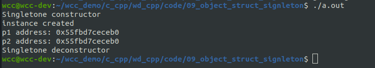

# 1. 对象的组织
有了自己定义的类，或者使用别人定义好的类创建对象，其机制与使用int等创建普通变量几乎完全一致，同样可以创建const对象、创建指向对象的指针、创建对象数组，还可使用new和delete等创建动态对象。
## 1.1 const 对象
类对象也可以声明为const对象，一般来说，能作用于const对象的成员函数除了构造函数和析构函数，便只有const成员函数了，因为const对象只能被创建、撤销以及只读访问，改写是不允许的.

## 1.2 指向对象的指针
对象占据一定的内存空间，和普通变量一致， C++ 程序中采用如下形式声明指向对象的指针：
```cpp
类名 *指针名 [=初始化表达式];
```
初始化表达式是可选的，既可以通过取地址（&对象名）给指针初始化，也可以通过申请动态内存给指针初始化，或者干脆不初始化（比如置为nullptr），在程序中再对该指针赋值。
指针中存储的是对象所占内存空间的首地址。

## 1.3 对象数组
对象数组和标准类型数组的使用方法并没有什么不同，也有声明、初始化和使用3个步骤。

## 1.4 堆对象
和把一个简单变量创建在动态存储区一样，可以用new和delete表达式为对象分配动态存储区，在复制构造函数一节中已经介绍了为类内的指针成员分配动态内存的相关范例，这里主要讨论如何为对象和对象数组动态分配内存。

<!--more-->

```cpp
#include <iostream>
#include <string.h>
using std::cout;
using std::endl;

class Point{
public:
    Point(int x=1, int y=1, int z=1)
    :_x(x)
    ,_y(y)
    ,_z(z){
        cout << "Point With default parameter" << endl;
    }


    Point(const Point& p)
    :_x(p._x)
    ,_y(p._y)
    ,_z(p._z){
        cout << "copy constructor" << endl;
    }

    ~Point(){
        cout << "destructor" << endl;
    }

    Point & operator=(const Point &rhs){
        cout << "equal operator" << endl;
        this->_x = rhs._x;
        this->_y = rhs._y;
        this->_z = rhs._z;
        return  *this;
        
    }

    void print_info() const{
        cout <<"(" << _x
             <<"," << _y
             <<"," << _z
             <<")" << endl;
    }

private:
    int _x;
    int _y;
    int _z;
};


void test(){
    const Point p1(0,1,1);
    p1.print_info();

    Point p2(2,2,2);
    Point *p3 = nullptr;
    Point *p4 = &p2;
    Point p_arr[6] = {};
    Point *p5 = new Point(1,1,1);
    Point *p6 = new Point[5];
    
    delete [] p6;
    delete p5;
}

int main(int argc, char* argv[])
{
    test();


    return 0;
}

```
使用new表达式为对象数组分配动态空间时，不能显式调用对象的构造函数，因此，对象要么没有定义任何形式的构造函数（由编译器缺省提供），要么显式定义了一个（且只能有一个）所有参数都有缺省值的构造函数。


# 2. 单例模式
一个类值能生成一个对象，并且是唯一的对象。
需要执行以下步骤：
- 将构造函数私有化
- 在类中定义一个静态(所有对象公用)的指向本类型的指针变量
- 定义一个返回值为类指针的静态成员函数(用于创建对象)

```cpp
#include <iostream>
#include <string.h>
using std::cout;
using std::endl;

class Singletone{
public:
    static Singletone * create_instance(){
        if (_pInstance==nullptr) {
            _pInstance = new Singletone();
            cout << "instance created" << endl;
        }

        return _pInstance;
    }

    static void destroy_instance(){
        if (_pInstance) {
            delete _pInstance;
        }
    }


private:
    Singletone(){
        cout << "Singletone constructor" << endl;
    }

    ~Singletone(){
        cout << "Singletone deconstructor" << endl;
    }

    static Singletone * _pInstance;
};


Singletone * Singletone::_pInstance =nullptr;

void test(){

    Singletone *p1 = Singletone::create_instance();
    Singletone *p2 = Singletone::create_instance();

    cout << "p1 address: "<<p1 << endl;
    cout << "p2 address: "<<p2 << endl;
    
    Singletone::destroy_instance();

}

int main(int argc, char* argv[])
{
    test();


    return 0;
}
```

