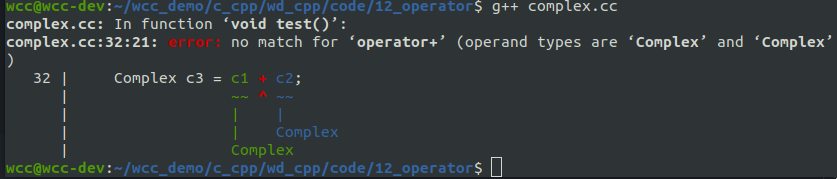
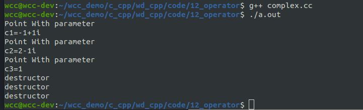

# 运算符重载的意义
C++预定义中的运算符的操作对象只局限于基本的内置数据类型，但是对于我们自定义的类型是没有办法操作的。但是大多时候我们需要对我们定义的类型进行类似的运算，这个时候就需要我们对这么运算
符进行重新定义，赋予其新的功能，以满足自身的需求。
<!--more-->
比如:
```cpp
#include <iostream>
#include <math.h>
using std::cout;
using std::endl;
using std::hypot;

class Complex{
public:
    Complex(double real =0 , double imag=0)
    :_real(real)
    ,_imag(imag){
        cout << "Point With parameter" << endl;

    }


    ~Complex(){
        cout << "destructor" << endl;
    }


private:
    double _real;
    double _imag;
};


void test(){
    Complex c1(1,1);
    Complex c2(2,2);

    Complex c3 = c1 + c2;
}

int main(int argc, char* argv[])
{
    test();


    return 0;
}
```


在上面的代码当中，我们想要完成两个自定义类型的数据的相加，可以看见，在编译的时候报错，提示对类来说没有可以执行的operator+函数。

为了使对用户自定义数据类型的数据的操作与内置数据类型的数据的操作形式一致，C++提供了运算符的重载,通过把C++中预定义的运算符重载为类的成员函数或者友元函数，使得对用户的自定义数据类型的数据(对象)的操作形式与C++内部定义的类型的数据一致。
运算符重载的实质就是函数重载或函数多态。运算符重载是一种形式的 C++ 多态。目的在于让人能够用同名的函数来完成不同的基本操作。要重载运算符，需要使用被称为运算符函数的特殊函数形式，运算符函数形式：
```cpp
返回类型 operator 运算符(参数表)
{
//...
}
```

## 运算符重载还具有以下规则：
- 为了防止用户对标准类型进行运算符重载，C++规定重载的运算符的操作对象必须至少有一个是自定义类型或枚举类型
- 重载运算符之后，其优先级和结合性还是固定不变的。
- 重载不会改变运算符的用法，原来有几个操作数、操作数在左边还是在右边，这些都不会改变。
- 重载运算符函数不能有默认参数，否则就改变了运算符操作数的个数。
- 重载逻辑运算符（&&,||）后，不再具备短路求值特性。
- 不能臆造一个并不存在的运算符，如@、$等

## 运算符函数重载的形式
运算符重载的形式有三种：
- 采用普通函数的重载形式
- 采用成员函数的重载形式
- 采用友元函数的重载形式

### 以普通函数形式重载
```cpp
#include <iostream>
#include <math.h>
using std::cout;
using std::endl;
using std::hypot;

class Complex{
public:
    Complex(double real =0 , double imag=0)
    :_real(real)
    ,_imag(imag){
        cout << "Point With parameter" << endl;

    }

    double get_real() const{
        return _real;
    }

    double get_imag() const{
        return _imag;
    }

    void print_info(){
        if (_real != 0 && _imag !=0) {
            if (_imag >0) {
                cout << _real << "+" << _imag << "i" << endl;
            } else if (_imag < 0) {
                cout << _real << _imag << "i" << endl;
            }
        }else if (_real == 0 && _imag == 0) {
            cout << "0" << endl;
        }else if (_real == 0) {
            cout << _imag << "i"<<endl;
        } else if (_imag == 0) {
            cout << _real <<endl;
        }
    }


    ~Complex(){
        cout << "destructor" << endl;
    }


private:
    double _real;
    double _imag;
};


Complex operator+(const Complex &lhs, const Complex &rhs){
    return Complex(lhs.get_real()+rhs.get_real(), lhs.get_imag()+rhs.get_imag());
}


void test(){
    Complex c1(-1,1);
    cout << "c1=";
    c1.print_info();
    Complex c2(2,-1);
    cout << "c2=";
    c2.print_info();
    Complex c3 = c1 + c2;
    cout << "c3=";
    c3.print_info();
}

int main(int argc, char* argv[])
{
    test();


    return 0;
}
```

从上面可以看到，我们通过定义一个和普通函数形式类似的运算符函数，在完成了运算符重载之后，编译通过，并且按照我们的预期执行。

### 以成员函数进行重载
```cpp
#include <iostream>
#include <math.h>
using std::cout;
using std::endl;
using std::hypot;

class Complex{
public:
    Complex(double real =0 , double imag=0)
    :_real(real)
    ,_imag(imag){
        cout << "Point With parameter" << endl;

    }
    // 使用成员函数进行重载有点违背二元运算符规则
    Complex operator+(const Complex &rhs){
        return Complex(_real+rhs._real, _imag+rhs._imag);
    }


    void print_info(){
        if (_real != 0 && _imag !=0) {
            if (_imag >0) {
                cout << _real << "+" << _imag << "i" << endl;
            } else if (_imag < 0) {
                cout << _real << _imag << "i" << endl;
            }
        }else if (_real == 0 && _imag == 0) {
            cout << "0" << endl;
        }else if (_real == 0) {
            cout << _imag << "i"<<endl;
        } else if (_imag == 0) {
            cout << _real <<endl;
        }
    }


    ~Complex(){
        cout << "destructor" << endl;
    }


private:
    double _real;
    double _imag;
};


void test(){
    Complex c1(-1,1);
    cout << "c1=";
    c1.print_info();
    Complex c2(2,-1);
    cout << "c2=";
    c2.print_info();
    Complex c3 = c1 + c2;
    cout << "c3=";
    c3.print_info();
}

int main(int argc, char* argv[])
{
    test();


    return 0;
}

```
### 使用友元函数重载
```cpp
#include <iostream>
#include <math.h>
using std::cout;
using std::endl;
using std::hypot;

class Complex{
    friend Complex operator+(const Complex &lhs, const Complex &rhs);
public:
    Complex(double real =0 , double imag=0)
    :_real(real)
    ,_imag(imag){
        cout << "Point With parameter" << endl;

    }

    double get_real() const{
        return _real;
    }

    double get_imag() const{
        return _imag;
    }

    void print_info(){
        if (_real != 0 && _imag !=0) {
            if (_imag >0) {
                cout << _real << "+" << _imag << "i" << endl;
            } else if (_imag < 0) {
                cout << _real << _imag << "i" << endl;
            }
        }else if (_real == 0 && _imag == 0) {
            cout << "0" << endl;
        }else if (_real == 0) {
            cout << _imag << "i"<<endl;
        } else if (_imag == 0) {
            cout << _real <<endl;
        }
    }


    ~Complex(){
        cout << "destructor" << endl;
    }


private:
    double _real;
    double _imag;
};

// 使用友元函数进行重载，可以访问类内部的私有成员
Complex operator+(const Complex &lhs, const Complex &rhs){
    return Complex(lhs._real+rhs._real, lhs._imag+rhs._imag);
}


void test(){
    Complex c1(-1,1);
    cout << "c1=";
    c1.print_info();
    Complex c2(2,-1);
    cout << "c2=";
    c2.print_info();
    Complex c3 = c1 + c2;
    cout << "c3=";
    c3.print_info();
}

int main(int argc, char* argv[])
{
    test();


    return 0;
}
```