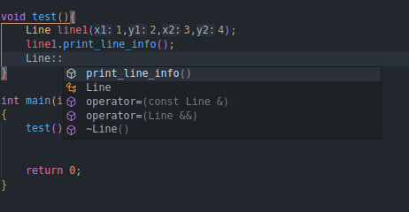
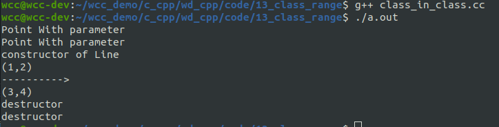

# 命名空间回顾
作用域可以分为类作用域、类名的作用域以及对象的作用域几部分内容。
在类中定义的成员变量和成员函数的作用域是整个类，这些名称只有在类中（包含类的定义部分和类外函数实现部分）是可见的，在类外是不可见的，因此，可以在不同类中使用相同的成员名。
另外，类作用域意味着不能从外部直接访问类的任何成员，即使该成员的访问权限是public，也要通过对象名来调用，对于static成员函数，要指定类名来调用。

和函数一样，类的定义没有生存期的概念，但类定义有**作用域和可见域**。使用类名创建对象时，首要的前提是类名可见，类名是否可见取决于类定义的可见域，该可见域同样包含在其作用域中，类本身可被定义在3种作用域内，这也是类定义的作用域。
<!--more-->
如果发生“屏蔽”现象，类成员的可见域将小于作用域，但此时可借助this指针或“类名::”形式指明所访问的是类成员，这有些类似于使用::访问全局变量

```cpp
#include <iostream>
using std::endl;
using std::cout;

int num = 1;

namespace tmp {
    int num =30;
    
    class Example{
        public:
        void print_info(int num){
            cout << "parameter num :" << num << endl;
            cout << "data member num :" << this->num << endl;
            cout << "namespace num :" << tmp::num << endl;
            cout << "global num :" << ::num << endl;

        }

        private:
            int num = 0;
    };
}


int main(int argc, char * argv[]){

    tmp::Example c1;
    c1.print_info(20);
    return 0 ;
}
```


# 作用域的类型
## 全局作用域
在函数和其他类定义的外部定义的类称为全局类，绝大多数的 C++ 类是定义在该作用域中，我们在前面定义的所有类都是在全局作用域中，全局类具有全局作用域。

## 类作用域
一个类可以定义在另一类的定义中，这是所谓嵌套类或者内部类，举例来说，如果**类A定义在类B中**，如果A的访问权限是public，则A的作用域可认为和B的作用域相同，不同之处在于必须使用B::A的形式访问A的类名。当然，如果A的访问权限是private，则只能在类内使用类名创建该类的对象，无法在外部创建A类的对象。

```cpp
#include <iostream>
#include <string.h>
#include <math.h>
using std::cout;
using std::endl;
using std::hypot;

class Line{
public:
    Line(int x1, int y1, int x2, int y2)
    :_p1(x1, y1)
    ,_p2(x2, y2){
        cout << "constructor of Line" << endl;
    }

    void print_line_info(){
            _p1.print_info();
            cout << "---------->"<< endl ;
            _p2.print_info();
    }

private:
    class Point{
    public:
        Point(int x, int y){
            cout << "Point With parameter" << endl;
            _x = x;
            _y = y;
        }

        Point(){
            cout << "Point Without parameter" << endl;
        }

        Point(const Point& p)
        :_x(p._x)
        ,_y(p._y){
            cout << "copy constructor" << endl;
        }

        ~Point(){
            cout << "destructor" << endl;
        }

        

        void set_loc(int x, int y){
            _x = x;
            _y = y;
        }

        void print_info(){
            cout << "(" << _x
                <<"," << _y
                <<")" << endl;
        }

    private:
        int _x;
        int _y;
    };

    Point _p1;
    Point _p2;
};


void test(){
    Line line1(1,2,3,4);
    line1.print_line_info();
}

int main(int argc, char* argv[])
{
    test();


    return 0;
}

```
可以看到在类的外部想要使用内部类去定义一个变量的时候，私有成员无法访问。即使类内部的point类是共有的成员，我们也无法直接使用内部类，必须通过B：：A的方式才能访问




### PIMPL 设计模式
PIMPL（Private Implementation 或Pointer to Implementation）是通过一个私有的成员指针，将指针所指向的类的内部实现数据进行隐藏。PIMPL又称作“编译防火墙”，它的实现中就用到了嵌套类。

下面是一个简单的例子来说明PIMPL的使用方式。

```cpp
class Line{
public:
    Line(int x1, int y1, int x2, int y2);
    ~Line();
    void print_line_info();

private:
    class LineImpl; // 类的前向声明

    LineImpl *_pimpl; // 隐藏类的内部信息

};
```
在一个头文件当中，我们定义了一个Line类，在类的内部，有一个私有的内部类，并使用了一个指针指向该内部类的实现。

具体的实现的代码如下：
```cpp
#include <iostream>
#include <string.h>
#include <math.h>
#include "pimpl.h"
using std::cout;
using std::endl;
using std::hypot;


class Line::LineImpl{
public:
    LineImpl(int x1, int y1, int x2, int y2);
    void printLineImpl();

private:
    class Point{
    public:
        Point(int x =0 , int y = 0)
        :_x(x)
        ,_y(y){
            cout << "Constructor of Point" << endl;
        }
        void print_info(){
            cout << "(" << _x
                <<"," << _y
                <<")" << endl;
        }

    private:
        int _x;
        int _y;
    };

    Point pt1;
    Point pt2;
};


Line::LineImpl::LineImpl(int x1, int y1, int x2, int y2)
:pt1(x1, y1)
,pt2(x2, y2){
    cout << "Constructor of LineImpl" << endl;
}

void Line::LineImpl::printLineImpl(){
    pt1.print_info();
    cout << "----------------->" << endl;
    pt2.print_info();
}


Line::Line(int x1, int y1, int x2, int y2)
:_pimpl(new LineImpl(x1, y1, x2, y2)){
    cout << "Constructor of Line" << endl;
}


Line::~Line(){
    delete _pimpl;
}

void Line::print_line_info(){
    _pimpl->printLineImpl();
}


void test(){
    Line line1(1,2,3,4);
    line1.print_line_info();
}

int main(int argc, char* argv[])
{
    test();
    return 0;
}
```

在上面的例子当中，我们将测试代码也写在这个里面，在实际的应用场景当中，我们只需要关注之前的头文件，这样可以将底层的信息进行封装。当我们修改该类的底层实现的时候，不会对上层的代码进行很大的修改。
