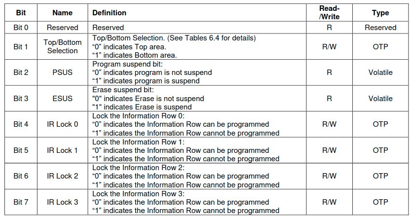
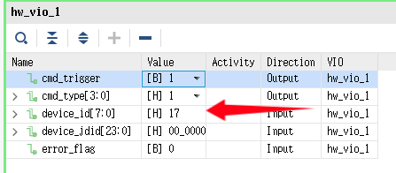
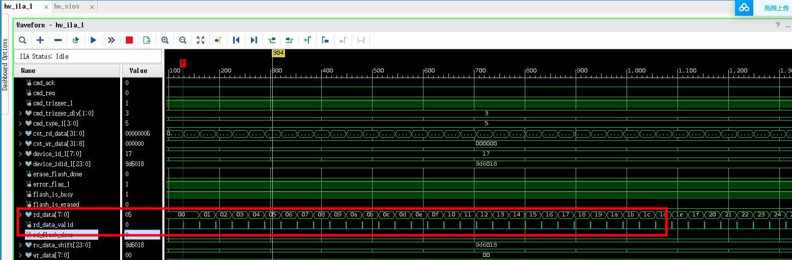

在这个文档当中，我们将会尝试使用SPI接口来读写A7-Lite上的QSPI Flash。在之前的SD卡读写部分，我们已经介绍了SPI协议，并且使用SPI协议完成了对SD卡的读写，因此在这一部分，将不会花太多内容在如何实现一个SPI协议上，更多的精力将放在对Flash芯片的访问之上。

在A7-Lite上板载了一个ISSI的Flash芯片，IS25LP128，我们首先了解一下这芯片，可以从ISSI的网站上下载这个芯片的数据手册: [IS25LP128](https://www.issi.com/WW/pdf/IS25LP128.pdf)

## 1. IS25LP128芯片手册

### 1.1 SPI模式

IS25LP128支持两种接口模式，一种是SPI模式，一种是QSPI模式，在这篇文档当中我们主要关注SPI模式。


在SPI模式下：CE#为片选信号，SCK为时钟信号，SI(IO0)是MOSI信号，SO(IO1)是MISO信号。

在QSPI模式下：数据信号由IO0~IO3组成，这些信号都是双向的。某种意义上来说使用QPSI模式，相对于SPI模式会更简单一点。


SPI的工作模式，不论在什么模式下，数据在上升沿写入，在下降沿读出。CS信号拉低的时候，开始进行操作。


QPI模式下的传输过程


### 1.2 芯片容量分配

一个扇区是4KB，一个32K block由相邻的8个扇区组成， 一个64K block由相邻的16个扇区组成。

IS25LP128一共有256个64Kblock，512个32Kblock，4096个扇区。


###  1.3  寄存器

IS25LP256具有三组寄存器：状态、功能和读取。 当连续读取寄存器时，重复输出相同的字节，直到 CE# 变为高电平。

#### 1.3.1 状态寄存器


- WIP：指示芯片的状态，当为1的时候，表示芯片正处于写入的状态，不能进行写入。

- WEL：当这个bit为0的时候，芯片处于不可写入的状态，只有当这一位为1的时候，芯片才处于可以写入的装药，可以通过WREN命令置位。

​		除设置易失性读取寄存器之外，每个写入寄存器、编程(PP命令，写入数据)和擦除指令之前必须有一个 WREN 指令。

​		需要设置WREN指令的命令如下：

​		

- BP3~BP0：用来设置保护区域的，保护区域的对应关系如下，当对应的区域被保护的时候，无法进行擦除和写入操作。


- SRWD: 状态寄存器写禁止 (SRWD) 位与写保护 (WP#) 信号一起运行以提供硬件保护模式。  当 SRWD 设置为“0”时，状态寄存器不受写保护。  当 SRWD 设置为“1”且 WP# 被拉低（VIL）时，状态寄存器的位（SRWD、QE、BP3、BP2、BP1、BP0）变为只读，WRSR 指令将被忽略.  如果 SRWD 设置为“1”且 WP# 被拉高 (VIH)，则可以通过 WRSR 指令更改状态寄存器
- QE: 四线使能 (QE) 是状态寄存器中允许四线操作的非易失性位。  当 QE 位设置为“0”时，引脚 WP# 和 HOLD# 被启用。  当 QE 位设置为“1”时，IO2 和 IO3 引脚被启用。


#### 1.3.2 功能寄存器




- Top/Bottom Selection:  保护区域选择，可以选择顶部或者底部，只能更改一次。
- PSUS ：程序暂停状态位指示程序操作何时暂停。  在程序运行期间发出暂停命令后，PSUS 变为“1”。  一旦挂起的程序恢复，PSUS 位将重置为“0”
- ESUS： 擦除暂停状态指示擦除操作何时暂停。  在擦除操作期间发出挂起命令后，ESUS 位为“1”。  一旦挂起的擦除恢复，ESUS 位将重置为“0
- IRLOCK 0~3：信息行锁定位是可编程的。  如果位设置为“1”，信息行 无法编程。


#### 1.3.3 读寄存器

读寄存器主要和QPI模式相关，在这里不做过多介绍。


Read Dummy Cycles vs Max Frequency


### 1.4 保护机制

Flash支持硬件和软件写保护机制。如果用户希望Flash 的某些区域不能被更改，则可以启用这些保护机制。

硬件保护机制可以用来保护状态寄存器，可以使得状态寄存器不能被用户写入数据，从而保证被保护的区域不能更改。


软件的保护机制在前面介绍状态寄存器的时候，已经提及过，通过对BP0~BP3的设置，可以来选择呢些block是不能被修改的。

### 1.5 设备操作

该设备使用一个 8 位指令寄存器。在串行数据输入 (SI) 或串行数据 IO（IO0、IO1、IO2、IO3）上，所有指令、地址和数据均以最高有效位 (MSB) 在前移入。  在芯片使能 (CE#) 被驱动为低电平 (VIL) 之后，SI 或 IO 上的输入数据在正常模式下在串行时钟 (SCK) 的上升沿锁存，在 DTR 模式下在上升沿和下降沿锁存。   每个指令序列都以一个字节的指令代码开始，然后是地址字节、数据字节，或者地址字节和数据字节，具体取决于指令的类型。  CE#必须  在指令序列的最后一位移入以结束操作后被驱动为高电平（VIH）。

在这里只记录几个通过SPI来读写寄存器时用到的命令。

#### 1.5.1 Normal Read 0x03

NORMAL READ (NORD) 指令用于以最大频率 50MHz的读取设备的内存内容。

NORD的指令的顺序如下，首先CE#拉低，然后在SI上传输NORD Command，然后是三字节的地址。然后数据从SO线上传出，Flash当中的所有存储地址都可以在一次NORD命令当中被读出。


#### 1.5.2 Page Program (PP 0x02)

页编程 (PP) 指令允许在一次操作中将最多 256 字节的数据编程到内存中。   要编程的存储器目标必须在块保护（BP3、BP2、BP1、BP0）位设置的受保护存储器区域之外。  试图编程到写保护页面的 PP 指令将被忽略。  在执行 PP 指令之前，必须通过 Write Enable (WREN) 指令启用 Write Enable Latch (WEL)。

PP 指令代码、三个地址字节和程序数据（1 到 256 字节）通过 SI 线输入。  CE#拉高后程序会立即开始运行，否则PP指令不会被执行。  内部控制逻辑自动处理编程电压和时序。  程序操作的进度或完成可以通过 RDSR 指令读取状态寄存器中的 WIP 位来确定。  如果 WIP  位为“1”，则程序操作仍在进行中。  如果 WIP 位为“0”，则程序操作已完成。

如果超过 256 字节的数据被发送到设备，地址计数器在同一页内翻转，先前锁存的数据被丢弃，最后 256 字节被保留以编程到页面中。   起始字节可以位于页面内的任何位置。  当到达页面末尾时，地址将环绕到同一页的开头。   如果要烧录的数据少于整页，则同一页上所有其他字节的数据将保持不变。


#### 1.5.3 Erase 

擦除命令将寻址扇区或块中的所有位设置为“1”，该设备的内存阵列被组织成统一的 4 KB 扇区或 32/64 KB 统一块（一个块分别由八个/十六个相邻扇区组成）。

**在重新编程一个字节之前，必须擦除包含该字节的扇区或块（擦除将位设置为“1”）**。  为了擦除器件，提供了三种擦除指令：扇区擦除 (SER)、块擦除 (BER) 和芯片擦除 (CER)。  扇区擦除操作允许擦除任何单个扇区而不影响 其他部门的数据。  块擦除操作擦除任何单独的块。  芯片擦除操作擦除设备的整个存储器阵列。  可以在任何编程操作之前执行扇区擦除、块擦除或芯片擦除操作。

##### 1.5.3.1 Sector Erase (SER 0xD7/0x20)

扇区擦除 (SER) 指令擦除 4 KB 扇区，在执行 SER 指令之前必须通过写使能 (WREN) 指令设置写使能锁存器 (WEL)。  WEL 位在扇区擦除操作完成后自动复位

擦除操作的进度或完成可以通过使用 RDSR 指令读取状态寄存器中的 WIP 位来确定。 如果 WIP 位为“1”，擦除操作仍在进行中。  如果 WIP 位为“0”，擦除操作已经完成


##### 1.5.3.2 Block Erase(BER32K 0x52, BER64K 0xD8)


##### 1.5.3.3 Chip Erase(CER 0xC7/0x60)

芯片擦除 (CER) 指令擦除整个存储器阵列。  在执行 CER 指令之前，必须通过写使能 (WREN) 指令设置写使能锁存器 (WEL)。  WEL 在芯片擦除操作完成后自动复位


#### 1.5.4 Write Enable(WREN 0x06)

写使能 (WREN) 指令用于设置写使能锁存器 (WEL) 位。  WEL 位在上电后复位为写保护状态。  WEL  位必须在任何写操作之前启用写操作，包括扇区擦除、块擦除、芯片擦除、页面编程、编程信息行、写状态寄存器和写功能寄存器操作。  写操作完成后，WEL 位将自动复位为写保护状态。  在执行上述任何操作之前都需要 WREN 指令


#### 1.5.5 Write Disable(WRDI 0x04


#### 1.5.6 Read Status Register(RDSR 0x05)

读取状态寄存器 (RDSR) 指令提供对状态寄存器的访问。  在执行写、擦除或写入状态寄存器操作期间，可以使用 RDSR 指令通过读取状态寄存器的 WIP 位来检查操作的进度或完成情况。

​        


#### 1.5.7 Write Status Register(WRSR ,0x01)


#### 1.5.8 Read Function Register(RDFR 0x48)


#### 1.5.9 Write Function Register(WRFR 0x42)

写功能寄存器 (WRFR) 指令允许用户通过将 TBS 位设置为“1”来从顶部块区域（默认）更改为底部块区域。 信息行锁定位 (IRL3~IRL0) 也可以通过 WRFR 指令单独设置为“1”以锁定信息行。  由于TBS 位和IRL 位是OTP，一旦设置为“1”，就不能再设置回“0”。


#### 1.5.10 Read Product ID(RDID 0xAB)


#### 1.5.10 Read Product JDID(RDID 0x9F)


## 2. Flash读写的具体设计

### 2.1 SPI读写模块

在了解了上面的Flash芯片相关的内容之后，我们可以得出一个结论，对Flash的操作都是以命令+地址+数据的这种形式来进行传输的，其中地址和数据是可选的。比如：如果想要使设备处于可以写入的状态，我们只需要向设备发出命令，而不需要额外的地址和写入的数据。又比如，如果我们想要读取Flash的寄存器的数据，我们只需要向Flash发出命令然后在接收返回的数据即可。

因此，我们可以首先抽象出一个对Flash操作的最基本的模块，该模块接收来自上一级的命令地址和数据，根据不同地情况完成对Flash的访问。首先，我们需要确定在这个模块当中支持的命令。

| 命令       | 描述                                                         |
| ---------- | ------------------------------------------------------------ |
| CMD_WREN   | 写使能，进行擦除和写入Flash的时候，先要由此命令，不需要地址和数据 |
| CMD_ERASE  | 擦除指令，需要给定起始地址                                   |
| CMD_PP     | 写操作，需要给出起始地址和要写入的数据                       |
| CMD_RDSR   | 读取状态寄存器，不需要地址，从Flash读出状态寄存器的数据      |
| CMD_NORD   | 读取Flash数据，需要地址，从Flash读出存储空间的数据           |
| CMD_RDID   | 读取设备的ID，不需要地址，从Flash读出数据                    |
| CMD_RDJDID | 读取设备的JDID，作用与CMD_RDID类似，读出三字节的数据         |


## 

| Port name     | Direction | Description                                                  |
| ------------- | --------- | ------------------------------------------------------------ |
| clk           | input     |                                                              |
| rst           | input     |                                                              |
| cmd_start     | input     | 一次命令起始信号，拉高1 beat                                 |
| cmd           | input     | 具体的命令类型，比如：WREN, PP, NORD,RDSR等等                |
| cmd_addr      | input     | 需要读取的地址，只有访问存储空间的时候才有效，访问寄存器时无效 |
| addr_len      | input     | 如果需要访问存储空间时，该值为3，如果访问寄存器或者其他命令为0 |
| wr_data       | input     | 要写入Flash存储空间的数据                                    |
| wr_len        | input     | 要写入Flash存储空间数据的长度，一般为256字节，一个Page       |
| wr_data_pop   | output    | 向上游模块取数据信号，该信号有效的时候，上游模块将会给出一个数据 |
| wr_done       | output    | 一次写入操作完成                                             |
| rd_data       | output    | 从Flash读出的数据                                            |
| rd_len        | input     | 一次读操作的长度                                             |
| rd_data_valid | output    | 读出的数据有效信号                                           |
| rd_done       | output    | 一次读取操作完成                                             |
| busy          | output    | 该模块处于忙碌状态                                           |
| spi_clk       | output    |                                                              |
| spi_cs_n      | output    |                                                              |
| spi_mosi      | output    |                                                              |
| spi_miso      | input     |                                                              |

在这个模块当中，我们设计一个状态机来完成对各种不同情况的判断与跳转：


IDLE：复位所处的状态，复位结束，进入ARBIT状态

ARBIT状态：在ARBIT状态下，如果检测到一次命令开始cmd_start有效，判断当前的命令，如果是写这一类的则跳转进入WR_START状态。如果是读一类命令则跳转进入RD_START状态。

WR_START：直接跳转到写WR_COMMAND状态。

WR_COMMAND：在该状态下，需要注意这个命令是否包含地址和数据，如果是WREN命令，则在高状态结束的时候，直接跳转到WR_STOP状态，如果该命令是对寄存器的写操作，那么跳转到WR_DATA状态。如果该命令是对内存空间的操作，比如写Flash或者擦除Flash则进入WR_ADDR状态。

WR_ADDR：当3字节的地址写入完成之后，如果是擦除操作，那就直接进入到WR_STOP状态，如果是写入数据，那么将会进入到WR_DATA状态。

WR_DATA： 当所有数据都写入到寄存器或者存储空间之后，跳转到WR_STOP状态，结束本次操作。

WR_STOP：直接跳转到ARBIT状态。

RD_START：标志一次读开始，直接进入RD_COMMAND状态。

RD_COMMAND： 需要检测是否是对存储空间的读取，如果是读寄存器在状态结束的时候，跳转到接收读取的数据状态，如果是读取Flash的数据，呢么需要进入到给出要读取的Flash 的地址的状态。

RD_DATA：接收读取到的数据，所有数据接收完成之后，跳转到RD_STOP状态

RD_STOP：直接跳转到ARBIT状态。


有了这个状态机的描述，剩下的就是取根据这个状态机完成具体的代码，具体代码不在文档中进行记录，用户可以查阅源码。


### 2.2 封装SPI读写模块

在前面我们实现了一个最基础的操作Flash的模块。然而在实际操作Flash的时候，可能需要遇到一些比较复杂的情况，比如在写入Flash之前，我们需要检查Flash的状态，通过读取状态寄存器，判断当前Flash是否处于忙碌的状态，知道Flash处于空闲，我们才可以进行写入。

因此这样就需要多个操作进行组合才能成功地将数据写入到Flash 当中。再回想我们最终的目的，最终的目的是能够对Flash进行写入，擦除和读取，因此我们可以对前面的模块进行一个封装，从而提供给用户一个向上的接口，用户只需要简单地执行写入，擦除，读取命令即可，而不必取关心Flash所处的状态。

经过简化之后，上游模块只需要处理三类命令即可，分别是读取，写入和擦除操作。

其中在读取数据的时候，增加可对芯片ID的读取，在实际使用的时候，可以不需要这两种操作。


| Port name            | Direction | Description                         |
| -------------------- | --------- | ----------------------------------- |
| clk                  | input     |                                     |
| rst                  | input     |                                     |
| cmd_type             | input     | 用户的命令                          |
| cmd_req              | input     | 用户命令请求                        |
| cmd_ack              | output    | 用户命令响应                        |
| total_bytes_to_pp    | input     | 一共需要写入的数据长度              |
| wr_data              | input     | 写入Flash的数据                     |
| wr_data_pop          | output    | 下游模块从用户取出要写入Flash的数据 |
| wr_flash_done        | output    | 所有数据写入完毕                    |
| total_bytes_to_erase | input     | 一共要擦除的数据长度                |
| erase_flash_done     | output    | 所有出数据擦除结束                  |
| total_bytes_to_rd    | input     | 一共需要读取的数据长度              |
| rd_data              | output    | 读出出来的数据                      |
| rd_data_valid        | output    | 读取数据有效                        |
| rd_flash_done        | output    | 所有数据读取完成                    |
| flash_is_busy        | output    | flash处于忙碌状态                   |
| spi_clk              | output    |                                     |
| spi_cs_n             | output    |                                     |
| spi_mosi             | output    |                                     |
| spi_miso             | input     |                                     |


该模块的状态机如上图所示：

IDLE： 复位状态，复位结束之后进入ARBIT状态

ARBIT： 在该状态下，如果用户发起了请求，则进入到RDSR状态，读取状态寄存器，判断当前是否处于空闲。

RDSR： 读取状态寄存器，如果设备空闲则进入DEVICE_READY状态，否则返回到ARBIT状态。

DEVICE_READY:在该状态下，判断用户是需要进行的操作，如果是写入寄存器或者擦除操作，则进入到WREN状态，如果是读取Flash则进入到读取状态。

WREN：WREN命令结束，需要跳转到WREN_CHECK状态，进一步判断当前是否可以进行写入或者擦除操作。

WREN_CHECJK： 如果设备处于可以进行写入或者擦除操作，状态寄存器的WELbit为1，则进入写入或者擦除状态。如果当前设备不可写入，那么需要再起发起读取状态寄存器，知道WEL bit为1。

PP: 写入数据，一次写入的数据长度是256字节，也就是一个PAGE，写入完成之后需要进入PP_CHECK状态。

PP_CHECK： 判断是否所有数据都已经写入到Flash，如果还有数据没有写入到Flash，那么跳转到WR_RDSR状态，获取当前Flash的状态，为下一次写入做准备，如果所有数据都写入，则跳转到ARBIT状态。

WR_RDSR：写入数据时读取Flash 状态寄存器，如果设备空闲，则进入WREN状态，开始下一次写入。否则，继续向Flash发送读取状态寄存器的命令，直到Flash 空闲。

ERASE：一次擦除一个扇区，一次擦除结束之后，进入到ERASE_CHECK状态。

ERASE_CHECK：如果需要擦除的扇区都被擦除，进入到ARBIT状态，如果还有扇区没有被擦除，那么跳转到ERASE_RDSR状态，获取当前Flash的状态，为下一次擦除做准备

ERASE_RDSR： 擦除时读取Flash 状态寄存器，如果设备空闲，则进入WREN状态，开始下一次擦除。否则，继续向Flash发送读取状态寄存器的命令，直到Flash 空闲。

 READ： 数据全部从Flash读取之后，跳转到ARBIT状态。

### 2.3 顶层测试模块

有了前面封装好之后的模块，我们就可以来完成一个模块实现对上面封装好的模块的测试。

在这个模块当中，我们会使用一个VIO来产生测试命令和用户请求，并观察读取到的DEVICE ID和JDID。


在这个模块当中，将实现如下的状态跳转：

IDLE： 复位状态

ARBIT： 判断来自VIO产生的用户请求和命令。在这个状态下，检测VIO产生的cmd_trigger信号的上升沿，如果检测到上升沿，我们就可以开始产生一次用户请求。然后分别进入到5个不同的状态，分别是ERASE，WRITE，READID，READ_JDID，READ_DATA这几个状态。

ERASE，WRITE，READID，READ_JDID，READ_DATA： 一次操作结束时回到ARBIT状态。

在写入数据状态，我们会向Flash的地址0~0x20000的地址空间写入0~255的递增数，在擦除状态，我们会将0~0x20000的空间的说有数据擦除。

为了验证我们的设计，在开始之前，我们可以先启动一次读Flash操作，查看当前从Flash当中读出的数据， 一般情况下，为对Flash进行任何操作的时候，读出的将是随机数。

然后我们可以启动一次擦除操作，擦除之后，对应地址里的值应该为0xFF，然后我们可以再一次启动读操作，查看当前是否所有数据都为0xFF.

接下来我们可以进行一次写操作，将递增数写入到flash当中，然后在启动读操作，查看当前读出的数据是否是递增数。由此判断我们Flash控制器是否有效。


在这个模块当中我们需要使用一个 STARTUPE2模块，在A7-Lite的QPSI CLK这个引脚上，我们使用的是复用的引脚，因此直接在约束文件当中约束这个SPI的时钟引脚是无效的。为此我们需要将SPI的CLK信号连接到STARTUPE2的时钟引脚上，这样FPGA就能产生到QPSI Flash的时钟信号了。


```verilog
STARTUPE2 #( 
        .PROG_USR           ("FALSE" ),//Activate program event security feature. Requires encrypted bitstreams.
        .SIM_CCLK_FREQ      (0.0     ) //Set the Configuration Clock Frequency(ns) for simulation
    )
    STARTUPE2_inst(     
        .CFGCLK             (        ),//1-bit output: Configuration main clock output
        .CFGMCLK            (        ),//1-bit output: Configuration internal oscillator clock output
        .EOS                (        ),//1-bit output: Active high output signal indicating the End Of Startup.
        .PREQ               (        ),//1-bit output: PROGRAM request to fabric output
        .CLK                (0       ),//1-bit input: User start-up clock input
        .GSR                (0       ),//1-bit input: Global Set/Reset input(GSR cannot be used for the port name)
        .GTS                (0       ),//1-bit input: Global 3-state input(GTS cannot be used for the port name)
        .KEYCLEARB          (1      ),//1-bit input: Clear AES Decrypter Key input from Battery-Backed RAM(BBRAM)
        .PACK               (1      ),//1-bit input: PROGRAM acknowledge input
        .USRCCLKO           (spi_clk         ),//1-bit input: User CCLK input
        .USRCCLKTS          (0      ),//1-bit input: User CCLK 3-state enable input
        .USRDONEO           (1      ),//1-bit input: User DONE pin output control
        .USRDONETS          (1      ) //1-bit input: User DONE 3-state enable output
    );
```


## 3. 下载验证

将bit文件下载到FPGA之后，会出现一个ILA窗口和一个VIO窗口

### 3.1 读取设备ID，厂商号，设备类型容量


在ILA窗口当中，我们可以设置触发类型为rd_data_valid的上升沿触发。

在VIO窗口当中，我们首先将cmd_type的值设置为1,这个命令是读取设备ID的操作，然后我们将cnd_trigger由0调整到1。

此时ILA会触发，并且VIO上将会显示读出的设备ID值。




然后我们再次点击ILA触发，是ILA进入到等待触发模式。

接下来调整vio的cmd_type=2，这个命令实现读取JDID，然后我们调整cmd_trigger由0变为1，产生一个上升沿。


可以看到ILA触发，并且读出了JDID的值，回顾前面的设备ID我们可以看到device ID是0x17,厂商号是0x9D,存储类型和容量是0x6018


这个和我们从VIO上看到的读取到的数据都是能够吻合上的。

### 3.2 数据写入测试

首先，对Flash进行擦除操作，在VIO窗口当中，将cmd_type设置为4，然后再将cmd_trigger由0变到1。


等待一段时间，擦除结束，我们可以准备读取擦除之后的数据。在ILA窗口当中，点击触发，等待rd_data_valid的上升沿出现。

然后回到VIO窗口党总，将cmd_type设置为5，然后再将cmd_trigger由0变到1。 可以看到ILA触发之后，所有读出的数据都为0xFF。


然后我们再对Flash进行写入操作，首先在VIO当中，将cmd_type设置为3，然后再将cmd_trigger由0变到1。

等待一段时间，写入结束，我们可以准备读取写入之后的数据。在ILA窗口当中，点击触发，等待rd_data_valid的上升沿出现。

然后回到VIO窗口党总，将cmd_type设置为5，然后再将cmd_trigger由0变到1。 可以看到ILA触发之后，读出的数据为递增数。



从这里可以看到数据能够被正常写入和读出。