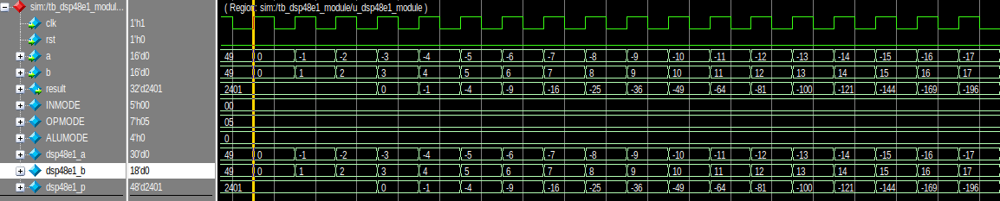

# 1. 前言
FPGA在数字信号处理（DSP）应用方面非常高效，因为它们可以实现定制的、完全并行的算法。 DSP应用使用许多二进制乘法器和累加器，最好在专用的DSP片上实现。 所有7系列FPGA都有许多专用的、完全定制的低功耗DSP片，将高速性与小尺寸相结合，同时保留了系统设计的灵活性。

DSP48E1的常见的一个功能就是实现 `P=(A+D)*B+C` 这个功能。
<!--more-->

# 2. DSP48E1的结构
### 2.1 DSP48E1主要结构
DSP48E1的具体的结构如下，DSP48E1的功能很多，结构比较复杂，但是在我们实际使用的时候，可能只需要使用到其中的某些功能。在我的这些博客当中，我还是主要以记录DSP48E实现乘法，加法这些简单的操作为主。

DSP48E1的结构可以看成由以下几个部分构成：

- 输入数据选择与寄存部分
- 25x18乘法器
- X，Y，Z多路复用选择器
- 多功能运算单元
- 计算结果输出


DSP slice 由一个乘法器和一个累加器组成。至少需要三个流水线寄存器，才能使乘法和乘加运算以全速运行。第一阶段中的乘法运算生成两个部分积，在第二阶段中需要将它们加起来。当乘法器设计中只存在一个或两个寄存器时，应始终使用M寄存器来节省功耗并提高性能。加/减和逻辑单元操作需要至少有两个流水线寄存器（输入、输出）才能以全速运行。

DSP slice的级联功能非常有效，可在基于加法器级联而非加法器树的高速流水线滤波器上实现。多路复用器由动态控制信号（例如OPMODE、ALUMODE和CARRYINSEL）控制，从而具有很大的灵活性。使用寄存器和动态opmodes的设计比组合乘法更能利用DSP片的能力。

通常，由于动态OPMODE和级联功能，DSP片支持串行和级联操作。快速傅里叶变换（FFT）、浮点计算（乘法、加/减、除法）、计数器和大总线多路复用器是DSP片的一些应用。DSP片的其他功能包括同步复位和时钟使能、双A输入流水线寄存器、模式检测、逻辑单元功能、单指令/多数据（SIMD）功能以及96位的MACC和Add-Acc扩展。DSP片支持收敛舍入和对称舍入、计数器的终端计数检测和自动复位以及顺序累加器的上溢/下溢检测。

## 2.2 DSP48E1源语与结构
DSP48E1的源语如下：
```verilog
DSP48E1 #(
      // Feature Control Attributes: Data Path Selection
      .A_INPUT("DIRECT"),               // Selects A input source, "DIRECT" (A port) or "CASCADE" (ACIN port)
      .B_INPUT("DIRECT"),               // Selects B input source, "DIRECT" (B port) or "CASCADE" (BCIN port)
      .USE_DPORT("FALSE"),              // Select D port usage (TRUE or FALSE)
      .USE_MULT("MULTIPLY"),            // Select multiplier usage ("MULTIPLY", "DYNAMIC", or "NONE")
      .USE_SIMD("ONE48"),               // SIMD selection ("ONE48", "TWO24", "FOUR12")
      // Pattern Detector Attributes: Pattern Detection Configuration
      .AUTORESET_PATDET("NO_RESET"),    // "NO_RESET", "RESET_MATCH", "RESET_NOT_MATCH" 
      .MASK(48'h3fffffffffff),          // 48-bit mask value for pattern detect (1=ignore)
      .PATTERN(48'h000000000000),       // 48-bit pattern match for pattern detect
      .SEL_MASK("MASK"),                // "C", "MASK", "ROUNDING_MODE1", "ROUNDING_MODE2" 
      .SEL_PATTERN("PATTERN"),          // Select pattern value ("PATTERN" or "C")
      .USE_PATTERN_DETECT("NO_PATDET"), // Enable pattern detect ("PATDET" or "NO_PATDET")
      // Register Control Attributes: Pipeline Register Configuration
      .ACASCREG(1),                     // Number of pipeline stages between A/ACIN and ACOUT (0, 1 or 2)
      .ADREG(1),                        // Number of pipeline stages for pre-adder (0 or 1)
      .ALUMODEREG(1),                   // Number of pipeline stages for ALUMODE (0 or 1)
      .AREG(1),                         // Number of pipeline stages for A (0, 1 or 2)
      .BCASCREG(1),                     // Number of pipeline stages between B/BCIN and BCOUT (0, 1 or 2)
      .BREG(1),                         // Number of pipeline stages for B (0, 1 or 2)
      .CARRYINREG(1),                   // Number of pipeline stages for CARRYIN (0 or 1)
      .CARRYINSELREG(1),                // Number of pipeline stages for CARRYINSEL (0 or 1)
      .CREG(1),                         // Number of pipeline stages for C (0 or 1)
      .DREG(1),                         // Number of pipeline stages for D (0 or 1)
      .INMODEREG(1),                    // Number of pipeline stages for INMODE (0 or 1)
      .MREG(1),                         // Number of multiplier pipeline stages (0 or 1)
      .OPMODEREG(1),                    // Number of pipeline stages for OPMODE (0 or 1)
      .PREG(1)                          // Number of pipeline stages for P (0 or 1)
   )
   DSP48E1_inst (
      // Cascade: 30-bit (each) output: Cascade Ports
      .ACOUT(ACOUT),                   // 30-bit output: A port cascade output
      .BCOUT(BCOUT),                   // 18-bit output: B port cascade output
      .CARRYCASCOUT(CARRYCASCOUT),     // 1-bit output: Cascade carry output
      .MULTSIGNOUT(MULTSIGNOUT),       // 1-bit output: Multiplier sign cascade output
      .PCOUT(PCOUT),                   // 48-bit output: Cascade output
      // Control: 1-bit (each) output: Control Inputs/Status Bits
      .OVERFLOW(OVERFLOW),             // 1-bit output: Overflow in add/acc output
      .PATTERNBDETECT(PATTERNBDETECT), // 1-bit output: Pattern bar detect output
      .PATTERNDETECT(PATTERNDETECT),   // 1-bit output: Pattern detect output
      .UNDERFLOW(UNDERFLOW),           // 1-bit output: Underflow in add/acc output
      // Data: 4-bit (each) output: Data Ports
      .CARRYOUT(CARRYOUT),             // 4-bit output: Carry output
      .P(P),                           // 48-bit output: Primary data output
      // Cascade: 30-bit (each) input: Cascade Ports
      .ACIN(ACIN),                     // 30-bit input: A cascade data input
      .BCIN(BCIN),                     // 18-bit input: B cascade input
      .CARRYCASCIN(CARRYCASCIN),       // 1-bit input: Cascade carry input
      .MULTSIGNIN(MULTSIGNIN),         // 1-bit input: Multiplier sign input
      .PCIN(PCIN),                     // 48-bit input: P cascade input
      // Control: 4-bit (each) input: Control Inputs/Status Bits
      .ALUMODE(ALUMODE),               // 4-bit input: ALU control input
      .CARRYINSEL(CARRYINSEL),         // 3-bit input: Carry select input
      .CLK(CLK),                       // 1-bit input: Clock input
      .INMODE(INMODE),                 // 5-bit input: INMODE control input
      .OPMODE(OPMODE),                 // 7-bit input: Operation mode input
      // Data: 30-bit (each) input: Data Ports
      .A(A),                           // 30-bit input: A data input
      .B(B),                           // 18-bit input: B data input
      .C(C),                           // 48-bit input: C data input
      .CARRYIN(CARRYIN),               // 1-bit input: Carry input signal
      .D(D),                           // 25-bit input: D data input
      // Reset/Clock Enable: 1-bit (each) input: Reset/Clock Enable Inputs
      .CEA1(CEA1),                     // 1-bit input: Clock enable input for 1st stage AREG
      .CEA2(CEA2),                     // 1-bit input: Clock enable input for 2nd stage AREG
      .CEAD(CEAD),                     // 1-bit input: Clock enable input for ADREG
      .CEALUMODE(CEALUMODE),           // 1-bit input: Clock enable input for ALUMODE
      .CEB1(CEB1),                     // 1-bit input: Clock enable input for 1st stage BREG
      .CEB2(CEB2),                     // 1-bit input: Clock enable input for 2nd stage BREG
      .CEC(CEC),                       // 1-bit input: Clock enable input for CREG
      .CECARRYIN(CECARRYIN),           // 1-bit input: Clock enable input for CARRYINREG
      .CECTRL(CECTRL),                 // 1-bit input: Clock enable input for OPMODEREG and CARRYINSELREG
      .CED(CED),                       // 1-bit input: Clock enable input for DREG
      .CEINMODE(CEINMODE),             // 1-bit input: Clock enable input for INMODEREG
      .CEM(CEM),                       // 1-bit input: Clock enable input for MREG
      .CEP(CEP),                       // 1-bit input: Clock enable input for PREG
      .RSTA(RSTA),                     // 1-bit input: Reset input for AREG
      .RSTALLCARRYIN(RSTALLCARRYIN),   // 1-bit input: Reset input for CARRYINREG
      .RSTALUMODE(RSTALUMODE),         // 1-bit input: Reset input for ALUMODEREG
      .RSTB(RSTB),                     // 1-bit input: Reset input for BREG
      .RSTC(RSTC),                     // 1-bit input: Reset input for CREG
      .RSTCTRL(RSTCTRL),               // 1-bit input: Reset input for OPMODEREG and CARRYINSELREG
      .RSTD(RSTD),                     // 1-bit input: Reset input for DREG and ADREG
      .RSTINMODE(RSTINMODE),           // 1-bit input: Reset input for INMODEREG
      .RSTM(RSTM),                     // 1-bit input: Reset input for MREG
      .RSTP(RSTP)                      // 1-bit input: Reset input for PREG
   );
```
DSP48E1的源语的结构如下


### 2.2.1源语功能属性
首先需要理解源语的几个比较有特点的属性：

**.A_INPUT("DIRECT"),   // Selects A input source, "DIRECT" (A port) or "CASCADE" (ACIN port)**

**.B_INPUT("DIRECT"),   // Selects B input source, "DIRECT" (B port) or "CASCADE" (BCIN port)**

**.USE_DPORT("FALSE"),  // Select D port usage (TRUE or FALSE)**

**.USE_MULT("MULTIPLY"),// Select multiplier usage ("MULTIPLY", "DYNAMIC", or "NONE")**

**.USE_SIMD("ONE48"),   // SIMD selection ("ONE48", "TWO24", "FOUR12")**

A_INPUT,B_INPUT选择输入给AB的数据是来自直接的端口，还是上一级DSP48E1的输出。

USE_DPORT表示是否使用预加器，也就是是否使用DSP48E1的D端口作为预加器的输入。

USE_MULT：选择乘法器的使用方式。将其设置为NONE以节省功率，仅使用加法器/逻辑单元时。DYNAMIC设置表示用户正在动态切换A * B和A：B操作，因此需要获得两条路径的最坏情况时间。

USE_SIMD：选择加法器/减法器的操作模式。属性设置可以是一个48位加法器模式（ONE48），两个24位加法器模式（TWO24）或四个12位加法器模式（FOUR12）。当模式设置为ONE48时，支持典型的乘-加运算。当选择TWO24或FOUR12模式时，**不能使用乘法器**，并且必须将**USE_MULT设置为NONE**。
下面是将USE_SIMD设置为使用4个12bit加法器的时候的结构，DSP48E1后端的结构。在 **USE_SIMD** 设置为 **FOUR12** 的时候， **USE_MULT**要设置为 NONE

### 2.2.2 源语寄存器属性
源语当中关于寄存器的属性如下


## 2.3 A D B 输入端口
ABD输入端口在DSP48E1当中经过的路径如下图所示：

ABD通道上都有寄存器，通过设置源语的属性，可以来设置寄存器的级数，通过INMODE和源语的属性的共同设置，可以选择给到 XY的多路复用器的值。
下面是INMODE的功能，INMODE和AREG，BREG源语属性一起，给到XY多路复用器的数据的来源。

下面举一个具体的例子：源语属性当中AREG和BREG都设置为1，INMODE的值设置为5'b00000。
- 根据源语属性，USEP_DPORT设置为FALSE， 当AREG BREG都设为1，1的时候，使能的REG是 A2和B2，然后又在INMODE为5'b00000，因此最终给到XY的多路复用器的值的来源是A2和B2。
- 根据源语属性，USEP_DPORT设置为FALSE， 当AREG BREG都设为2，2的时候，会使能A1,A2,B1,B2, 然后在INMODE设置为5'b00000,最终给到XY的多路复用器的值来源是A2和B2
- 根据源语属性，USEP_DPORT设置为FALSE， 当AREG BREG都设为2，2的时候，会使能A1,A2,B1,B2, 然后在INMODE设置为5'b10001,最终给到XY的多路复用器的值来源是A1和B1


## 2.2 XYZ多路复用器
在DSP48E1当中有三个多路复用器，这三个多路复用器能够给后续的多功能计算单元提供数据。对于XYZ这三个多路复用器，可以通过OPMODE来控制输出给ALU的数据来源。


OPMODE输入提供了一种方式，使您可以从时钟周期到时钟周期动态更改DSP48E1的功能（例如，相对于给定计算序列更改DSP48E1片内数据路径配置）。
可以使用OPMODEREG属性选择是否使用寄存器寄存OPMODE。

下面列出了OPMODE的可能值以及三个多路复用器（X，Y和Z多路复用器）的输出结果函数。多路复用器的输出向以下的加法器/减法器提供三个操作数。并非所有可能的多路复用器选择位组合都被允许。在表格中，有些被标记为“非法选择”，并给出未定义的结果。如果选择乘法器输出，则同时使用X和Y多路复用器向加法器/减法器提供乘法器部分积。


在XYZ多路器当中，需要注意，如果DSP48E1当中要使用到乘法，由于乘法器输出的是分部积，因此需要XY都输出M的时候才能得到最终的乘法得到的乘积。也就是说，当使用到**乘法的时候OPMODE[3:0]=4'b0101**
其余情况下只需要根据自己的选择来进行使用就可以。

## 2.3 ALU计算单元
4位ALUMODE控制第二级加/减/逻辑单元的行为。当ALUMODE = 0000时，选择形如Z + (X + Y + CIN) 的加法操作。CIN是CARRYIN多路复用器的输出。当ALUMODE = 0011时，选择形如Z - (X + Y + CIN)的减法操作。当ALUMODE = 0001时，可以实现-Z + (X + Y + CIN) - 1。当ALUMODE = 0010时，可以实现-(Z + X + Y + CIN) - 1，这等效于not(Z + X + Y + CIN)。对于一个二进制补码数取相反数，需要将其按位取反再加一，例如，-k = not(k) + 1。增强的加/减/逻辑单元还可以实现其他减法和逻辑运算。


# 3. DSP48E1使用实例
在上面介绍了DSP48E1的基础功能之后，我们就可以动手来使用DSP48E1了，值得说明的是，关于DSP48E1我们还有很多东西没有深入分析，比如过于DSP48E1的级联，DSP48E1的进位链等等。这些功能等之后需要进一步了解的时候再来探索。
下面我们使用DSP48E1来试下一个简单的乘法器。

```verilog
module dsp48e1_module(
    input   wire            clk         ,
    input   wire            rst         ,
    input   wire    [15:0]  a           ,
    input   wire    [15:0]  b           , 
    output  wire    [31:0]  result    
);


    wire    [4:0]   INMODE;
    wire    [6:0]   OPMODE;
    wire    [3:0]   ALUMODE;
    
    wire    [29:0]  dsp48e1_a;
    wire    [17:0]  dsp48e1_b;
    wire    [47:0]  dsp48e1_p;
    assign INMODE = 5'b00000;   // A,B 1beat pipe stage
    assign OPMODE = 7'b000_0101; // Z Multiplexers = 0 XY Multiplexers=M
    assign ALUMODE = 4'b0000; // Z+X+Y+CIN

    assign dsp48e1_a = {{14{a[15]}}, a};
    assign dsp48e1_b = {{2{b[15]}}, b};
    assign result = dsp48e1_p[31:0];

DSP48E1 #(
    // Feature Control Attributes: Data Path Selection
    .A_INPUT("DIRECT"),               // Selects A input source, "DIRECT" (A port) or "CASCADE" (ACIN port)
    .B_INPUT("DIRECT"),               // Selects B input source, "DIRECT" (B port) or "CASCADE" (BCIN port)
    .USE_DPORT("FALSE"),              // Select D port usage (TRUE or FALSE)
    .USE_MULT("MULTIPLY"),            // Select multiplier usage ("MULTIPLY", "DYNAMIC", or "NONE")
    .USE_SIMD("ONE48"),               // SIMD selection ("ONE48", "TWO24", "FOUR12")
    // Pattern Detector Attributes: Pattern Detection Configuration
    .AUTORESET_PATDET("NO_RESET"),    // "NO_RESET", "RESET_MATCH", "RESET_NOT_MATCH" 
    .MASK(48'h3fffffffffff),          // 48-bit mask value for pattern detect (1=ignore)
    .PATTERN(48'h000000000000),       // 48-bit pattern match for pattern detect
    .SEL_MASK("MASK"),                // "C", "MASK", "ROUNDING_MODE1", "ROUNDING_MODE2" 
    .SEL_PATTERN("PATTERN"),          // Select pattern value ("PATTERN" or "C")
    .USE_PATTERN_DETECT("NO_PATDET"), // Enable pattern detect ("PATDET" or "NO_PATDET")
    // Register Control Attributes: Pipeline Register Configuration
    .ACASCREG(1),                     // Number of pipeline stages between A/ACIN and ACOUT (0, 1 or 2)
    .ADREG(1),                        // Number of pipeline stages for pre-adder (0 or 1)
    .ALUMODEREG(1),                   // Number of pipeline stages for ALUMODE (0 or 1)
    .AREG(1),                         // Number of pipeline stages for A (0, 1 or 2)
    .BCASCREG(1),                     // Number of pipeline stages between B/BCIN and BCOUT (0, 1 or 2)
    .BREG(1),                         // Number of pipeline stages for B (0, 1 or 2)
    .CARRYINREG(1),                   // Number of pipeline stages for CARRYIN (0 or 1)
    .CARRYINSELREG(1),                // Number of pipeline stages for CARRYINSEL (0 or 1)
    .CREG(1),                         // Number of pipeline stages for C (0 or 1)
    .DREG(1),                         // Number of pipeline stages for D (0 or 1)
    .INMODEREG(1),                    // Number of pipeline stages for INMODE (0 or 1)
    .MREG(1),                         // Number of multiplier pipeline stages (0 or 1)
    .OPMODEREG(1),                    // Number of pipeline stages for OPMODE (0 or 1)
    .PREG(1)                          // Number of pipeline stages for P (0 or 1)
 )
 DSP48E1_inst (
    // Cascade: 30-bit (each) output: Cascade Ports
    .ACOUT(),                   // 30-bit output: A port cascade output
    .BCOUT(),                   // 18-bit output: B port cascade output
    .CARRYCASCOUT(),            // 1-bit output: Cascade carry output
    .MULTSIGNOUT(),             // 1-bit output: Multiplier sign cascade output
    .PCOUT(),                   // 48-bit output: Cascade output
    // Control: 1-bit (each) output: Control Inputs/Status Bits
    .OVERFLOW(),                // 1-bit output: Overflow in add/acc output
    .PATTERNBDETECT(),          // 1-bit output: Pattern bar detect output
    .PATTERNDETECT(),           // 1-bit output: Pattern detect output
    .UNDERFLOW(),               // 1-bit output: Underflow in add/acc output
    // Data: 4-bit (each) output: Data Ports
    .CARRYOUT(),                // 4-bit output: Carry output
    .P(dsp48e1_p),                           // 48-bit output: Primary data output
    // Cascade: 30-bit (each) input: Cascade Ports
    .ACIN('d0),                     // 30-bit input: A cascade data input
    .BCIN('d0),                     // 18-bit input: B cascade input
    .CARRYCASCIN(1'b0),             // 1-bit input: Cascade carry input
    .MULTSIGNIN(1'b0),              // 1-bit input: Multiplier sign input
    .PCIN('d0),                     // 48-bit input: P cascade input
    // Control: 4-bit (each) input: Control Inputs/Status Bits
    .ALUMODE(ALUMODE),               // 4-bit input: ALU control input
    .CARRYINSEL(3'b000),             // 3-bit input: Carry select input
    .CLK(clk),                       // 1-bit input: Clock input
    .INMODE(INMODE),                 // 5-bit input: INMODE control input
    .OPMODE(OPMODE),                 // 7-bit input: Operation mode input
    // Data: 30-bit (each) input: Data Ports
    .A(dsp48e1_a),                           // 30-bit input: A data input
    .B(dsp48e1_b),                           // 18-bit input: B data input
    .C('d0),                         // 48-bit input: C data input
    .CARRYIN(1'b0),                  // 1-bit input: Carry input signal
    .D('d0),                         // 25-bit input: D data input
    // Reset/Clock Enable: 1-bit (each) input: Reset/Clock Enable Inputs
    .CEA1(1'b1),                     // 1-bit input: Clock enable input for 1st stage AREG
    .CEA2(1'b1),                     // 1-bit input: Clock enable input for 2nd stage AREG
    .CEAD(1'b1),                     // 1-bit input: Clock enable input for ADREG
    .CEALUMODE(1'b1),                // 1-bit input: Clock enable input for ALUMODE
    .CEB1(1'b1),                     // 1-bit input: Clock enable input for 1st stage BREG
    .CEB2(1'b1),                     // 1-bit input: Clock enable input for 2nd stage BREG
    .CEC(1'b1),                      // 1-bit input: Clock enable input for CREG
    .CECARRYIN(1'b1),                // 1-bit input: Clock enable input for CARRYINREG
    .CECTRL(1'b1),                   // 1-bit input: Clock enable input for OPMODEREG and CARRYINSELREG
    .CED(1'b1),                      // 1-bit input: Clock enable input for DREG
    .CEINMODE(1'b1),                 // 1-bit input: Clock enable input for INMODEREG
    .CEM(1'b1),                      // 1-bit input: Clock enable input for MREG
    .CEP(1'b1),                      // 1-bit input: Clock enable input for PREG
    .RSTA(rst),                      // 1-bit input: Reset input for AREG
    .RSTALLCARRYIN(rst),             // 1-bit input: Reset input for CARRYINREG
    .RSTALUMODE(rst),                // 1-bit input: Reset input for ALUMODEREG
    .RSTB(rst),                      // 1-bit input: Reset input for BREG
    .RSTC(rst),                      // 1-bit input: Reset input for CREG
    .RSTCTRL(rst),                   // 1-bit input: Reset input for OPMODEREG and CARRYINSELREG
    .RSTD(rst),                      // 1-bit input: Reset input for DREG and ADREG
    .RSTINMODE(rst),                 // 1-bit input: Reset input for INMODEREG
    .RSTM(rst),                      // 1-bit input: Reset input for MREG
    .RSTP(rst)                       // 1-bit input: Reset input for PREG
 );

endmodule
```
在上面的代码当中，我们首先看关于DSP48E1的属性设置。
可以看到在这里面我们是直接使用AB端口，不使用D端口，使用乘法器，并使用一个48bit的加法器。
然后设置了各个接口的寄存器的值。
```verilog
    .A_INPUT("DIRECT"),               // Selects A input source, "DIRECT" (A port) or "CASCADE" (ACIN port)
    .B_INPUT("DIRECT"),               // Selects B input source, "DIRECT" (B port) or "CASCADE" (BCIN port)
    .USE_DPORT("FALSE"),              // Select D port usage (TRUE or FALSE)
    .USE_MULT("MULTIPLY"),            // Select multiplier usage ("MULTIPLY", "DYNAMIC", or "NONE")
    .USE_SIMD("ONE48"),               // SIMD selection ("ONE48", "TWO24", "FOUR12")
    
    .ACASCREG(1),                     // Number of pipeline stages between A/ACIN and ACOUT (0, 1 or 2)
    .ADREG(1),                        // Number of pipeline stages for pre-adder (0 or 1)
    .ALUMODEREG(1),                   // Number of pipeline stages for ALUMODE (0 or 1)
    .AREG(1),                         // Number of pipeline stages for A (0, 1 or 2)
    .BCASCREG(1),                     // Number of pipeline stages between B/BCIN and BCOUT (0, 1 or 2)
    .BREG(1),                         // Number of pipeline stages for B (0, 1 or 2)
    .CARRYINREG(1),                   // Number of pipeline stages for CARRYIN (0 or 1)
    .CARRYINSELREG(1),                // Number of pipeline stages for CARRYINSEL (0 or 1)
    .CREG(1),                         // Number of pipeline stages for C (0 or 1)
    .DREG(1),                         // Number of pipeline stages for D (0 or 1)
    .INMODEREG(1),                    // Number of pipeline stages for INMODE (0 or 1)
    .MREG(1),                         // Number of multiplier pipeline stages (0 or 1)
    .OPMODEREG(1),                    // Number of pipeline stages for OPMODE (0 or 1)
    .PREG(1)                          // Number of pipeline stages for P (0 or 1)
```

有了属性之后，还需要配合前面提供的操作码才能让系统正常工作，因此我们设置了如下的操作码：
```verilog
    assign INMODE = 5'b00000;   // A,B 1beat pipe stage
    assign OPMODE = 7'b000_0101; // Z Multiplexers = 0 XY Multiplexers=M
    assign ALUMODE = 4'b0000; // Z+X+Y+CIN
```
通过最开始的DSP48E1的结构我们可以只带，DSP48E1的寄存功能是P = (A+D)*B + C
在上面的这几个配置末实现，我们可以实现输出的结果是P=A*B

接下来我们可以设计一个简单的仿真文件，来仿真一下我们的模块是不是按照预期进行工作的。


```verilog
`timescale  1ns / 1ps

module tb_dsp48e1_module;

// dsp48e1_module Parameters
parameter PERIOD  = 10;


// dsp48e1_module Inputs
reg   clk                                  = 0 ;
reg   rst                                  = 1 ;


initial
begin
    forever #(PERIOD/2)  clk=~clk;
end

initial
begin
    #(PERIOD*200) rst  =  0;
end


reg    [15:0]  a         ; 
reg    [15:0]  b         ;  
wire    [31:0]  result   ; 

integer i =0;

initial begin
    a = 0;
    b = 0; 
    @(negedge rst);
    repeat(50)@(posedge clk);
    for (i = 0; i<50; i=i+1) begin
        a = i[15:0];
        b = i[15:0]; 
        @(posedge clk);
    end
    
    repeat(50)@(posedge clk);
    for (i = 0; i<50; i=i+1) begin
        a = -i[15:0];
        b = i[15:0]; 
        @(posedge clk);
    end

    repeat(50)@(posedge clk);
    for (i = 0; i<50; i=i+1) begin
        a = -i[15:0];
        b = -i[15:0]; 
        @(posedge clk);
    end

end

    dsp48e1_module u_dsp48e1_module(
        .clk  ( clk  ),
        .rst  ( rst  ),
        .a    ( a    ),
        .b    ( b    ),
        .result  ( result  )
    );

endmodule
```
可以看到模块在工作，然后我们可以看看具体实现的细节


可以看到，在当前设计模式下，乘法器输出有3拍的延时


