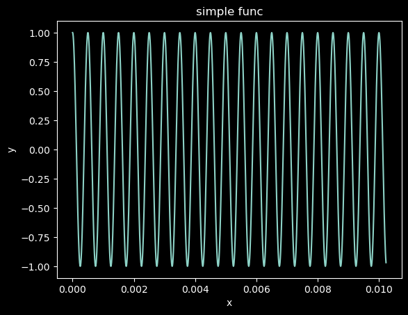
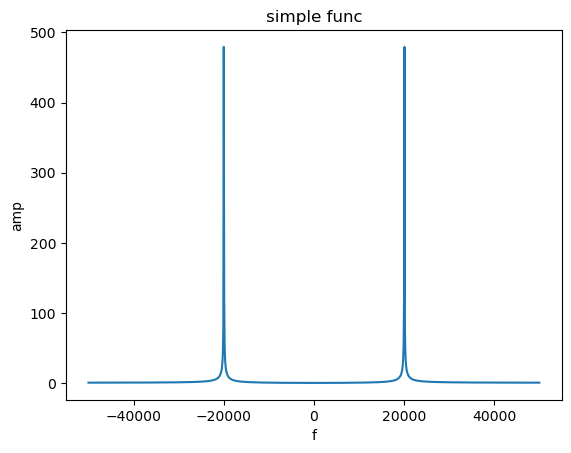

晚上回家尝试学习一些新的东西。感觉python挺好用的，利用Python当中的numpy和和scipy等工具包可以很好地来处理DSP和无线通信相关的算法，因此我觉得可以简单地来了解一下如何使用Python进行DSP的处理。
<!--more-->

## 1. 使用numpy和matplotlib绘制简单的图形
- 绘制简单图形
    使用Python来绘制简单的2D图像是比较简单的，下面就是一个绘制一个简单正弦函数的例子：
    ```python
    import numpy as np
    import matplotlib.pyplot as plt

    fs = 100e3
    fc = 2e3
    num_of_samp = 1024
    t = np.arange(0,num_of_samp)/fs

    signal = np.cos(2*np.pi*fc*t)
    plt.plot(t, signal)
    plt.xlabel('x')
    plt.ylabel('y')
    plt.title("simple func")
    ```
    
    像这种比较简单的问一问chatgpt就可以写出来了，不知道的时候就去问chatgpt，感觉他写这个还挺擅长的。

- 更新绘制图像
  像上面这种图形，如果想要动态地更改，可以修改由plot返回的对象。
    ```py
    import numpy as np
    import matplotlib.pyplot as plt
    import time

    fs = 100e3
    fc = 2e3
    num_of_samp = 1024
    t = np.arange(0,num_of_samp)/fs

    signal = np.cos(2*np.pi*fc*t)
    fig1, ax1 = plt.subplots()
    line, = ax1.plot(t, signal)
    plt.show(block=False)
    for r in range(25):
        fc += 1e2
        signal = np.cos(2*np.pi*fc*t)
        line.set_ydata(signal)
        fig1.canvas.draw()
        fig1.canvas.flush_events()
        time.sleep(0.2)
    ```
## 2. numpy 当中常用的函数与操作
### 2.1.常用函数
np.abs(a) np.fabs(a) : 取各元素的绝对值
np.sqrt(a) : 计算各元素的平方根
np.square(a): 计算各元素的平方
np.log(a) np.log10(a) np.log2(a) : 计算各元素的自然对数、10、2为底的对数
np.ceil(a) np.floor(a) : 计算各元素的ceiling 值， floor值（ceiling向上取整，floor向下取整）
np.rint(a) : 各元素 四舍五入
np.modf(a) : 将数组各元素的小数和整数部分以两个独立数组形式返回
np.exp(a) : 计算各元素的指数值
np.sign(a) : 计算各元素的符号值 1（+），0，-1（-）
np.maximum(a, b) np.fmax() : 比较（或者计算）元素级的最大值
np.minimum(a, b) np.fmin() : 取最小值
np.mod(a, b) : 元素级的模运算
np.copysign(a, b) : 将b中各元素的符号赋值给数组a的对应元素
np.sum(a, axis = None) : 依给定轴axis计算数组a相关元素之和，axis为整数或者元组
np.mean(a, axis = None) : 同理，计算平均值
np.average(a, axis =None, weights=None) : 依给定轴axis计算数组a相关元素的加权平均值
np.std（a, axis = None） ：同理，计算标准差
np.var（a, axis = None）: 计算方差
np.min(a) np.max(a) : 计算数组a的最小值和最大值
np.argmin(a) argmax(a) : 计算数组a的最小、最大值的下标（注：是一维的下标）
np.ptp(a) : 计算数组a最大值和最小值的差
np.median(a) : 计算数组a中元素的中位数（中值）

t = np.arange(start,stop, step, dtype)/
f = np.linspace(start, stop, num, endpoint=True, retstep=False,dtype=None, axis=0)

### 2.2 FFT相关函数
在数字信号处理当中，FFT是一个十分重要的操作，能够完成从时域到频域的转换。其中比较常用的几个和fft操作相关的函数是在numpy的fft包当中.
fft.fft(a, n=None, axis=-1, norm=None): a:输入的数组，n:fft计算的长度
np.fft.fftshift(x) ：用于将FFT变换之后的频谱显示范围从[0,N]转换为[-N/2,N/2 -1] 或者[-(N-1)/2, (N-1)/2],也就是复频谱
np.fft.ifft()： fft的逆变换，从频域到时域
np.fft.ifftshift()： 同前面的fftshift
下面是一个简单的FFT变换的例子：

```python
import numpy as np
import matplotlib.pyplot as plt

fs = 100e3
fc = 20e3
num_of_samp = 1024
t = np.arange(0,num_of_samp)/fs

signal = np.cos(2*np.pi*fc*t)
fft_result = abs(np.fft.fftshift(np.fft.fft(signal)))
f = np.linspace(fs/-2, fs/2, len(fft_result))
plt.plot(f, fft_result)
plt.xlabel('f')
plt.ylabel('amp')
plt.title("simple func")
```
