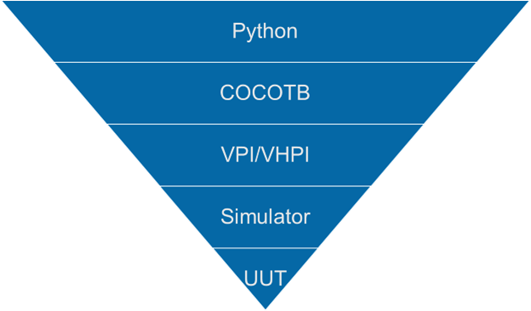
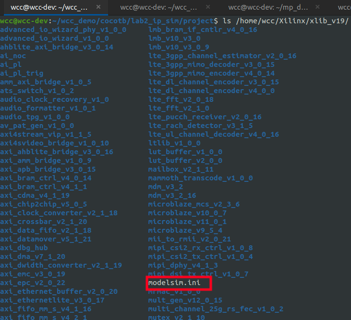
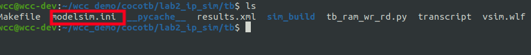
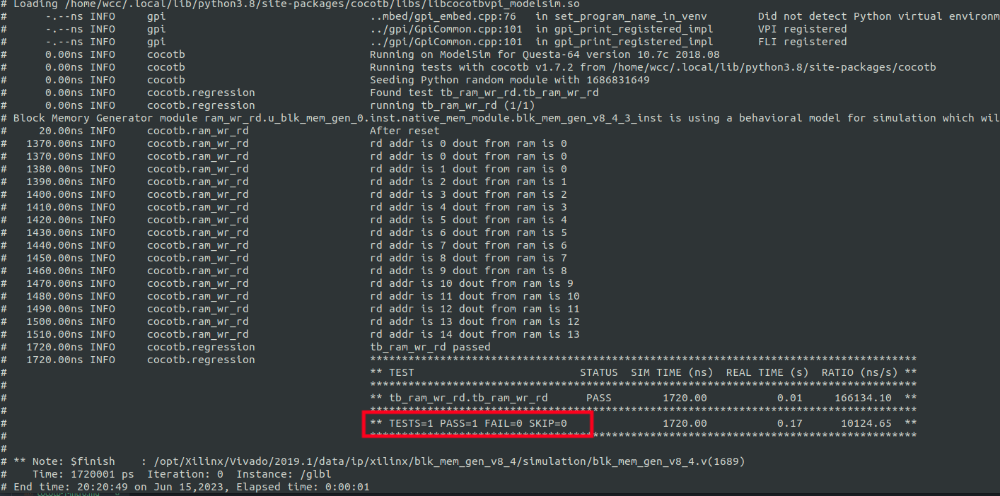
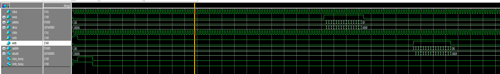

# 前言
模块和顶层测试的验证通常比创建 HDL 更复杂、更耗时。cocotb（基于协程的协同仿真测试平台）是基于 Python 协程的，可以验证 SystemVerilog 和 VHDL，允许开发人员在 Python 中创建测试台，当然，还引入了所有更广泛的 Python 库和框架，除了处理 UUT 的输出之外，它们还可用于创建激励。
在最高层，cocotb 提供了我们选择的仿真工具和 Python 之间的接口。
为了实现这一点，cocotb 使用协程和联合仿真。  协程是 Python 函数，可以自动暂停运行，使多个函数同时运行。  协同仿真意味着设计和测试平台是独立仿真的，这意味着当 Python 运行时，仿真时间不提前。  这是使用模拟器的 Verilog 程序接口 (VPI) 和 VHDL 程序接口 (VHPI) 实现的。
cocotb 的一个重要特色是广泛的社区开发附加功能，这些附加功能提供了一系列总线功能模型，可用于验证具有 AXI 或 Wishbone 接口的模块等。

<!--more-->

# 简单的例子
学习一下使用cocotb的基本流程。为了能够演示在cocotb当中仿真vivado的IP，在这个博客当中会以一个简答的例子来进行仿真。
首先工程的结构怒路如下：其中project目录是vivado的工程目录。rtl是需要仿真的verilog源码，tb文件夹是Makefile和cocotb的testbench。

```bash
wcc@wcc-dev:~/wcc_demo/cocotb/lab2_ip_sim$ tree -L 2
.
├── project
│   ├── project_1.cache
│   ├── project_1.hw
│   ├── project_1.ip_user_files
│   ├── project_1.runs
│   ├── project_1.sim
│   ├── project_1.srcs
│   └── project_1.xpr
├── rtl
│   └── ram_wr_rd.v
└── tb
    ├── Makefile
    └── tb_ram_wr_rd.py
```

首先我们创建一个vivado工程，在vivado当中创建一个BRAM IP。IP 的输入输出位宽为16，深度为32。读出有一拍延时。具体的接口信号如下：
```verilog
blk_mem_gen_0 your_instance_name (
  .clka(clka),            // input wire clka
  .wea(wea),              // input wire [0 : 0] wea
  .addra(addra),          // input wire [4 : 0] addra
  .dina(dina),            // input wire [15 : 0] dina
  .clkb(clkb),            // input wire clkb
  .rstb(rstb),            // input wire rstb
  .enb(enb),              // input wire enb
  .addrb(addrb),          // input wire [4 : 0] addrb
  .doutb(doutb),          // output wire [15 : 0] doutb
  .rsta_busy(rsta_busy),  // output wire rsta_busy
  .rstb_busy(rstb_busy)  // output wire rstb_busy
);
```

接下来我们创建一个verilog模块来例化这个IP：
```verilog
`timescale 1ns / 1ps
module ram_wr_rd(
    input   wire            clk     ,
    input   wire            rst     ,

    input   wire    [4:0]   wr_addr ,
    input   wire            wr_en   ,
    input   wire    [15:0]  wr_data ,

    input   wire            rd_en   ,
    input   wire    [4:0]   rd_addr ,
    output  wire    [15:0]  rd_data 

    );

    wire    rsta_busy   ;
    wire    rstb_busy   ;

    blk_mem_gen_0 u_blk_mem_gen_0 (
        .clka(clk),            // input wire clka
        .wea(wr_en),           // input wire [0 : 0] wea
        .addra(wr_addr),       // input wire [4 : 0] addra
        .dina(wr_data),        // input wire [15 : 0] dina
        .clkb(clk),            // input wire clkb
        .rstb(rst),            // input wire rstb
        .enb(rd_en),           // input wire enb
        .addrb(rd_addr),       // input wire [4 : 0] addrb
        .doutb(rd_data),       // output wire [15 : 0] doutb
        .rsta_busy(rsta_busy), // output wire rsta_busy
        .rstb_busy(rstb_busy)  // output wire rstb_busy
    );

endmodule
```

接下来需要创建testbench了，传统的方式是直接创建.v或者.sv的testbench，然后对待测DUT进行仿真。在使用cocotb的时候，我们只需要使用python就可以进行仿真了。但是在编写python的测试脚本的时候，需要遵循一些特殊的格式才可以。

- 我们的 HDL 文件的顶层作为参数传递到 Python 文件中的异步测试函数，例如被测 test(dut)。我们使用装饰器 @cocotb.test() 将此函数标识为 cocotb 测试
- 我们可以在这个测试函数中访问 dut 层次结构和信号。例如，如果将顶层作为包含信号 clk 的参数 dut 传递给函数，我们可以使用 dut.clk 访问信号时钟。
- 由于我们使用的是同步设计，所以我们需要能够创建一个时钟，而在这种情况下，cocotb 提供了一个时钟生成器功能来生成所需频率的时钟。这可以添加到测试功能的顶部以提供时钟。 
- 如果我们需要在我们的测试函数或其他函数中等待事件，我们可以使用 Python await 函数。  例如，我们可以等待信号的上升/下降沿或等待几个时钟周期。

下面是一个具体的例子：
```python
# Simple tests for an counter module
import cocotb
from cocotb.clock import Clock
from cocotb.triggers import RisingEdge, Timer

async def reset_dut(reset, duration_ns):
    reset.value = 1
    await Timer(duration_ns, units="ns")
    reset.value = 0
    reset._log.debug("reset complete")


async def write_mem(wr_clk, wr_addr, wr_data, wr_en, nums):
    for x in range(nums):
        wr_addr.value = x
        wr_data.value = x
        wr_en.value = 1
        await RisingEdge(wr_clk)


@cocotb.test()
async def tb_ram_wr_rd(dut):
    # generate a clock
    cocotb.start_soon(Clock(dut.clk, 10, units="ns").start())

    # Reset DUT
    dut.wr_addr.value = 0
    dut.wr_en.value = 0
    dut.wr_data.value = 0
    dut.rd_en.value = 0
    dut.rd_addr.value = 0
    dut.rst.value = 1

    await reset_dut(dut.rst, 20)
    dut._log.info("After reset")
    dut.rst.value = 0

    for _ in range(100):
        await RisingEdge(dut.clk)


    await write_mem(dut.clk, dut.wr_addr, dut.wr_data, dut.wr_en, 16)
    dut.wr_en.value = 0
    
    await Timer(200, units="ns")

    for x in range(16):
        dut.rd_addr.value = x
        dut.rd_en.value = 1
        dout = dut.rd_data.value
        dut._log.info("rd addr is %d dout from ram is %d" %(dut.rd_addr, dout))
        await RisingEdge(dut.clk)

    dut.rd_en.value = 0
    dut.rd_addr.value = 0 

    await Timer(200, units="ns")
```

最后，我们还需要编写一个Makefile，这个 makefile 告诉 cocotb 顶层语言、HDL 设计的顶层和 Python 模块名称。  在 makefile 中，我们还可以定义模拟器，以及模拟和编译参数。

Makefile如下：
```makefile
TOPLEVEL_LANG ?= verilog

PWD=$(shell pwd)
TOPDIR=$(PWD)/

SIM ?= questa
WAVES ?= 1
# GUI=1

VERILOG_SOURCES += $(PWD)/../rtl/ram_wr_rd.v
VERILOG_SOURCES += /opt/Xilinx/Vivado/2019.1/data/verilog/src/glbl.v
VERILOG_SOURCES += /opt/Xilinx/Vivado/2019.1/data/verilog/src/unisims/*.v
VHDL_SOURCES += $(PWD)/../project/project_1.srcs/sources_1/ip/blk_mem_gen_0/synth/*.vhd
VERILOG_SOURCES += $(PWD)/../project/project_1.srcs/sources_1/ip/blk_mem_gen_0/sim/*.v
SIM_ARGS = -work xil_defaultlib -L unisims_ver -L unimacro_ver -L secureip -L xpm -L blk_mem_gen_v8_4_3 work.glbl  -voptargs=+acc=rn

TOPLEVEL = ram_wr_rd
MODULE   = tb_ram_wr_rd

include $(shell cocotb-config --makefiles)/Makefile.sim
```
在Makefile上，需要包含待测试的所有源文件。对于IP，也需要添加仿真对应的.v/vhd文件。然后在SIM_ARGS当中，是一些可以作为参数传递个仿真工具的。对于Xilinx的IP，在使用questa进行仿真的时候，需要先编译对应的IP，编译完对应的IP之后，有一个modelsim.ini，里面会包含对应的IP库所在的位置。



```ini
secureip = /home/wcc/Xilinx/xlib_v19/secureip
unisim = /home/wcc/Xilinx/xlib_v19/unisim
unimacro = /home/wcc/Xilinx/xlib_v19/unimacro
unifast = /home/wcc/Xilinx/xlib_v19/unifast
unisims_ver = /home/wcc/Xilinx/xlib_v19/unisims_ver
unimacro_ver = /home/wcc/Xilinx/xlib_v19/unimacro_ver
unifast_ver = /home/wcc/Xilinx/xlib_v19/unifast_ver
simprims_ver = /home/wcc/Xilinx/xlib_v19/simprims_ver
xpm = /home/wcc/Xilinx/xlib_v19/xpm
xilinx_vip = /home/wcc/Xilinx/xlib_v19/xilinx_vip
common_cpp_v1_0 = /home/wcc/Xilinx/xlib_v19/common_cpp_v1_0
xtlm = /home/wcc/Xilinx/xlib_v19/xtlm
axi_tg_sc_v1_0 = /home/wcc/Xilinx/xlib_v19/axi_tg_sc_v1_0
noc_sc_v1_0_0 = /home/wcc/Xilinx/xlib_v19/noc_sc_v1_0_0
remote_port_c_v4 = /home/wcc/Xilinx/xlib_v19/remote_port_c_v4
remote_port_sc_v4 = /home/wcc/Xilinx/xlib_v19/remote_port_sc_v4
xtlm_simple_interconnect_v1_0 = /home/wcc/Xilinx/xlib_v19/xtlm_simple_interconnect_v1_0
debug_tcp_server_v1 = /home/wcc/Xilinx/xlib_v19/debug_tcp_server_v1
rwd_tlmmodel_v1 = /home/wcc/Xilinx/xlib_v19/rwd_tlmmodel_v1
common_rpc_v1 = /home/wcc/Xilinx/xlib_v19/common_rpc_v1
sim_xdma_cpp_v1 = /home/wcc/Xilinx/xlib_v19/sim_xdma_cpp_v1
sim_xdma_sc_v1 = /home/wcc/Xilinx/xlib_v19/sim_xdma_sc_v1
lib_cdc_v1_0_2 = /home/wcc/Xilinx/xlib_v19/lib_cdc_v1_0_2
v_hdmi_rx_v3_0_0 = /home/wcc/Xilinx/xlib_v19/v_hdmi_rx_v3_0_0
bsip_v1_1_0 = /home/wcc/Xilinx/xlib_v19/bsip_v1_1_0
fifo_generator_v13_2_4 = /home/wcc/Xilinx/xlib_v19/fifo_generator_v13_2_4
xaui_v12_3_6 = /home/wcc/Xilinx/xlib_v19/xaui_v12_3_6
axi_lite_ipif_v3_0_4 = /home/wcc/Xilinx/xlib_v19/axi_lite_ipif_v3_0_4
pc_cfr_v6_1_4 = /home/wcc/Xilinx/xlib_v19/pc_cfr_v6_1_4
hbm_v1_0_3 = /home/wcc/Xilinx/xlib_v19/hbm_v1_0_3
v_vid_in_axi4s_v4_0_9 = /home/wcc/Xilinx/xlib_v19/v_vid_in_axi4s_v4_0_9
interlaken_v2_4_3 = /home/wcc/Xilinx/xlib_v19/interlaken_v2_4_3
v_uhdsdi_audio_v2_0_1 = /home/wcc/Xilinx/xlib_v19/v_uhdsdi_audio_v2_0_1
vfb_v1_0_13 = /home/wcc/Xilinx/xlib_v19/vfb_v1_0_13
xxv_ethernet_v2_5_2 = /home/wcc/Xilinx/xlib_v19/xxv_ethernet_v2_5_2
noc_nidb_v1_0_0 = /home/wcc/Xilinx/xlib_v19/noc_nidb_v1_0_0
v_hcresampler_v1_0_13 = /home/wcc/Xilinx/xlib_v19/v_hcresampler_v1_0_13
xxv_ethernet_v3_0_0 = /home/wcc/Xilinx/xlib_v19/xxv_ethernet_v3_0_0
gmii_to_rgmii_v4_0_7 = /home/wcc/Xilinx/xlib_v19/gmii_to_rgmii_v4_0_7
stm_v1_0_0 = /home/wcc/Xilinx/xlib_v19/stm_v1_0_0
mipi_csi2_rx_ctrl_v1_0_8 = /home/wcc/Xilinx/xlib_v19/mipi_csi2_rx_ctrl_v1_0_8
in_system_ibert_v1_0_9 = /home/wcc/Xilinx/xlib_v19/in_system_ibert_v1_0_9
ecc_v2_0_13 = /home/wcc/Xilinx/xlib_v19/ecc_v2_0_13
gtwizard_ultrascale_v1_7_6 = /home/wcc/Xilinx/xlib_v19/gtwizard_ultrascale_v1_7_6
emc_common_v3_0_5 = /home/wcc/Xilinx/xlib_v19/emc_common_v3_0_5
hdcp22_cipher_dp_v1_0_0 = /home/wcc/Xilinx/xlib_v19/hdcp22_cipher_dp_v1_0_0
ethernet_1_10_25g_v2_0_4 = /home/wcc/Xilinx/xlib_v19/ethernet_1_10_25g_v2_0_4
usxgmii_v1_0_5 = /home/wcc/Xilinx/xlib_v19/usxgmii_v1_0_5
fifo_generator_v13_1_4 = /home/wcc/Xilinx/xlib_v19/fifo_generator_v13_1_4
multi_channel_25g_rs_fec_v1_0_2 = /home/wcc/Xilinx/xlib_v19/multi_channel_25g_rs_fec_v1_0_2
high_speed_selectio_wiz_v3_5_1 = /home/wcc/Xilinx/xlib_v19/high_speed_selectio_wiz_v3_5_1
lmb_bram_if_cntlr_v4_0_16 = /home/wcc/Xilinx/xlib_v19/lmb_bram_if_cntlr_v4_0_16
noc_nps_v1_0_0 = /home/wcc/Xilinx/xlib_v19/noc_nps_v1_0_0
ta_dma_v1_0_3 = /home/wcc/Xilinx/xlib_v19/ta_dma_v1_0_3
pci64_v5_0_11 = /home/wcc/Xilinx/xlib_v19/pci64_v5_0_11
util_reduced_logic_v2_0_4 = /home/wcc/Xilinx/xlib_v19/util_reduced_logic_v2_0_4
noc_na_v1_0_0 = /home/wcc/Xilinx/xlib_v19/noc_na_v1_0_0
v_hdmi_rx_v2_0_0 = /home/wcc/Xilinx/xlib_v19/v_hdmi_rx_v2_0_0
v_uhdsdi_vidgen_v1_0_1 = /home/wcc/Xilinx/xlib_v19/v_uhdsdi_vidgen_v1_0_1
v_frmbuf_rd_v2_1_2 = /home/wcc/Xilinx/xlib_v19/v_frmbuf_rd_v2_1_2
v_scenechange_v1_0_1 = /home/wcc/Xilinx/xlib_v19/v_scenechange_v1_0_1
v_mix_v3_0_3 = /home/wcc/Xilinx/xlib_v19/v_mix_v3_0_3
lmb_v10_v3_0_9 = /home/wcc/Xilinx/xlib_v19/lmb_v10_v3_0_9
axi_tg_lib = /home/wcc/Xilinx/xlib_v19/axi_tg_lib
v_demosaic_v1_0_5 = /home/wcc/Xilinx/xlib_v19/v_demosaic_v1_0_5
iomodule_v3_1_4 = /home/wcc/Xilinx/xlib_v19/iomodule_v3_1_4
jesd204_v7_2_6 = /home/wcc/Xilinx/xlib_v19/jesd204_v7_2_6
tmr_manager_v1_0_4 = /home/wcc/Xilinx/xlib_v19/tmr_manager_v1_0_4
ieee802d3_clause74_fec_v1_0_4 = /home/wcc/Xilinx/xlib_v19/ieee802d3_clause74_fec_v1_0_4
tcc_decoder_3gpplte_v3_0_6 = /home/wcc/Xilinx/xlib_v19/tcc_decoder_3gpplte_v3_0_6
rama_v1_1_1_lib = /home/wcc/Xilinx/xlib_v19/rama_v1_1_1_lib
ibert_lib_v1_0_6 = /home/wcc/Xilinx/xlib_v19/ibert_lib_v1_0_6
gig_ethernet_pcs_pma_v16_1_6 = /home/wcc/Xilinx/xlib_v19/gig_ethernet_pcs_pma_v16_1_6
axi_bram_ctrl_v4_1_1 = /home/wcc/Xilinx/xlib_v19/axi_bram_ctrl_v4_1_1
advanced_io_wizard_v1_0_0 = /home/wcc/Xilinx/xlib_v19/advanced_io_wizard_v1_0_0
timer_sync_1588_v1_2_4 = /home/wcc/Xilinx/xlib_v19/timer_sync_1588_v1_2_4
v_smpte_uhdsdi_rx_v1_0_0 = /home/wcc/Xilinx/xlib_v19/v_smpte_uhdsdi_rx_v1_0_0
pc_cfr_v6_3_0 = /home/wcc/Xilinx/xlib_v19/pc_cfr_v6_3_0
ten_gig_eth_mac_v15_1_7 = /home/wcc/Xilinx/xlib_v19/ten_gig_eth_mac_v15_1_7
jesd204c_v4_1_0 = /home/wcc/Xilinx/xlib_v19/jesd204c_v4_1_0
nvmeha_v1_0_0 = /home/wcc/Xilinx/xlib_v19/nvmeha_v1_0_0
jtag_axi = /home/wcc/Xilinx/xlib_v19/jtag_axi
mutex_v2_1_10 = /home/wcc/Xilinx/xlib_v19/mutex_v2_1_10
advanced_io_wizard_phy_v1_0_0 = /home/wcc/Xilinx/xlib_v19/advanced_io_wizard_phy_v1_0_0
qdma_v3_0_1 = /home/wcc/Xilinx/xlib_v19/qdma_v3_0_1
vid_phy_controller_v2_2_3 = /home/wcc/Xilinx/xlib_v19/vid_phy_controller_v2_2_3
util_idelay_ctrl_v1_0_1 = /home/wcc/Xilinx/xlib_v19/util_idelay_ctrl_v1_0_1
v_hdmi_tx_v3_0_0 = /home/wcc/Xilinx/xlib_v19/v_hdmi_tx_v3_0_0
sim_clk_gen_v1_0_2 = /home/wcc/Xilinx/xlib_v19/sim_clk_gen_v1_0_2
shell_utils_msp432_bsl_crc_gen_v1_0_0 = /home/wcc/Xilinx/xlib_v19/shell_utils_msp432_bsl_crc_gen_v1_0_0
uhdsdi_gt_v1_0_3 = /home/wcc/Xilinx/xlib_v19/uhdsdi_gt_v1_0_3
emb_fifo_gen_v1_0_1 = /home/wcc/Xilinx/xlib_v19/emb_fifo_gen_v1_0_1
cmac_v2_5_0 = /home/wcc/Xilinx/xlib_v19/cmac_v2_5_0
ethernet_1_10_25g_v2_2_2 = /home/wcc/Xilinx/xlib_v19/ethernet_1_10_25g_v2_2_2
cmac_usplus_v2_4_5 = /home/wcc/Xilinx/xlib_v19/cmac_usplus_v2_4_5
axi_amm_bridge_v1_0_9 = /home/wcc/Xilinx/xlib_v19/axi_amm_bridge_v1_0_9
tmr_inject_v1_0_3 = /home/wcc/Xilinx/xlib_v19/tmr_inject_v1_0_3
axi_pcie3_v3_0_9 = /home/wcc/Xilinx/xlib_v19/axi_pcie3_v3_0_9
i2s_receiver_v1_0_3 = /home/wcc/Xilinx/xlib_v19/i2s_receiver_v1_0_3
ai_noc = /home/wcc/Xilinx/xlib_v19/ai_noc
lut_buffer_v2_0_0 = /home/wcc/Xilinx/xlib_v19/lut_buffer_v2_0_0
xsdbm_v2_0_0 = /home/wcc/Xilinx/xlib_v19/xsdbm_v2_0_0
cmac_usplus_v2_5_1 = /home/wcc/Xilinx/xlib_v19/cmac_usplus_v2_5_1
l_ethernet_v2_3_5 = /home/wcc/Xilinx/xlib_v19/l_ethernet_v2_3_5
util_vector_logic_v2_0_1 = /home/wcc/Xilinx/xlib_v19/util_vector_logic_v2_0_1
av_pat_gen_v1_0_0 = /home/wcc/Xilinx/xlib_v19/av_pat_gen_v1_0_0
zynq_ultra_ps_e_v3_3_0 = /home/wcc/Xilinx/xlib_v19/zynq_ultra_ps_e_v3_3_0
v_uhdsdi_audio_v1_0_0 = /home/wcc/Xilinx/xlib_v19/v_uhdsdi_audio_v1_0_0
mammoth_transcode_v1_0_0 = /home/wcc/Xilinx/xlib_v19/mammoth_transcode_v1_0_0
pcie_jtag_v1_0_0 = /home/wcc/Xilinx/xlib_v19/pcie_jtag_v1_0_0
axi_ahblite_bridge_v3_0_16 = /home/wcc/Xilinx/xlib_v19/axi_ahblite_bridge_v3_0_16
picxo = /home/wcc/Xilinx/xlib_v19/picxo
pc_cfr_v6_0_8 = /home/wcc/Xilinx/xlib_v19/pc_cfr_v6_0_8
sem_v4_1_12 = /home/wcc/Xilinx/xlib_v19/sem_v4_1_12
axi_infrastructure_v1_1_0 = /home/wcc/Xilinx/xlib_v19/axi_infrastructure_v1_1_0
i2s_transmitter_v1_0_3 = /home/wcc/Xilinx/xlib_v19/i2s_transmitter_v1_0_3
ten_gig_eth_pcs_pma_v6_0_15 = /home/wcc/Xilinx/xlib_v19/ten_gig_eth_pcs_pma_v6_0_15
rst_vip_v1_0_3 = /home/wcc/Xilinx/xlib_v19/rst_vip_v1_0_3
compact_gt_v1_0_5 = /home/wcc/Xilinx/xlib_v19/compact_gt_v1_0_5
rld3_pl_v1_0_1 = /home/wcc/Xilinx/xlib_v19/rld3_pl_v1_0_1
versal_cips_v1_0_0 = /home/wcc/Xilinx/xlib_v19/versal_cips_v1_0_0
axi_dbg_hub = /home/wcc/Xilinx/xlib_v19/axi_dbg_hub
hdmi_gt_controller_v1_0_0 = /home/wcc/Xilinx/xlib_v19/hdmi_gt_controller_v1_0_0
axi_perf_mon_v5_0_21 = /home/wcc/Xilinx/xlib_v19/axi_perf_mon_v5_0_21
mrmac_v1_0_0 = /home/wcc/Xilinx/xlib_v19/mrmac_v1_0_0
blk_mem_gen_v8_4_3 = /home/wcc/Xilinx/xlib_v19/blk_mem_gen_v8_4_3
dist_mem_gen_v8_0_13 = /home/wcc/Xilinx/xlib_v19/dist_mem_gen_v8_0_13
bs_mux_v1_0_0 = /home/wcc/Xilinx/xlib_v19/bs_mux_v1_0_0
v_deinterlacer_v4_0_12 = /home/wcc/Xilinx/xlib_v19/v_deinterlacer_v4_0_12
axi_jtag_v1_0_0 = /home/wcc/Xilinx/xlib_v19/axi_jtag_v1_0_0
l_ethernet_v2_5_0 = /home/wcc/Xilinx/xlib_v19/l_ethernet_v2_5_0
emb_mem_gen_v1_0_1 = /home/wcc/Xilinx/xlib_v19/emb_mem_gen_v1_0_1
l_ethernet_v2_4_1 = /home/wcc/Xilinx/xlib_v19/l_ethernet_v2_4_1
ddr4_pl_phy_v1_0_0 = /home/wcc/Xilinx/xlib_v19/ddr4_pl_phy_v1_0_0
generic_baseblocks_v2_1_0 = /home/wcc/Xilinx/xlib_v19/generic_baseblocks_v2_1_0
zynq_ultra_ps_e_v3_2_3 = /home/wcc/Xilinx/xlib_v19/zynq_ultra_ps_e_v3_2_3
xlconstant_v1_1_6 = /home/wcc/Xilinx/xlib_v19/xlconstant_v1_1_6
v_hdmi_tx_v2_0_0 = /home/wcc/Xilinx/xlib_v19/v_hdmi_tx_v2_0_0
noc_nmu_v1_0_0 = /home/wcc/Xilinx/xlib_v19/noc_nmu_v1_0_0
ltlib_v1_0_0 = /home/wcc/Xilinx/xlib_v19/ltlib_v1_0_0
video_frame_crc_v1_0_1 = /home/wcc/Xilinx/xlib_v19/video_frame_crc_v1_0_1
gtwizard_ultrascale_v1_6_11 = /home/wcc/Xilinx/xlib_v19/gtwizard_ultrascale_v1_6_11
gigantic_mux = /home/wcc/Xilinx/xlib_v19/gigantic_mux
sem_ultra_v3_1_11 = /home/wcc/Xilinx/xlib_v19/sem_ultra_v3_1_11
mii_to_rmii_v2_0_21 = /home/wcc/Xilinx/xlib_v19/mii_to_rmii_v2_0_21
mipi_csi2_tx_ctrl_v1_0_4 = /home/wcc/Xilinx/xlib_v19/mipi_csi2_tx_ctrl_v1_0_4
hdcp_keymngmt_blk_v1_0_0 = /home/wcc/Xilinx/xlib_v19/hdcp_keymngmt_blk_v1_0_0
tmr_voter_v1_0_2 = /home/wcc/Xilinx/xlib_v19/tmr_voter_v1_0_2
xhmc_v1_0_9 = /home/wcc/Xilinx/xlib_v19/xhmc_v1_0_9
oddr_v1_0_0 = /home/wcc/Xilinx/xlib_v19/oddr_v1_0_0
v_vscaler_v1_0_13 = /home/wcc/Xilinx/xlib_v19/v_vscaler_v1_0_13
v_csc_v1_0_13 = /home/wcc/Xilinx/xlib_v19/v_csc_v1_0_13
lib_pkg_v1_0_2 = /home/wcc/Xilinx/xlib_v19/lib_pkg_v1_0_2
lut_buffer_v1_0_0 = /home/wcc/Xilinx/xlib_v19/lut_buffer_v1_0_0
fit_timer_v2_0_10 = /home/wcc/Xilinx/xlib_v19/fit_timer_v2_0_10
v_tpg_v8_0_1 = /home/wcc/Xilinx/xlib_v19/v_tpg_v8_0_1
v_smpte_sdi_v3_0_8 = /home/wcc/Xilinx/xlib_v19/v_smpte_sdi_v3_0_8
axis_infrastructure_v1_1_0 = /home/wcc/Xilinx/xlib_v19/axis_infrastructure_v1_1_0
xlconcat_v2_1_3 = /home/wcc/Xilinx/xlib_v19/xlconcat_v2_1_3
ai_pl_trig = /home/wcc/Xilinx/xlib_v19/ai_pl_trig
ethernet_1_10_25g_v2_1_3 = /home/wcc/Xilinx/xlib_v19/ethernet_1_10_25g_v2_1_3
audio_clock_recovery_v1_0 = /home/wcc/Xilinx/xlib_v19/audio_clock_recovery_v1_0
ahblite_axi_bridge_v3_0_14 = /home/wcc/Xilinx/xlib_v19/ahblite_axi_bridge_v3_0_14
hdcp22_rng_v1_0_1 = /home/wcc/Xilinx/xlib_v19/hdcp22_rng_v1_0_1
axi_chip2chip_v5_0_5 = /home/wcc/Xilinx/xlib_v19/axi_chip2chip_v5_0_5
blk_mem_gen_v8_3_6 = /home/wcc/Xilinx/xlib_v19/blk_mem_gen_v8_3_6
sim_rst_gen_v1_0_2 = /home/wcc/Xilinx/xlib_v19/sim_rst_gen_v1_0_2
v_frmbuf_wr_v2_1_2 = /home/wcc/Xilinx/xlib_v19/v_frmbuf_wr_v2_1_2
roe_framer_v2_0_0 = /home/wcc/Xilinx/xlib_v19/roe_framer_v2_0_0
mipi_dsi_tx_ctrl_v1_0_7 = /home/wcc/Xilinx/xlib_v19/mipi_dsi_tx_ctrl_v1_0_7
v_axi4s_remap_v1_0_11 = /home/wcc/Xilinx/xlib_v19/v_axi4s_remap_v1_0_11
v_vcresampler_v1_0_13 = /home/wcc/Xilinx/xlib_v19/v_vcresampler_v1_0_13
xbip_utils_v3_0_10 = /home/wcc/Xilinx/xlib_v19/xbip_utils_v3_0_10
v_hscaler_v1_0_13 = /home/wcc/Xilinx/xlib_v19/v_hscaler_v1_0_13
high_speed_selectio_wiz_v3_4_1 = /home/wcc/Xilinx/xlib_v19/high_speed_selectio_wiz_v3_4_1
v_sdi_rx_vid_bridge_v2_0_0 = /home/wcc/Xilinx/xlib_v19/v_sdi_rx_vid_bridge_v2_0_0
v_mix_v4_0_0 = /home/wcc/Xilinx/xlib_v19/v_mix_v4_0_0
hdcp22_cipher_v1_0_3 = /home/wcc/Xilinx/xlib_v19/hdcp22_cipher_v1_0_3
v_letterbox_v1_0_13 = /home/wcc/Xilinx/xlib_v19/v_letterbox_v1_0_13
xxv_ethernet_v2_4_4 = /home/wcc/Xilinx/xlib_v19/xxv_ethernet_v2_4_4
xdma_v4_1_3 = /home/wcc/Xilinx/xlib_v19/xdma_v4_1_3
v_gamma_lut_v1_0_5 = /home/wcc/Xilinx/xlib_v19/v_gamma_lut_v1_0_5
uhdsdi_gt_v2_0_0 = /home/wcc/Xilinx/xlib_v19/uhdsdi_gt_v2_0_0
pci32_v5_0_12 = /home/wcc/Xilinx/xlib_v19/pci32_v5_0_12
cmac_v2_3_5 = /home/wcc/Xilinx/xlib_v19/cmac_v2_3_5
sd_fec_v1_0_2 = /home/wcc/Xilinx/xlib_v19/sd_fec_v1_0_2
hdcp_v1_0_3 = /home/wcc/Xilinx/xlib_v19/hdcp_v1_0_3
microblaze_v11_0_1 = /home/wcc/Xilinx/xlib_v19/microblaze_v11_0_1
v_deinterlacer_v5_0_13 = /home/wcc/Xilinx/xlib_v19/v_deinterlacer_v5_0_13
xlslice_v1_0_2 = /home/wcc/Xilinx/xlib_v19/xlslice_v1_0_2
rld3_pl_phy_v1_0_0 = /home/wcc/Xilinx/xlib_v19/rld3_pl_phy_v1_0_0
mipi_dphy_v4_1_3 = /home/wcc/Xilinx/xlib_v19/mipi_dphy_v4_1_3
system_cache_v4_0_6 = /home/wcc/Xilinx/xlib_v19/system_cache_v4_0_6
axi_pmon_v1_0_0 = /home/wcc/Xilinx/xlib_v19/axi_pmon_v1_0_0
cmac_usplus_v2_6_0 = /home/wcc/Xilinx/xlib_v19/cmac_usplus_v2_6_0
vid_edid_v1_0_0 = /home/wcc/Xilinx/xlib_v19/vid_edid_v1_0_0
stm_v1_0 = /home/wcc/Xilinx/xlib_v19/stm_v1_0
sim_trig_top_v1_0 = /home/wcc/Xilinx/xlib_v19/sim_trig_top_v1_0
fifo_generator_v13_0_6 = /home/wcc/Xilinx/xlib_v19/fifo_generator_v13_0_6
microblaze_v10_0_7 = /home/wcc/Xilinx/xlib_v19/microblaze_v10_0_7
smartconnect_v1_0 = /home/wcc/Xilinx/xlib_v19/smartconnect_v1_0
v_multi_scaler_v1_0_1 = /home/wcc/Xilinx/xlib_v19/v_multi_scaler_v1_0_1
xbip_dsp48_wrapper_v3_0_4 = /home/wcc/Xilinx/xlib_v19/xbip_dsp48_wrapper_v3_0_4
high_speed_selectio_wiz_v3_2_3 = /home/wcc/Xilinx/xlib_v19/high_speed_selectio_wiz_v3_2_3
v_uhdsdi_audio_v1_1_0 = /home/wcc/Xilinx/xlib_v19/v_uhdsdi_audio_v1_1_0
cmac_v2_4_1 = /home/wcc/Xilinx/xlib_v19/cmac_v2_4_1
axis_protocol_checker_v2_0_3 = /home/wcc/Xilinx/xlib_v19/axis_protocol_checker_v2_0_3
ethernet_1_10_25g_v2_3_0 = /home/wcc/Xilinx/xlib_v19/ethernet_1_10_25g_v2_3_0
pc_cfr_v6_2_2 = /home/wcc/Xilinx/xlib_v19/pc_cfr_v6_2_2
high_speed_selectio_wiz_v3_3_1 = /home/wcc/Xilinx/xlib_v19/high_speed_selectio_wiz_v3_3_1
microblaze_v9_5_4 = /home/wcc/Xilinx/xlib_v19/microblaze_v9_5_4
ddr4_pl_v1_0_2 = /home/wcc/Xilinx/xlib_v19/ddr4_pl_v1_0_2
v_tpg_v7_0_13 = /home/wcc/Xilinx/xlib_v19/v_tpg_v7_0_13
tsn_endpoint_ethernet_mac_block_v1_0_4 = /home/wcc/Xilinx/xlib_v19/tsn_endpoint_ethernet_mac_block_v1_0_4
usxgmii_v1_1_0 = /home/wcc/Xilinx/xlib_v19/usxgmii_v1_1_0
vid_phy_controller_v2_1_5 = /home/wcc/Xilinx/xlib_v19/vid_phy_controller_v2_1_5
ba317 = /home/wcc/Xilinx/xlib_v19/ba317
v_smpte_uhdsdi_tx_v1_0_0 = /home/wcc/Xilinx/xlib_v19/v_smpte_uhdsdi_tx_v1_0_0
clk_vip_v1_0_2 = /home/wcc/Xilinx/xlib_v19/clk_vip_v1_0_2
xsdbm_v3_0_0 = /home/wcc/Xilinx/xlib_v19/xsdbm_v3_0_0
clk_gen_sim_v1_0_0 = /home/wcc/Xilinx/xlib_v19/clk_gen_sim_v1_0_0
gtwizard_ultrascale_v1_5_4 = /home/wcc/Xilinx/xlib_v19/gtwizard_ultrascale_v1_5_4
audio_tpg_v1_0_0 = /home/wcc/Xilinx/xlib_v19/audio_tpg_v1_0_0
v_smpte_uhdsdi_v1_0_7 = /home/wcc/Xilinx/xlib_v19/v_smpte_uhdsdi_v1_0_7
ai_pl = /home/wcc/Xilinx/xlib_v19/ai_pl
quadsgmii_v3_4_6 = /home/wcc/Xilinx/xlib_v19/quadsgmii_v3_4_6
displayport_v7_0_11 = /home/wcc/Xilinx/xlib_v19/displayport_v7_0_11
xbip_pipe_v3_0_6 = /home/wcc/Xilinx/xlib_v19/xbip_pipe_v3_0_6
xbip_dsp48_addsub_v3_0_6 = /home/wcc/Xilinx/xlib_v19/xbip_dsp48_addsub_v3_0_6
xbip_addsub_v3_0_6 = /home/wcc/Xilinx/xlib_v19/xbip_addsub_v3_0_6
xbip_bram18k_v3_0_6 = /home/wcc/Xilinx/xlib_v19/xbip_bram18k_v3_0_6
mult_gen_v12_0_15 = /home/wcc/Xilinx/xlib_v19/mult_gen_v12_0_15
axi_utils_v2_0_6 = /home/wcc/Xilinx/xlib_v19/axi_utils_v2_0_6
floating_point_v7_0_16 = /home/wcc/Xilinx/xlib_v19/floating_point_v7_0_16
cmpy_v6_0_17 = /home/wcc/Xilinx/xlib_v19/cmpy_v6_0_17
c_reg_fd_v12_0_6 = /home/wcc/Xilinx/xlib_v19/c_reg_fd_v12_0_6
c_mux_bit_v12_0_6 = /home/wcc/Xilinx/xlib_v19/c_mux_bit_v12_0_6
c_shift_ram_v12_0_13 = /home/wcc/Xilinx/xlib_v19/c_shift_ram_v12_0_13
c_addsub_v12_0_13 = /home/wcc/Xilinx/xlib_v19/c_addsub_v12_0_13
xfft_v7_2_9 = /home/wcc/Xilinx/xlib_v19/xfft_v7_2_9
axi_data_fifo_v2_1_18 = /home/wcc/Xilinx/xlib_v19/axi_data_fifo_v2_1_18
ieee802d3_200g_rs_fec_v1_0_6 = /home/wcc/Xilinx/xlib_v19/ieee802d3_200g_rs_fec_v1_0_6
axis_broadcaster_v1_1_18 = /home/wcc/Xilinx/xlib_v19/axis_broadcaster_v1_1_18
lte_fft_v2_0_18 = /home/wcc/Xilinx/xlib_v19/lte_fft_v2_0_18
xbip_dsp48_multadd_v3_0_6 = /home/wcc/Xilinx/xlib_v19/xbip_dsp48_multadd_v3_0_6
dds_compiler_v6_0_18 = /home/wcc/Xilinx/xlib_v19/dds_compiler_v6_0_18
fir_compiler_v7_2_12 = /home/wcc/Xilinx/xlib_v19/fir_compiler_v7_2_12
xbip_multadd_v3_0_14 = /home/wcc/Xilinx/xlib_v19/xbip_multadd_v3_0_14
xbip_dsp48_mult_v3_0_6 = /home/wcc/Xilinx/xlib_v19/xbip_dsp48_mult_v3_0_6
lte_rach_detector_v3_1_5 = /home/wcc/Xilinx/xlib_v19/lte_rach_detector_v3_1_5
v_tc_v6_1_13 = /home/wcc/Xilinx/xlib_v19/v_tc_v6_1_13
v_rgb2ycrcb_v7_1_13 = /home/wcc/Xilinx/xlib_v19/v_rgb2ycrcb_v7_1_13
axis_data_fifo_v2_0_1 = /home/wcc/Xilinx/xlib_v19/axis_data_fifo_v2_0_1
soft_ecc_proxy_v1_0_0 = /home/wcc/Xilinx/xlib_v19/soft_ecc_proxy_v1_0_0
axi_sideband_util_v1_0_3 = /home/wcc/Xilinx/xlib_v19/axi_sideband_util_v1_0_3
lib_fifo_v1_0_13 = /home/wcc/Xilinx/xlib_v19/lib_fifo_v1_0_13
lib_bmg_v1_0_12 = /home/wcc/Xilinx/xlib_v19/lib_bmg_v1_0_12
etrnic_v1_0_3 = /home/wcc/Xilinx/xlib_v19/etrnic_v1_0_3
xbip_dsp48_acc_v3_0_6 = /home/wcc/Xilinx/xlib_v19/xbip_dsp48_acc_v3_0_6
xbip_accum_v3_0_6 = /home/wcc/Xilinx/xlib_v19/xbip_accum_v3_0_6
axi_epc_v2_0_22 = /home/wcc/Xilinx/xlib_v19/axi_epc_v2_0_22
c_gate_bit_v12_0_6 = /home/wcc/Xilinx/xlib_v19/c_gate_bit_v12_0_6
xbip_counter_v3_0_6 = /home/wcc/Xilinx/xlib_v19/xbip_counter_v3_0_6
c_counter_binary_v12_0_13 = /home/wcc/Xilinx/xlib_v19/c_counter_binary_v12_0_13
lib_srl_fifo_v1_0_2 = /home/wcc/Xilinx/xlib_v19/lib_srl_fifo_v1_0_2
prc_v1_3_2 = /home/wcc/Xilinx/xlib_v19/prc_v1_3_2
axi_clock_converter_v2_1_18 = /home/wcc/Xilinx/xlib_v19/axi_clock_converter_v2_1_18
axi_register_slice_v2_1_19 = /home/wcc/Xilinx/xlib_v19/axi_register_slice_v2_1_19
axi_protocol_converter_v2_1_19 = /home/wcc/Xilinx/xlib_v19/axi_protocol_converter_v2_1_19
axi_dwidth_converter_v2_1_19 = /home/wcc/Xilinx/xlib_v19/axi_dwidth_converter_v2_1_19
axi_msg_v1_0_5 = /home/wcc/Xilinx/xlib_v19/axi_msg_v1_0_5
cic_compiler_v4_0_14 = /home/wcc/Xilinx/xlib_v19/cic_compiler_v4_0_14
interrupt_control_v3_1_4 = /home/wcc/Xilinx/xlib_v19/interrupt_control_v3_1_4
axi_hwicap_v3_0_23 = /home/wcc/Xilinx/xlib_v19/axi_hwicap_v3_0_23
g975_efec_i7_v2_0_18 = /home/wcc/Xilinx/xlib_v19/g975_efec_i7_v2_0_18
v_enhance_v8_0_15 = /home/wcc/Xilinx/xlib_v19/v_enhance_v8_0_15
rxaui_v4_4_6 = /home/wcc/Xilinx/xlib_v19/rxaui_v4_4_6
lte_3gpp_mimo_encoder_v4_0_14 = /home/wcc/Xilinx/xlib_v19/lte_3gpp_mimo_encoder_v4_0_14
axis_clock_converter_v1_1_20 = /home/wcc/Xilinx/xlib_v19/axis_clock_converter_v1_1_20
flexo_100g_rs_fec_v1_0_10 = /home/wcc/Xilinx/xlib_v19/flexo_100g_rs_fec_v1_0_10
xsdbs_v1_0_2 = /home/wcc/Xilinx/xlib_v19/xsdbs_v1_0_2
axis_register_slice_v1_1_19 = /home/wcc/Xilinx/xlib_v19/axis_register_slice_v1_1_19
axis_switch_v1_1_19 = /home/wcc/Xilinx/xlib_v19/axis_switch_v1_1_19
sync_ip = /home/wcc/Xilinx/xlib_v19/sync_ip
fec_5g_common_v1_1_1 = /home/wcc/Xilinx/xlib_v19/fec_5g_common_v1_1_1
xbip_dsp48_macro_v3_0_17 = /home/wcc/Xilinx/xlib_v19/xbip_dsp48_macro_v3_0_17
floating_point_v7_1_8 = /home/wcc/Xilinx/xlib_v19/floating_point_v7_1_8
axis_dwidth_converter_v1_1_18 = /home/wcc/Xilinx/xlib_v19/axis_dwidth_converter_v1_1_18
ieee802d3_50g_rs_fec_v2_0_0 = /home/wcc/Xilinx/xlib_v19/ieee802d3_50g_rs_fec_v2_0_0
proc_sys_reset_v5_0_13 = /home/wcc/Xilinx/xlib_v19/proc_sys_reset_v5_0_13
axi_datamover_v5_1_21 = /home/wcc/Xilinx/xlib_v19/axi_datamover_v5_1_21
axi_vdma_v6_3_7 = /home/wcc/Xilinx/xlib_v19/axi_vdma_v6_3_7
ieee802d3_400g_rs_fec_v1_0_6 = /home/wcc/Xilinx/xlib_v19/ieee802d3_400g_rs_fec_v1_0_6
bs_switch_v1_0_0 = /home/wcc/Xilinx/xlib_v19/bs_switch_v1_0_0
axi_uart16550_v2_0_21 = /home/wcc/Xilinx/xlib_v19/axi_uart16550_v2_0_21
audio_formatter_v1_0_1 = /home/wcc/Xilinx/xlib_v19/audio_formatter_v1_0_1
v_gamma_v7_0_15 = /home/wcc/Xilinx/xlib_v19/v_gamma_v7_0_15
tmr_sem_v1_0_8 = /home/wcc/Xilinx/xlib_v19/tmr_sem_v1_0_8
dp_videoaxi4s_bridge_v1_0_0 = /home/wcc/Xilinx/xlib_v19/dp_videoaxi4s_bridge_v1_0_0
c_compare_v12_0_6 = /home/wcc/Xilinx/xlib_v19/c_compare_v12_0_6
c_mux_bus_v12_0_6 = /home/wcc/Xilinx/xlib_v19/c_mux_bus_v12_0_6
rs_toolbox_v9_0_7 = /home/wcc/Xilinx/xlib_v19/rs_toolbox_v9_0_7
rs_encoder_v9_0_15 = /home/wcc/Xilinx/xlib_v19/rs_encoder_v9_0_15
v_axi4s_vid_out_v4_0_10 = /home/wcc/Xilinx/xlib_v19/v_axi4s_vid_out_v4_0_10
axi4svideo_bridge_v1_0_10 = /home/wcc/Xilinx/xlib_v19/axi4svideo_bridge_v1_0_10
axi4stream_vip_v1_1_5 = /home/wcc/Xilinx/xlib_v19/axi4stream_vip_v1_1_5
axi_vip_v1_1_5 = /home/wcc/Xilinx/xlib_v19/axi_vip_v1_1_5
perf_axi_tg_v1_0_8 = /home/wcc/Xilinx/xlib_v19/perf_axi_tg_v1_0_8
zynq_ultra_ps_e_vip_v1_0_5 = /home/wcc/Xilinx/xlib_v19/zynq_ultra_ps_e_vip_v1_0_5
v_cresample_v4_0_14 = /home/wcc/Xilinx/xlib_v19/v_cresample_v4_0_14
xfft_v9_0_17 = /home/wcc/Xilinx/xlib_v19/xfft_v9_0_17
v_cfa_v7_0_14 = /home/wcc/Xilinx/xlib_v19/v_cfa_v7_0_14
axi_fifo_mm_s_v4_2_1 = /home/wcc/Xilinx/xlib_v19/axi_fifo_mm_s_v4_2_1
axi_vfifo_ctrl_v2_0_21 = /home/wcc/Xilinx/xlib_v19/axi_vfifo_ctrl_v2_0_21
pr_axi_shutdown_manager_v1_0_1 = /home/wcc/Xilinx/xlib_v19/pr_axi_shutdown_manager_v1_0_1
axi_firewall_v1_0_7 = /home/wcc/Xilinx/xlib_v19/axi_firewall_v1_0_7
canfd_v2_0_1 = /home/wcc/Xilinx/xlib_v19/canfd_v2_0_1
iomodule_v3_0 = /home/wcc/Xilinx/xlib_v19/iomodule_v3_0
lmb_bram_if_cntlr_v4_0 = /home/wcc/Xilinx/xlib_v19/lmb_bram_if_cntlr_v4_0
lmb_v10_v3_0 = /home/wcc/Xilinx/xlib_v19/lmb_v10_v3_0
axi_lite_ipif_v3_0 = /home/wcc/Xilinx/xlib_v19/axi_lite_ipif_v3_0
mdm_v3_2 = /home/wcc/Xilinx/xlib_v19/mdm_v3_2
microblaze_mcs_v2_3_6 = /home/wcc/Xilinx/xlib_v19/microblaze_mcs_v2_3_6
xbip_dsp48_multacc_v3_0_6 = /home/wcc/Xilinx/xlib_v19/xbip_dsp48_multacc_v3_0_6
lte_pucch_receiver_v2_0_16 = /home/wcc/Xilinx/xlib_v19/lte_pucch_receiver_v2_0_16
spdif_v2_0_21 = /home/wcc/Xilinx/xlib_v19/spdif_v2_0_21
mdm_v3_2_16 = /home/wcc/Xilinx/xlib_v19/mdm_v3_2_16
xfft_v9_1_2 = /home/wcc/Xilinx/xlib_v19/xfft_v9_1_2
lte_fft_v2_1_0 = /home/wcc/Xilinx/xlib_v19/lte_fft_v2_1_0
dsp_macro_v1_0_0 = /home/wcc/Xilinx/xlib_v19/dsp_macro_v1_0_0
v_ccm_v6_0_15 = /home/wcc/Xilinx/xlib_v19/v_ccm_v6_0_15
axi_mm2s_mapper_v1_1_18 = /home/wcc/Xilinx/xlib_v19/axi_mm2s_mapper_v1_1_18
g975_efec_i4_v1_0_17 = /home/wcc/Xilinx/xlib_v19/g975_efec_i4_v1_0_17
g709_rs_encoder_v2_2_6 = /home/wcc/Xilinx/xlib_v19/g709_rs_encoder_v2_2_6
g709_rs_decoder_v2_2_8 = /home/wcc/Xilinx/xlib_v19/g709_rs_decoder_v2_2_8
axi_ethernet_buffer_v2_0_20 = /home/wcc/Xilinx/xlib_v19/axi_ethernet_buffer_v2_0_20
rs_decoder_v9_0_16 = /home/wcc/Xilinx/xlib_v19/rs_decoder_v9_0_16
axis_subset_converter_v1_1_19 = /home/wcc/Xilinx/xlib_v19/axis_subset_converter_v1_1_19
mailbox_v2_1_11 = /home/wcc/Xilinx/xlib_v19/mailbox_v2_1_11
c_accum_v12_0_13 = /home/wcc/Xilinx/xlib_v19/c_accum_v12_0_13
tsn_temac_v1_0_4 = /home/wcc/Xilinx/xlib_v19/tsn_temac_v1_0_4
amm_axi_bridge_v1_0_5 = /home/wcc/Xilinx/xlib_v19/amm_axi_bridge_v1_0_5
div_gen_v5_1_15 = /home/wcc/Xilinx/xlib_v19/div_gen_v5_1_15
tcc_encoder_3gpplte_v4_0_15 = /home/wcc/Xilinx/xlib_v19/tcc_encoder_3gpplte_v4_0_15
lte_dl_channel_encoder_v4_0_0 = /home/wcc/Xilinx/xlib_v19/lte_dl_channel_encoder_v4_0_0
axi_intc_v4_1_13 = /home/wcc/Xilinx/xlib_v19/axi_intc_v4_1_13
videoaxi4s_bridge_v1_0_5 = /home/wcc/Xilinx/xlib_v19/videoaxi4s_bridge_v1_0_5
axi_timer_v2_0_21 = /home/wcc/Xilinx/xlib_v19/axi_timer_v2_0_21
tri_mode_ethernet_mac_v9_0_14 = /home/wcc/Xilinx/xlib_v19/tri_mode_ethernet_mac_v9_0_14
sid_v8_0_14 = /home/wcc/Xilinx/xlib_v19/sid_v8_0_14
displayport_v9_0_1 = /home/wcc/Xilinx/xlib_v19/displayport_v9_0_1
axi_apb_bridge_v3_0_15 = /home/wcc/Xilinx/xlib_v19/axi_apb_bridge_v3_0_15
dft_v4_1_1 = /home/wcc/Xilinx/xlib_v19/dft_v4_1_1
sd_fec_v1_1_3 = /home/wcc/Xilinx/xlib_v19/sd_fec_v1_1_3
axi_bram_ctrl_v4_0_14 = /home/wcc/Xilinx/xlib_v19/axi_bram_ctrl_v4_0_14
axi_sg_v4_1_12 = /home/wcc/Xilinx/xlib_v19/axi_sg_v4_1_12
axi_cdma_v4_1_19 = /home/wcc/Xilinx/xlib_v19/axi_cdma_v4_1_19
axis_accelerator_adapter_v2_1_15 = /home/wcc/Xilinx/xlib_v19/axis_accelerator_adapter_v2_1_15
axi_ethernetlite_v3_0_17 = /home/wcc/Xilinx/xlib_v19/axi_ethernetlite_v3_0_17
axi_uartlite_v2_0_23 = /home/wcc/Xilinx/xlib_v19/axi_uartlite_v2_0_23
axi_dma_v7_1_20 = /home/wcc/Xilinx/xlib_v19/axi_dma_v7_1_20
cordic_v6_0_15 = /home/wcc/Xilinx/xlib_v19/cordic_v6_0_15
axi_pcie_v2_9_1 = /home/wcc/Xilinx/xlib_v19/axi_pcie_v2_9_1
cpri_v8_10_0 = /home/wcc/Xilinx/xlib_v19/cpri_v8_10_0
dft_v4_0_16 = /home/wcc/Xilinx/xlib_v19/dft_v4_0_16
lte_ul_channel_decoder_v4_0_16 = /home/wcc/Xilinx/xlib_v19/lte_ul_channel_decoder_v4_0_16
pr_decoupler_v1_0_7 = /home/wcc/Xilinx/xlib_v19/pr_decoupler_v1_0_7
fir_compiler_v5_2_6 = /home/wcc/Xilinx/xlib_v19/fir_compiler_v5_2_6
duc_ddc_compiler_v3_0_15 = /home/wcc/Xilinx/xlib_v19/duc_ddc_compiler_v3_0_15
axis_vio_v1_0_0 = /home/wcc/Xilinx/xlib_v19/axis_vio_v1_0_0
tcc_encoder_3gpp_v5_0_15 = /home/wcc/Xilinx/xlib_v19/tcc_encoder_3gpp_v5_0_15
v_vid_sdi_tx_bridge_v2_0_0 = /home/wcc/Xilinx/xlib_v19/v_vid_sdi_tx_bridge_v2_0_0
v_osd_v6_0_16 = /home/wcc/Xilinx/xlib_v19/v_osd_v6_0_16
srio_gen2_v4_1_6 = /home/wcc/Xilinx/xlib_v19/srio_gen2_v4_1_6
etrnic_v1_1_2 = /home/wcc/Xilinx/xlib_v19/etrnic_v1_1_2
noc_mc_ddr4_phy_v1_0_0 = /home/wcc/Xilinx/xlib_v19/noc_mc_ddr4_phy_v1_0_0
g709_fec_v2_3_5 = /home/wcc/Xilinx/xlib_v19/g709_fec_v2_3_5
g709_fec_v2_4_1 = /home/wcc/Xilinx/xlib_v19/g709_fec_v2_4_1
tcc_decoder_3gppmm_v2_0_18 = /home/wcc/Xilinx/xlib_v19/tcc_decoder_3gppmm_v2_0_18
axi_traffic_gen_v3_0_5 = /home/wcc/Xilinx/xlib_v19/axi_traffic_gen_v3_0_5
processing_system7_vip_v1_0_7 = /home/wcc/Xilinx/xlib_v19/processing_system7_vip_v1_0_7
ernic_v1_0_1 = /home/wcc/Xilinx/xlib_v19/ernic_v1_0_1
ieee802d3_rs_fec_v2_0_4 = /home/wcc/Xilinx/xlib_v19/ieee802d3_rs_fec_v2_0_4
axi_fifo_mm_s_v4_1_16 = /home/wcc/Xilinx/xlib_v19/axi_fifo_mm_s_v4_1_16
switch_core_top_v1_0_7 = /home/wcc/Xilinx/xlib_v19/switch_core_top_v1_0_7
viterbi_v9_1_11 = /home/wcc/Xilinx/xlib_v19/viterbi_v9_1_11
polar_v1_0_3 = /home/wcc/Xilinx/xlib_v19/polar_v1_0_3
axi_mcdma_v1_1_0 = /home/wcc/Xilinx/xlib_v19/axi_mcdma_v1_1_0
axi_timebase_wdt_v3_0_11 = /home/wcc/Xilinx/xlib_v19/axi_timebase_wdt_v3_0_11
axi_protocol_checker_v2_0_5 = /home/wcc/Xilinx/xlib_v19/axi_protocol_checker_v2_0_5
v_ycrcb2rgb_v7_1_13 = /home/wcc/Xilinx/xlib_v19/v_ycrcb2rgb_v7_1_13
axi_memory_init_v1_0_0 = /home/wcc/Xilinx/xlib_v19/axi_memory_init_v1_0_0
tmr_comparator_v1_0_2 = /home/wcc/Xilinx/xlib_v19/tmr_comparator_v1_0_2
axi_crossbar_v2_1_20 = /home/wcc/Xilinx/xlib_v19/axi_crossbar_v2_1_20
axi_traffic_gen_v2_0_20 = /home/wcc/Xilinx/xlib_v19/axi_traffic_gen_v2_0_20
axi_master_burst_v2_0_7 = /home/wcc/Xilinx/xlib_v19/axi_master_burst_v2_0_7
axi_tft_v2_0_22 = /home/wcc/Xilinx/xlib_v19/axi_tft_v2_0_22
lte_3gpp_channel_estimator_v2_0_16 = /home/wcc/Xilinx/xlib_v19/lte_3gpp_channel_estimator_v2_0_16
ldpc_v2_0_3 = /home/wcc/Xilinx/xlib_v19/ldpc_v2_0_3
axis_interconnect_v1_1_17 = /home/wcc/Xilinx/xlib_v19/axis_interconnect_v1_1_17
ats_switch_v1_0_2 = /home/wcc/Xilinx/xlib_v19/ats_switch_v1_0_2
axis_data_fifo_v1_1_20 = /home/wcc/Xilinx/xlib_v19/axis_data_fifo_v1_1_20
axi_usb2_device_v5_0_20 = /home/wcc/Xilinx/xlib_v19/axi_usb2_device_v5_0_20
axis_combiner_v1_1_17 = /home/wcc/Xilinx/xlib_v19/axis_combiner_v1_1_17
axi_emc_v3_0_19 = /home/wcc/Xilinx/xlib_v19/axi_emc_v3_0_19
fc32_rs_fec_v1_0_10 = /home/wcc/Xilinx/xlib_v19/fc32_rs_fec_v1_0_10
lte_dl_channel_encoder_v3_0_15 = /home/wcc/Xilinx/xlib_v19/lte_dl_channel_encoder_v3_0_15
convolution_v9_0_14 = /home/wcc/Xilinx/xlib_v19/convolution_v9_0_14
axi_mmu_v2_1_17 = /home/wcc/Xilinx/xlib_v19/axi_mmu_v2_1_17
lte_3gpp_mimo_decoder_v3_0_15 = /home/wcc/Xilinx/xlib_v19/lte_3gpp_mimo_decoder_v3_0_15
v_dual_splitter_v1_0_9 = /home/wcc/Xilinx/xlib_v19/v_dual_splitter_v1_0_9
pr_bitstream_monitor_v1_0_1 = /home/wcc/Xilinx/xlib_v19/pr_bitstream_monitor_v1_0_1
fec_5g_common_v1_0_1 = /home/wcc/Xilinx/xlib_v19/fec_5g_common_v1_0_1
displayport_v8_1_1 = /home/wcc/Xilinx/xlib_v19/displayport_v8_1_1
axi_iic_v2_0_22 = /home/wcc/Xilinx/xlib_v19/axi_iic_v2_0_22
axi_mcdma_v1_0_5 = /home/wcc/Xilinx/xlib_v19/axi_mcdma_v1_0_5
ieee802d3_rs_fec_v1_0_15 = /home/wcc/Xilinx/xlib_v19/ieee802d3_rs_fec_v1_0_15
axi_gpio_v2_0_21 = /home/wcc/Xilinx/xlib_v19/axi_gpio_v2_0_21
can_v5_0_22 = /home/wcc/Xilinx/xlib_v19/can_v5_0_22
ieee802d3_50g_rs_fec_v1_0_11 = /home/wcc/Xilinx/xlib_v19/ieee802d3_50g_rs_fec_v1_0_11
ieee802d3_25g_rs_fec_v1_0_12 = /home/wcc/Xilinx/xlib_v19/ieee802d3_25g_rs_fec_v1_0_12
axi_interconnect_v1_7_16 = /home/wcc/Xilinx/xlib_v19/axi_interconnect_v1_7_16
axi_quad_spi_v3_2_18 = /home/wcc/Xilinx/xlib_v19/axi_quad_spi_v3_2_18

```

# 开始运行仿真
所有的准备工作完毕之后，就可以开始进行仿真了，在tb目录下有我们的测试脚本和Makefile。我们执行make会为我们生成测试的工程。但是需要注意，在此时还不能完成正常的仿真，因为此时我们传递给questa的参数还不能正确地识别。

如果此时不能正常工作，可以考虑将前面的那些IP路径添加到这个新生成的modelsim.ini下。然后再运行仿真就可以工作了。
最终运行的结果如下：

由于我们在Makefile当中制定了WAVES这个选项，因此我们可以仿真结束之后看到一个vsim.wlf文件，该文件可以用questa/modelsim打开，从而观察具体的波形。



到这里就完成了一个cocotb的仿真过程，从上面看到，使用cocotb，我们可以不用再用传统的方式来编写测试用例。这对熟悉python，但是不熟悉verilog的开发人员是很友好的。确实能够感受到这个工具有些强大的地方。再比如结合上python的工具，比如numpy，matplot那么对与数字信号处理的FPGA开发工程师来说，就可以加快验证的verilog模块的能力了。
希望在之后我有机会也更多地去使用cocotb完成相关的设计。