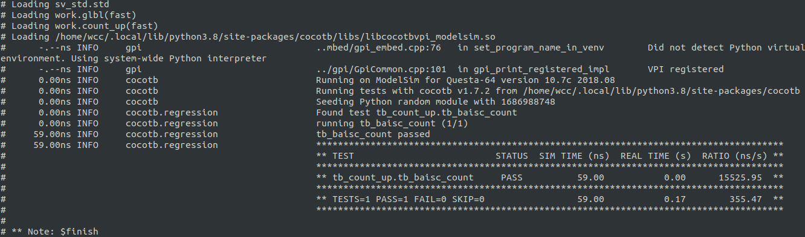
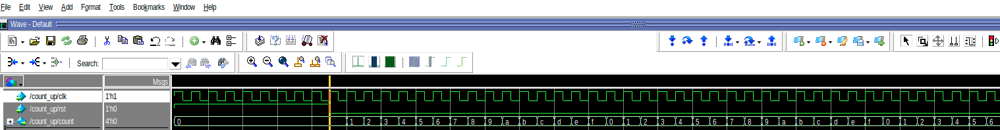
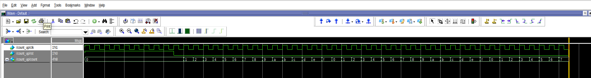

# 前言
在之前我们已经介绍了使用cocotb来仿真xilinx IP的一个简单流程，在那里面并没有介绍太多关于cocotb的注意事项。在这篇博客当中，我会记录学习cocotb的一些基本知识。
<!--more-->

# 1. cocotb 当中赋值和获取值

```python
# to assign our clock signal to 1 we coul do this
dut.clk.value = 1

# or get the handle to the clock and pass that around like this
clk = dut.clk
clk.value = 1

# or use direct assignment through the hiearchy as follows:
dut.clk <= 1
```
读取值同样简单。访问 handle对象的 value属性将返回cocotb调用的 BinaryValue对象--这只是一个具有一些辅助函数的特殊类。
关于 BinaryValue 需要注意的重要一点是，任何未解析的位（Z、X 等）都将被保留并可以使用 binstr 属性访问，或者可以使用整数属性访问已解析的整数值。
```python
count = dut.count.value

# you can see the full binstr as follows
print(count.binstr)

# resolve the value to an integer - X or Z treated as 0!
print(count.integer)

# or show number of bits in a value
print(count.n_bits)
```

# 2. 通过简单的仿真认识cocotb当中比较重要的点
首先准备一个待测试文件，以一个简单的累加器为例子：
```verilog
module count_up(
    input   wire        clk     ,
    input   wire        rst     ,
    output  reg   [3:0] count   
);

    always @(posedge clk ) begin
        if (rst==1'b1) begin
            count <= 'd0;
        end  else begin
            count <=  count + 1'b1;
        end
    end
    
endmodule
```
然后编写一个简单的python testbench。
```python
import cocotb
from cocotb.clock import Clock
from cocotb.triggers import RisingEdge, FallingEdge

@cocotb.test()

async def tb_baisc_count(dut):
    # generate a clock, stared as a separate coroutine
    cocotb.start_soon(Clock(dut.clk, 1, units="ns").start())

    # Reset DUT
    dut.rst.value = 1

    # wait for 10 clocks, then release the rst
    for _ in range(10):
        await RisingEdge(dut.clk)
    dut.rst.value = 0

    # run for 50ns checking count on every rising edge
    for cnt in range(50):
        await RisingEdge(dut.clk)
        v_count = dut.count.value
        mod_cnt = cnt % 16
        assert v_count.integer == mod_cnt, "counter result is incorrect:%s != %s" \
        %(str(dut.count.value, mod_cnt))
```
上面的python testbench 顺序地执行。
每个 await 表达式都会暂停测试的执行，直到测试正在等待的任何事件发生并且模拟器将控制权返回给 cocotb。
- 我们通过 from cocotb.clock import Clock 引入了时钟类，这使得生成时钟信号变得容易
- 我们通过 from cocotb.triggers import RisingEdge 引入了一个触发器来监控我们模拟的上升沿
- dut.<signal name>.value 是我们在 cocotb 的设计中读取和写入信号的方式。  我们通过 dut.reset.value 驱动复位信号，并通过 dut.count.value 读取输出计数。
- @cocotb.test() 是一个 python 装饰器。  这一个将功能标记为测试。  您可以在一个文件中进行多个测试。
- cocotb.start_soon(Clock(dut.clk, 1, units="ns").start()) 是我们设置时钟以作为单独的协程运行的方式。 现在不要担心协程或 start_soon 的细节。  只知道我们通过cocotb中的单独协程来驱动时钟端口。
- async def tb_baisc_count - 测试使用 async 关键字。  异步函数可以安排为并发运行并在继续之前等待其他事情发生（将控制权交还给其他进程）。
- 在测试台的最后，我们有一个简单的断言，用 assert 表示，它类似于 SystemVerilog 断言。  我们在 testbench.py​​ 中编写的那个只是检查输出是否符合我们的预期。  如果发生故障，它会向我们报告。
<br>
<br>

然后准备一个makefile: Makefile当中需要指定需要仿真的顶层模块 `TOPLEVEL` 和测试程序`MODULE`。

```bash
TOPLEVEL_LANG ?= verilog

PWD=$(shell pwd)
TOPDIR=$(PWD)/

SIM ?= modelsim
WAVES ?= 1
# GUI=1

VERILOG_SOURCES += $(PWD)/../rtl/count_up.v
VERILOG_SOURCES += /opt/Xilinx/Vivado/2019.1/data/verilog/src/glbl.v
VERILOG_SOURCES += /opt/Xilinx/Vivado/2019.1/data/verilog/src/unisims/*.v
SIM_ARGS = -work xil_defaultlib -L unisims_ver -L unimacro_ver -L secureip -L xpm -L blk_mem_gen_v8_4_3 work.glbl  -voptargs=+acc=rn

TOPLEVEL = count_up
MODULE   = tb_count_up

include $(shell cocotb-config --makefiles)/Makefile.sim
```


从仿真结果上来，该测试程序一共运行了59ns。

# 3. cocotb当中的协程
在之前的例子当中，我们使用了协程来创建时钟，使用协程的效果就是创建时钟的这个过程和我们的测试主函数是一起运行的。
下面我们将上面的测试程序更改一下，来检验一下协程的作用。
```python
import cocotb
from cocotb.clock import Clock
from cocotb.triggers import RisingEdge, FallingEdge

async def run_reset_routine(dut):
    for _ in range(10):
        await RisingEdge(dut.clk)
    dut.rst.value = 0


@cocotb.test()
async def tb_baisc_count(dut):
    # generate a clock, stared as a separate coroutine
    cocotb.start_soon(Clock(dut.clk, 1, units="ns").start())

    # Reset DUT
    dut.rst.value = 1

    # wait for 10 clocks, then release the rst
    cocotb.start_soon(run_reset_routine(dut))

    # run for 50ns checking count on every rising edge
    for cnt in range(50):
        await RisingEdge(dut.clk)
        v_count = dut.count.value
        mod_cnt = cnt % 16
        # assert v_count.integer == mod_cnt, "counter result is incorrect:%s != %s" \
        # %(str(dut.count.value, mod_cnt))
```


可以看到此时仿真结束的时间为49ns。在这里就可以看到协程的作用了，在之前没有使用协程的时候，程序将会等到复位的结束之后，才会继续执行后续的内容。
而现在，在复位进行的时候，我们的主程序房中的内容还是在继续执行。

# cocotb当中的 Datatypes & Handle Values
Handles简单来说就是一个可以访问HDL当中所有信号的一个对象。在前面的例子当中，我们使用 `dut.<signal name>.value`从handle获取值。
访问句柄对象的`value`将返回一个 BinaryValue 对象。任何未解析的位都将保留并可以使用 binstr 属性访问，或者可以使用integer属性访问已解析的整数值.

## BinaryValue
BinaryValue如下：
```python
BinaryValue(value=None, n_bits=None, bigEndian=True, binaryRepresentation=0, bits=None)
```
- `BinaryValue.integer` is an integer
- `BinaryValue.signed_integer` is a signed integer
- `BinaryValue.binstr` is a string of “01xXzZ”
- `BinaryValue.buff` is a binary buffer of bytes
- `BinaryValue.value` is an integer deprecated

下面这段代码可以帮助理解BinaryValue.
```python
from cocotb.binary import BinaryRepresentation, BinaryValue

bv = BinaryValue(10, 8, True, BinaryRepresentation.TWOS_COMPLEMENT)
print("===============================================================")
print("BinaryValue(10, 8, True, BinaryRepresentation.TWOS_COMPLEMENT)")
print("bv.get_value(): " + str(bv.get_value()))
print("bv.integer: " + str(bv.integer))
print("===============================================================")

print()


bv =  BinaryValue('XzZx0100', 8, True, BinaryRepresentation.TWOS_COMPLEMENT)
print("===============================================================")
print("BinaryValue('XzZx0100', 8, True, BinaryRepresentation.TWOS_COMPLEMENT)")
print("bv.is_resolvable: "+ str(bv.is_resolvable))
print("bv.binstr: "+ str(bv.binstr))
print("===============================================================")

print()


bv = BinaryValue('10000000', 8, True, BinaryRepresentation.TWOS_COMPLEMENT); 
print("===============================================================")
print("BinaryValue('10000000', 8, True, BinaryRepresentation.TWOS_COMPLEMENT)")
print("bv.get_value_signed(): " + str(bv.get_value_signed()))
print("bv.signed_integer: " + str(bv.signed_integer))
print("===============================================================")

print()

bv = BinaryValue(n_bits=10, bigEndian=False, binaryRepresentation=BinaryRepresentation.TWOS_COMPLEMENT)
bv.integer = -128
print("===============================================================")
print("bv = BinaryValue(n_bits=10, bigEndian=False, binaryRepresentation=BinaryRepresentation.TWOS_COMPLEMENT)")
print("bv.integer = -128")
print("bv.get_value_signed: " + str(bv.signed_integer))
print("bv.get_value_signed: " + str(bv.n_bits))
print("===============================================================")
```
下面是运行的结果：

```txt
===============================================================
BinaryValue(10, 8, True, BinaryRepresentation.TWOS_COMPLEMENT)
bv.get_value(): 10
bv.integer: 10
===============================================================

===============================================================
BinaryValue('XzZx0100', 8, True, BinaryRepresentation.TWOS_COMPLEMENT)
bv.is_resolvable: False
bv.binstr: XzZx0100
===============================================================

===============================================================
BinaryValue('10000000', 8, True, BinaryRepresentation.TWOS_COMPLEMENT)
bv.get_value_signed(): -128
bv.signed_integer: -128
===============================================================

===============================================================
bv = BinaryValue(n_bits=10, bigEndian=False, binaryRepresentation=BinaryRepresentation.TWOS_COMPLEMENT)
bv.integer = -128
bv.get_value_signed: -128
bv.get_value_signed: 10
===============================================================
```

## BinaryRepresentation
我们再看看BinaryValue的参数，可以看到其中有一个`BinaryRepresentation`

```python
BinaryValue(value=None, n_bits=None, bigEndian=True, binaryRepresentation=0, bits=None)
```
BinaryRepresentation 具有一下三种类型
```python
class BinaryRepresentation:  # noqa
    UNSIGNED = 0  #: Unsigned format
    SIGNED_MAGNITUDE = 1  #: Sign and magnitude format
    TWOS_COMPLEMENT = 2  #: Two's complement format
```

## Bit, Logic & LogicArray
Logic是 HDL 中常见的 4 值（0、1、X、Z）数据类型的模型。通过使用适当的构造函数语法，可以将Logic与 int、str、bool 和 Bit 相互转换。Logic可以放入 LogicArrays。
Bit 是 HDL 中常见的 2 值数据类型的模型。

```python
from cocotb.types import Bit,Logic, LogicArray
from cocotb.types.range import Range

print('Logic("X"): ' + str(Logic("X")))

print("Logic('X'): " + str(Logic('X')))

print("Logic(True): " + str(Logic(True)))

print("Logic('1'): " + str(Logic('1')))

print("Logic(1): " + str(Logic(1)))

print("Logic(Bit(0)): " + str(Logic(Bit(0))))

print("Logic('0'): " + str(Logic('0')))

print("Logic(): " + str(Logic()))

print('Logic("01XZ").binstr: ' + LogicArray("01XZ").binstr)

print("LogicArray('01XZ', Range(3, 'downto', 0)): " + LogicArray('01XZ', Range(3, 'downto', 0)).binstr)

print('LogicArray([0, True, "X"]): ' + LogicArray([0, True, "X"]).binstr)

print("LogicArray('01X', Range(2, 'downto', 0))" + LogicArray('01X', Range(2, 'downto', 0)).binstr)

print("LogicArray(0xA).integer: " +    str(LogicArray(0xA).integer))         

print("LogicArray('1010', Range(3, 'downto', 0)): " + LogicArray('1010', Range(3, 'downto', 0)).binstr)

print('LogicArray(-4, Range(0, "to", 3)).signed_integer : ' + str(LogicArray(-4, Range(0, "to", 3)).signed_integer)) # will sign-extend

print("LogicArray('1100', Range(0, 'to', 3)): " + str(LogicArray('1100', Range(0, 'to', 3)).integer))

# note ordering
la = LogicArray('1100', Range(0, 'to', 3))
print("la[0]: " + str(la[0]))

# note ordering
la = LogicArray('1100', Range(3, 'downto', 0))
print("la[0]: " + str(la[0]))

# others to know

str(Logic("Z"))
bool(Logic(0))
int(Logic(1))
Bit(Logic("1"))
Bit('1')
```
下面是仿真结果:
```txt
Logic("X"): X
Logic('X'): X
Logic(True): 1
Logic('1'): 1
Logic(1): 1
Logic(Bit(0)): 0
Logic('0'): 0
Logic(): X
Logic("01XZ").binstr: 01XZ
LogicArray('01XZ', Range(3, 'downto', 0)): 01XZ
LogicArray([0, True, "X"]): 01X
LogicArray('01X', Range(2, 'downto', 0))01X
LogicArray(0xA).integer: 10
LogicArray('1010', Range(3, 'downto', 0)): 1010
LogicArray(-4, Range(0, "to", 3)).signed_integer : -4
LogicArray('1100', Range(0, 'to', 3)): 12
la[0]: 1
la[0]: 0
```