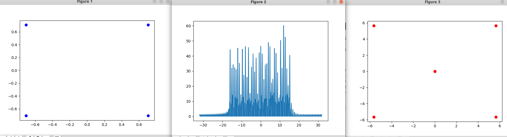

# 1. 前言
在之前的有学习过Python当中基础的numpy操作是怎样的。在学习的时候还是需要配合具体的例子来熟悉。以恰好我对OFDM的实现比较感兴趣，因此通过Python来学习OFDM的相关知识。在这一篇博客当中来简单实现一下OFDM。
<!--more-->
# 2. OFDM 概述
OFDM是一个多载波系统，被应用到多个无线传输系统当中，比如LTE，WIMAX，DVB-T和DAB。多载波系统的基本原理是将高速率的传输数据流分配到不同的低速率的窄带子载波上，这样做有几个好处。
- 由于符号持续时间与符号率成反比，因此每个子载波具有相对较长的符号。长符号因为在无线系统中对多径衰落具有鲁棒性
- 当一个载波由于信道的频率选择性而处于深度衰落时（即在这个载波上接收到的能量非常低），只有这个子载波上的数据丢失，而不是整个流。
- 多载波系统通过将不同的子载波分配给不同的用户来实现轻松的多用户资源共享。

# 3. 具体实例

下面是一个简单的OFDM收发的例子，在这个例子当中，只是实现了OFDM符号的生成，在接收端，并没有做任何关于同步的操作，只是认定当前一切都处于理想的状态下。

- 首先我们会定义OFDM的参数，主要参数包括，OFDM的子载波个数，OFDM的有效子载波个数，循环前缀的长度。
- 然后我们根据OFDM的参数，来构建一个OFDM的调制符号
  - 经过映射之后的bit组，对应到OFDM当中的有效子载波上
  - 其余子载波填充零
  - 所有子载波数据填充完毕之后进行ifft变换到时域
  - 将得到的时域信号的末尾部分进行复制，然后添加到时域信号的开始位置从而组成一个完整的OFDM符号
- 在接收端我们没有实现同步的功能，假设一切都是理想状态
  - 首先进行循环前缀的去除
  - 然后再执行IFFT变换到频域
  - 然后就直接显示了，也没有提取出有效的子载波，所以在最终的打印结果的星座图上，我们可以看到其中有一个处于星座点0的位置。

如果我们在接收端，接收到的符号晚一点或者早一点，我们都不能正确地恢复出星座图。因此现在的一切都是在理想状态下。在之后的博客当中，或许会尝试配合一些同步和均衡的操作来实现正确的解调。


```py
import numpy as np
import matplotlib.pyplot as plt


class OFDM():
    def __init__(self, K, Kon, CP):
        self.k = K
        self.kon = Kon
        self.cp= CP


ofdm = OFDM(128,64,32)

# ofdm modulation
def ofdm_modulation(ofdm, qam):
    xk = np.zeros(ofdm.k, dtype=complex)
    off = int(np.ceil((ofdm.k-ofdm.kon)/2)) # calculate the data sub-carrier start position
    xk[off:off+ofdm.kon] = qam              # set data into used sub-carrier
    xk = np.fft.fftshift(xk)                # shift the ifft to switch the high frequency to negative
    xn = np.fft.ifft(xk) * np.sqrt(ofdm.k)  # from freq domain to time domain
    xn = np.hstack([xn[-ofdm.cp:], xn])     # add CP
    return xn

# constellation QPSK map 
def random_qam(ofdm):
    qam = np.array([1+1j, 1-1j, -1+1j, -1-1j]) / np.sqrt(2)
    return np.random.choice(qam, size=ofdm.kon, replace=True)

constellation = random_qam(ofdm)
# plt.figure(1)
# plt.plot(constellation.real, constellation.imag, 'bo')

tx_sig = np.array([])
for i in range(4):
    tx_sig = np.append(tx_sig, ofdm_modulation(ofdm, constellation))
f= np.linspace(-ofdm.k/2, ofdm.k/2, len(tx_sig)*8, endpoint=False)
tx_spectrum = np.abs(np.fft.fftshift(np.fft.fft(tx_sig, 8*len(tx_sig))))
# plt.figure(2)
# plt.plot(f, tx_spectrum)


plt.figure(3)
class Basic_OFDM_Receiver():
    def __init__(self, ofdm_param):
        # need to know the ofdm parameter
        self._ofdm = ofdm_param
        self._symbol_len = ofdm_param.k + ofdm_param.cp
        self._current_symbol = np.array([])
        self._symbol_without_cp = np.array([])
        self._samps_left_in_symbol = self._symbol_len
        self._constellation = np.array([])

    def receive(self, data):
        # if current data buffer has more samples than a ofdm symbol
        # we need to extract the ofdm symbols from the buffer
        while(len(data) >= self._samps_left_in_symbol):
            # we just simply think the forst samples in buffer is the start 
            # of a frame with cp
            self._current_symbol = np.append(self._current_symbol, data[:self._samps_left_in_symbol])
            # pop one symbol 
            data = data[self._samps_left_in_symbol:]
            # remove cp
            self._symbol_without_cp = np.append(self._symbol_without_cp, self._current_symbol[self._ofdm.cp:])
            self.dft(self._symbol_without_cp)
            # set the samples left during one symbol
            self._samps_left_in_symbol = self._symbol_len
            self._current_symbol = self._current_symbol[self._samps_left_in_symbol:]
            self._symbol_without_cp = np.array([])

        # if the data length is less than one symbol length
        self._current_symbol = np.append(self._current_symbol, data)
        self._samps_left_in_symbol -= len(data)

    # convert time donmain to freq domain
    def dft(self, data):
        self._constellation = np.fft.fftshift(np.fft.fft(data))
        plt.plot(self._constellation.real, self._constellation.imag, 'ro')
        

ofdm_rx = Basic_OFDM_Receiver(ofdm)
ofdm_rx.receive(tx_sig)
plt.show()
```


