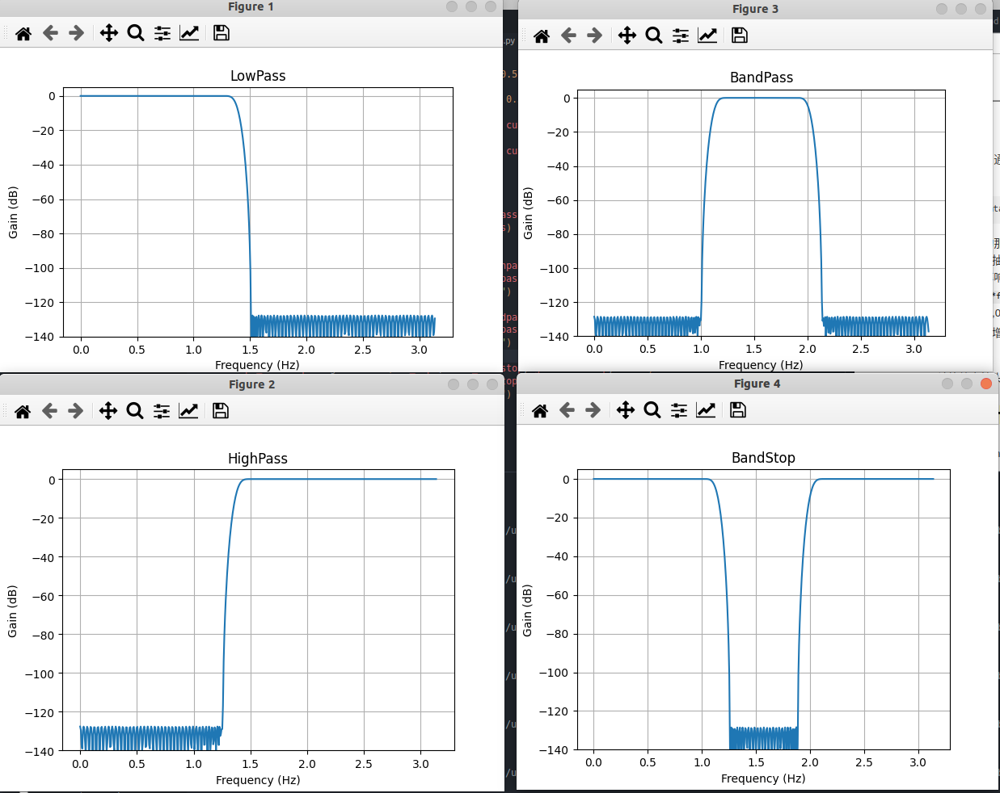

# 前言
之前简单的学习了一下python，并且看起来使用python能够做很多事情，比如设计滤波器，进行无线系统的仿真，甚至可以用来进行IC仿真。
看起来python还是很强大的，学习一下如何使用python来设计滤波器。
<!--more-->

# 关于signal.remez与 signal.freqz
## 1. 低通滤波器
为了能够直观地感受这两个函数的作用，我们可以用一个简单的例子来说明。
```python
import numpy as np
import matplotlib.pyplot as plt
from scipy import signal

def plot_response(w, h, title):
    "Utility function to plot response functions"
    fig = plt.figure()
    ax = fig.add_subplot(111)
    ax.plot(w, 20*np.log10(np.abs(h)))
    ax.set_ylim(-100, 5)
    ax.grid(True)
    ax.set_xlabel('Frequency (Hz)')
    ax.set_ylabel('Gain (dB)')
    ax.set_title(title)

fs = 10e6

cutoff = 2e6
trans_width = 4e5
num_taps = 101
taps = signal.remez(num_taps, [0, cutoff, cutoff+trans_width, 0.5*fs], [1, 0], fs=fs)
w, h = signal.freqz(taps)

plot_response(w,h, "LowPass")
plt.show()
```


从上面的图中可以看到，通过上面的方法可以设计出一个低通滤波器。其中一个重要的函数就是signal.remez().该函数的原型如下：
```python
scipy.signal.remez(numtaps, bands, desired, weight=None, Hz=None, type='bandpass', maxiter=25, grid_density=16, fs=None)
```
我们可以对照前面实现的那个简单的函数来介绍各个参数的含义。
numtaps：就是所需要的抽头系数的个数。
bands:指的是在设计频率响应的时候对应的各个频率，这个频率范围必须大于零并且小于fs/2。比如在前面的例子当中`[0, cutoff, cutoff+trans_width, 0.5*fs]`就表示比较重要的几个频率范围,频率范围需要和第三个参数desired配合使用就能够来创建想要的滤波器了，比如我们给出的[1,0]，就表示从0~cutoff表示的频率范围的增益为1，cutoff+trans_width~0.5fs的增益是0。
desired: 就是目标频段的增益。
fs:表示滤波器的采样率。

signal.freqz()计算给定抽头系数的频率响应。

## 其他滤波器设计
前面介绍了使用signal.remez设计低通滤波器，同样的，我们可以使用其来设计带通滤波器，下面是一个具体的例子。
```python
import numpy as np
import matplotlib.pyplot as plt
from scipy import signal

def plot_response(w, h, title):
    "Utility function to plot response functions"
    fig = plt.figure()
    ax = fig.add_subplot(111)
    ax.plot(w, 20*np.log10(np.abs(h)))
    ax.set_ylim(-140, 5)
    ax.grid(True)
    ax.set_xlabel('Frequency (Hz)')
    ax.set_ylabel('Gain (dB)')
    ax.set_title(title)

fs = 10e6

cutoff = 2e6
cutoff_r = 3e6
trans_width = 4e5
band_lowpass = [0, cutoff, cutoff+trans_width, 0.5*fs]
gain_lowpass = [1, 0]
band_highpass = [0, cutoff, cutoff+trans_width, 0.5*fs]
gain_highpass = [0, 1]
band_bandpass = [0, cutoff-trans_width, cutoff, cutoff_r, cutoff_r+trans_width, 0.5*fs]
gain_bandpass = [0, 1, 0]
band_bandstop = [0, cutoff-trans_width, cutoff, cutoff_r, cutoff_r+trans_width, 0.5*fs]
gain_bandstop = [1, 0, 1]


num_taps = 201
taps_lowpass = signal.remez(num_taps, band_lowpass, gain_lowpass, fs=fs)
w_lowpass, h_lowpass = signal.freqz(taps_lowpass)
plot_response(w_lowpass, h_lowpass, "LowPass")

taps_highpass = signal.remez(num_taps, band_highpass, gain_highpass, fs=fs)
w_highpass, h_highpass = signal.freqz(taps_highpass)
plot_response(w_highpass, h_highpass, "HighPass")

taps_bandpass = signal.remez(num_taps, band_bandpass, gain_bandpass, fs=fs)
w_bandpass, h_bandpass = signal.freqz(taps_bandpass)
plot_response(w_bandpass, h_bandpass, "BandPass")

taps_bandstop= signal.remez(num_taps, band_bandstop, gain_bandstop, fs=fs)
w_bandstop, h_bandstop= signal.freqz(taps_bandstop)
plot_response(w_bandstop, h_bandstop, "BandStop")
plt.show()
```


# 使用firwin设计滤波器
```python
from scipy import signal
import numpy as np
import matplotlib.pyplot as plt

def plot_response(w, h, title):
    "Utility function to plot response functions"
    fig = plt.figure()
    ax = fig.add_subplot(111)
    ax.plot(w, 20*np.log10(np.abs(h)))
    ax.set_ylim(-140, 5)
    ax.grid(True)
    ax.set_xlabel('Frequency (Hz)')
    ax.set_ylabel('Gain (dB)')
    ax.set_title(title)

cutoff_freq = 0.3  
filter_length = 75  
window_type = 'hamming'  

filter_coeff_highpass = signal.firwin(filter_length, cutoff_freq, window=window_type, pass_zero=False)
filter_coeff_lowpass = signal.firwin(filter_length, cutoff_freq, window=window_type, pass_zero=True)


w_high, h_high = signal.freqz(filter_coeff_highpass)
w_low, h_low = signal.freqz(filter_coeff_lowpass)

plot_response(w_high, h_high, "HighPass")
plot_response(w_low, h_low, "LowPass")
plt.show()
```
使用firwin设计滤波器和之前的很类似，需要给出滤波器长度，截止频率，窗函数类型，然后选择高通还是低通就可以了。