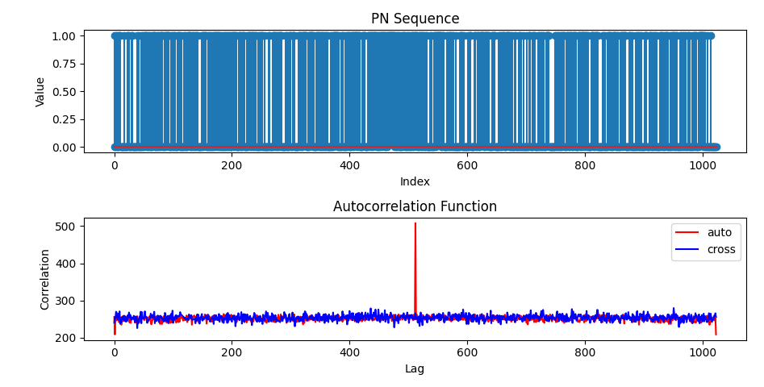

# 前言
最近帮一个客户实现将一部分算法卸载到FPGA上，其中的一个部分是相关算法。相关简单来说就是一个乘累加的过程。如果在设计的的时候采用一些特殊的序列，比如PN码，那么甚至可以把乘法变成加减法来进行操作。
<!--more-->

# 相关运算原理
相关运算的数学表达式如下
$$
    y(n) = \sum_{i=-\infty }^{\infty}h(i)x(n+i)
$$

在实际处理的时候，我们一般是使用有限长的两个序列进行相关，假设两个序列的长度为N，则上面的可以转换为：

$$
    y(n) = \sum_{i=0 }^{N-1}h(i)x(n+i)
$$

下面以一个具体的例子来说明卷积运算的这个过程：

我们假设要进行相关的序列的长度是1024，其中绿色部分我们可以看做是具体的系数，蓝色部分是实际的要处理的数据流，当i=0的时候，需要将x0~x1023分别与h0~h1023对应相乘，然后将这1024个乘积进行累加，得到第一个相关点的结果。
当i=1，也就是相当于数据流已经流过一个点，然后再执行上面的操作计算得到第二个相关点的结果。
依次类推下去，这样我们就能得到对应的相关结果了。

# PN码
在之前的博客当中，已经学习过PN码，并且了解到PN码的伪随机性，通过对PN码进行相关，能够检测到一个相关峰。
==[PN码以及生成多项式](https://black-pigeon.github.io/2021/06/07/2021.6/%E5%8C%97%E6%96%97%E5%8D%AB%E6%98%9F%E5%AE%9A%E4%BD%8D-1-PN%E7%A0%81/)==

# 使用python实现互相关与自相关操作
下面是一个简单的python脚本，能够实现PN码的互相关与自相关。并且能够检测到峰值。
```python

import numpy as np
from numpy import empty, exp, pi, arange, int8, fromiter, sum
import matplotlib.pyplot as plt

def pnsequence(pn_order, pn_seed, pn_mask, seq_length):
    """
    Generate a PN (Pseudo-Noise) sequence using a Linear Feedback Shift Register (LFSR).
    Seed and mask are ordered so that:
        - seed[-1] will be the first output
        - the new bit computed as :math:`sum(shift_register & mask) % 2` is inserted in shift[0]

    Parameters
    ----------
    pn_order : int
        Number of delay elements used in the LFSR.

    pn_seed : iterable providing 0's and 1's
        Seed for the initialization of the LFSR delay elements.
        The length of this string must be equal to 'pn_order'.

    pn_mask : iterable providing 0's and 1's
        Mask representing which delay elements contribute to the feedback
        in the LFSR. The length of this string must be equal to 'pn_order'.

    seq_length : int
        Length of the PN sequence to be generated. Usually (2^pn_order - 1)

    Returns
    -------
    pnseq : 1D ndarray of ints
        PN sequence generated.

    Raises
    ------
    ValueError
        If the pn_order is equal to the length of the strings pn_seed and pn_mask.

    """
    # Check if pn_order is equal to the length of the strings 'pn_seed' and 'pn_mask'
    if len(pn_seed) != pn_order:
        raise ValueError('pn_seed has not the same length as pn_order')
    if len(pn_mask) != pn_order:
        raise ValueError('pn_mask has not the same length as pn_order')

    # Pre-allocate memory for output
    pnseq = empty(seq_length, int8)

    # Convert input as array
    sr = fromiter(pn_seed, int8, pn_order)
    mask = fromiter(pn_mask, int8, pn_order)

    for i in range(seq_length):
        pnseq[i] = sr[-1]
        new_bit = sum(sr & mask) % 2
        sr[1:] = sr[:-1]
        sr[0] = new_bit

    return pnseq


pn_order = 11
pn_seed = '11010011001'
pn_mask = '11011000011'
pn_mask1 = '11011100011'
seq_length = 1024

# Generate PN sequence
pn_sequence = pnsequence(pn_order, pn_seed, pn_mask, seq_length)
# pn_sequence[pn_sequence==0] = -1
pn_sequence_shift =  np.roll(pn_sequence,seq_length//2)
print("pn_sequence:", pn_sequence[:20])

pn_sequence1 = pnsequence(pn_order, pn_seed, pn_mask1, seq_length)
# pn_sequence1[pn_sequence1==0] = -1
pn_sequence_shift1 =  np.roll(pn_sequence1,seq_length//2)
print("pn_sequence1:", pn_sequence1[:20])


# Calculate autocorrelation function
# acf = np.correlate(pn_sequence, np.hstack((pn_sequence[32:], pn_sequence[:32])), mode='full')
acf_auto = np.zeros(seq_length)
acf_cross = np.zeros(seq_length)
for i in range(seq_length):
    acf_auto[i] = np.sum(pn_sequence * pn_sequence_shift);
    acf_cross[i] = np.sum(pn_sequence * pn_sequence_shift1);
    pn_sequence_shift = np.roll(pn_sequence_shift,1)
    pn_sequence_shift1 = np.roll(pn_sequence_shift1,1)

# Plot results
fig, (ax1, ax2) = plt.subplots(nrows=2, ncols=1)

ax1.stem(pn_sequence)
ax1.set_title('PN Sequence')
ax1.set_xlabel('Index')
ax1.set_ylabel('Value')

ax2.plot(acf_auto,'r', label="auto")
ax2.plot(acf_cross,'b', label="cross")

ax2.legend(loc="upper right")
ax2.set_title('Autocorrelation Function')
ax2.set_xlabel('Lag')
ax2.set_ylabel('Correlation')

plt.tight_layout()
plt.show()

out_seq = pnsequence(pn_order, pn_seed, pn_mask, seq_length)
try:
    with open('pn_sequence.txt', 'w') as f:
        for item in out_seq:
            f.write("%s\n" % item)

except Exception as e:
    print("An error occurred while writing the file: ", e)

```



# 使用FPGA实现相关运算
在前面我们已经简单介绍了相关运算的原理，有了前面的介绍，想必在FPGA当中实现相关运算就有了一个大概的思路了。在FPGA当中想要实现相关操作的主要的限制是FPGA上的资源限制，比如DSP和查找表资源。如果相关的长度比较长的话，如果需要进行乘法运算，那么需要耗费大量的DSP资源。以我所使用的ZYNQ7020为例，一共只有220个DSP，因此在一些计算密集的应用当中，需要更高端的FPGA才能实现。

前面我们介绍了PN码的相关操作，可以看到PN码只是01010这种的bit。通过这种bit我们就能够实现相关，在实际使用的时候，我们也会经常遇到只需要数据的符号位就可以进行相关的情况。因此我们在FPGA当中就可以把乘法运算变成加减法运算。

然后我们还要注意的就是FPGA在进行相关运算的时候需要进行一定长度的累加，比如上面的相关的长度是1024，那么就需要进行1024个长度的累加。这么多数量的累加，想要在一个时钟周期内全部实现是不太现实的。因此我们需要实现一个模块，专门来实现1024个点的累加操作。

## FPGA实现累加树

下面以一个9个数相加的过程来详细描述这个过程：

- 第一个时钟周期：
  首先，我们有d0~d8一共9个数需要累加，在进行第一轮加法的时候，我们需要两两进行相加，可以看到一个可以进行4组加法，然后剩余了一个数据。那么在这一个时钟周期，我们需要完成4个加法和一个寄存。

- 第二个时钟周期：
  在上一个时钟周期结束之后，我们一共能够得到5个数据，继续执行两两相加，可以看到这里可以执行2组加法，剩余一个数据需要寄存。

- 第三个时钟周期：
  在上一个时钟周期结束之后，我们得到了3个数据，继续执行两两相加，执行一组加法，剩余一个数据需要寄存。

- 第四个时钟周期
  在第四个时钟周期当中，只剩下最后两个数据需要进行相加，我们就可以得到最终的结果。

假设：本次待相加的数目为n
(1) 本次需要进行的加法运算共有[n/2]组，也就是需要[n/2]的加法器，需要的寄存器的数目为[n/2] + n%2（其中[n/2]表示取整，n%2表示取余）
(2) 下一次运算需要相加的数目为[n/2] + n%2
(3)每一级的运算需要一个时钟周期的开销
  因此采用递归的方式，来完成这个运算是再方便不过了。但是在C/C++或其他高级语言中使用递归是在方便不过的事情了，但是在FPGA中想要使用递归还是有点麻烦的，这时候就需要灵活的使用generate语句，来在每一级生成不同的电路。

下面是使用systemverilog实现的这个累加树的模块。
```verilog
`timescale 1ns / 1ps

module add_tree_impl #(
	//==========================================
	//parameter define
	//==========================================
    parameter	DATA_NUM 		= 1024							        ,//需要相加的个数
	parameter 	HALF_IDX		= DATA_NUM >> 1				        ,//两两相加的个数
	parameter	DATA_NUM_NEW	= (DATA_NUM >> 1) + (DATA_NUM%2)	,//下一级模块需要相加的个数
	parameter	DW 				= 8						            ,//本阶段的输入数据位宽
	parameter	DW_NEW			= DW + 1 				            ,//本阶段的输出数据位宽
    parameter   DWO             = DW + clogb2(DATA_NUM-1)            // 最终输出结果的位宽  
	)(
	input 	wire 					    clk 		,
	input	wire					    rst 		,
	input	wire					    pi_dv		,
	input	wire	[DW-1: 0]	        pi_data	[DATA_NUM-1:0]	,

	output 	wire 					    po_dv		,
	output	wire	[DWO - 1 : 0]	    po_data
    );

    generate
        genvar i;
        reg 	[(DW_NEW) - 1 : 0]	sum_tmp	[DATA_NUM_NEW-1:0];
        reg 						tmp_dv	;
        //当前不是最后一次加法
        if (DATA_NUM != 2) begin
            for(i = 0; i < HALF_IDX; i = i + 1)
            begin: cal_sum
                always @(posedge clk) begin
                    if (rst==1'b1) begin
                        sum_tmp[i] <= 'd0;
                        tmp_dv <= 1'b0;
                    end
                    else begin
                        //两数相加，位宽扩充一位
                        //eg：sum_tmp[0] = pi_data[1] + pi_data[0];
                        //eg：sum_tmp[1] = pi_data[3] + pi_data[2];
                        //eg：sum_tmp[2] = pi_data[5] + pi_data[4];
                        //eg：sum_tmp[3] = pi_data[7] + pi_data[6];
                        sum_tmp[i] <= {pi_data[(2*i + 1)][DW-1],pi_data[(2*i + 1)]} + {pi_data[2*i][DW-1], pi_data[2*i]};
                        tmp_dv <= pi_dv;
                    end
                end	
            end
            //递归调用求和模块,将本季求和计算得到的模块，传递到下一级
            add_tree_impl #(
                .DATA_NUM(DATA_NUM_NEW),
                .DW(DW_NEW)
            ) inst_add_tree (
                .clk     (clk),
                .rst     (rst),
                .pi_dv   (tmp_dv),
                .pi_data (sum_tmp),
                .po_dv   (po_dv),
                .po_data (po_data)
            );
        end
        //==========================================
        //当前需要相加的个数为奇数个需要将最后一个数据缓存
        //==========================================
        if (DATA_NUM%2 ==1) begin
            always @(posedge clk) begin
                if (rst==1'b1) begin
                    sum_tmp[(DATA_NUM_NEW - 1)] <= 'd0;
                end
                else begin
                    sum_tmp[(DATA_NUM_NEW - 1)] <= {pi_data[DATA_NUM-1][DW-1],pi_data[DATA_NUM-1]};
                end
            end
        end
    endgenerate

    generate
        //执行最后一次加法,只剩下两个数相加
        if (DATA_NUM == 2) begin
            reg 								tmp_dv_final	;
            reg 	[DWO-1 : 0]			        sum_tmp_final	;

            always @(posedge clk) begin
                if (rst==1'b1) begin
                    sum_tmp_final <= 'd0;
                    tmp_dv_final <= 1'b0;
            end
                else begin
                    sum_tmp_final <= {pi_data[0][DW-1], pi_data[0]} + {pi_data[1][DW-1], pi_data[1]};				
                    tmp_dv_final <= pi_dv;		
                end
            end
            assign po_dv = tmp_dv_final;
            assign po_data = sum_tmp_final;
        end
    endgenerate


    function integer clogb2;
    input integer depth;
    for (clogb2=0; depth>0; clogb2=clogb2+1)
        depth = depth >> 1;
    endfunction
endmodule
```

## FPGA实现相关操作
前面我们实现了累加树的操作，有了上面的累加树，我们就可以实现一定个数的数据相加，并得到相加的结果。想要在FPGA上实现相关操作，接下来我们可以来实现"乘法"这一步，在本博客当中，主要是以PN码来进行的，因此是执行相关操作。

在FPGA上有一个用于相关的序列，序列的值是-1，+1。现在有输入的IQ数据的值，我们只需要有用符号位来进行相关就可以。如果符号位与序列相同，那么"乘法"的结果就为1，如果符号位与序列不同，那么"乘法"的结果就为-1，最终将所有得到的结果累加起来就可以了。
下面是使用systemverilog实现这个功能的模块。

```verilog
module cross_correlation#(
	//==========================================
	//parameter define
	//==========================================
    parameter	DATA_NUM 		= 1024							    ,//需要相加的个数
	parameter 	HALF_IDX		= DATA_NUM >> 1				        ,//两两相加的个数
	parameter	DATA_NUM_NEW	= (DATA_NUM >> 1) + (DATA_NUM%2)	,//下一级模块需要相加的个数
	parameter	DW 				= 2						            ,//本阶段的输入数据位宽
	parameter	DW_NEW			= DW + 1 				            ,//本阶段的输出数据位宽
    parameter   DWO             = DW + clogb2(DATA_NUM-1)            // 最终输出结果的位宽  
    )(
        input   wire                clk                 ,
        input   wire                rst                 ,
        input   wire                enable              ,
        input   wire                sample_valid        ,
        input   wire    [15:0]      sample_i            ,
        input   wire    [15:0]      sample_q            ,
        input   wire    [15:0]      threshold           ,
        
        input   wire    [1:0]       h_taps  [DATA_NUM-1:0],


        // output  reg    [15:0]       correlation_value   ,
        output  wire   [15:0]       est_amp_mon         ,
        output  reg                 peak_valid          
    );


    //====================================================
    // parameter define
    //====================================================
    function integer clogb2;
    input integer depth;
    for (clogb2=0; depth>0; clogb2=clogb2+1)
        depth = depth >> 1;
    endfunction


    // localparam THRESHOLD = 320;
    

    //====================================================
    // internal signals and registers
    //====================================================
    wire     [DWO-1:0]  acc_i               ;
    wire     [DWO-1:0]  acc_q               ;
    wire                acc_valid           ;


    reg     [DWO-1:0]   abs_acc_i           ;
    reg     [DWO-1:0]   abs_acc_q           ;
    reg                 abs_acc_valid       ;
    reg     [DWO-1:0]   acc_i_delay1     ;
    reg     [DWO-1:0]   acc_q_delay1     ;

    reg     [DWO-1:0]   max_abs         ;
    reg     [DWO-1:0]   min_abs         ;
    reg                 max_abs_valid   ;
    reg     [DWO-1:0]   acc_i_delay2     ;
    reg     [DWO-1:0]   acc_q_delay2     ;

    reg     [DWO-1:0]   est_amp         ;
    reg                 est_amp_valid   ;
    reg     [DWO-1:0]   acc_i_delay3     ;
    reg     [DWO-1:0]   acc_q_delay3     ;
    reg     [3:0]       cnt_marker      ;      

    (* ram_style = "block" *) reg     [1:0]       mult_i    [1023:0]  ; 
    (* ram_style = "block" *) reg     [1:0]       mult_q    [1023:0]  ; 
    reg                 mult_valid          ;


    reg     [1023:0]            sign_i      ;
    reg     [1023:0]            sign_q      ;
    // reg             h_tap   [1023:0]    ;   // taps for h
    // wire            sign_i              ;
    // wire            sign_q              ;
    integer i = 0;


    // assign sign_i = sample_i[15];
    // assign sign_q = sample_q[15];

    always @(posedge clk ) begin
        if (rst==1'b1) begin
            for (i=0; i<1024; i=i+1) begin
                mult_i[i] <= 'd0;
            end
        end else if (enable == 1'b1) begin
            if (sample_valid) begin
                for(i=0; i<1024; i=i+1)begin
                    if (h_taps[i] == 'd0) begin
                        mult_i[i] <= 2'b00;
                    end else begin
                        mult_i[i] <= sign_i[i]^h_taps[i][1] ? 2'b11 : 2'b01;
                    end
                end
            end 
        end else begin
            for (i=0; i<1024; i=i+1) begin
                mult_i[i] <= 'd0;
            end
        end

    end

    always @(posedge clk ) begin
        if (rst==1'b1) begin
            for (i=0; i<1024; i=i+1) begin
                mult_q[i] <= 'd0;
            end
        end else if (enable == 1'b1) begin
            if (sample_valid) begin
                for(i=0; i<1024; i=i+1)begin
                    if (h_taps[i] == 'd0) begin
                        mult_q[i] <= 2'b00;
                    end else begin
                        mult_q[i] <= sign_q[i]^h_taps[i][1] ? 2'b11 : 2'b01;
                    end
                end
            end 
        end else begin
            for (i=0; i<1024; i=i+1) begin
                mult_q[i] <= 'd0;
            end
        end
    end


    always @(posedge clk ) begin
        if (rst==1'b1) begin
            for (i=0; i<1024; i=i+1) begin
                sign_i[i] <= 'd0;
                sign_q[i] <= 'd0;
            end
        end else if (enable == 1'b1) begin
            if (sample_valid) begin
                sign_i[1023] <= sample_i[15];
                sign_q[1023] <= sample_q[15];
                for(i=0; i<1023; i=i+1)begin
                    sign_i[i] <= sign_i[i+1];
                    sign_q[i] <= sign_q[i+1];
                end
            end 
        end else begin
            for (i=0; i<1024; i=i+1) begin
                sign_i[i] <= 'd0;
                sign_q[i] <= 'd0;
            end
        end
    end

    always @(posedge clk ) begin
        if (rst==1'b1) begin
            mult_valid <= 1'b0;
        end else if(enable == 1'b1)begin
            mult_valid <= sample_valid;
        end else begin
            mult_valid <= 1'b0;
        end
    end

    add_tree_impl#(
        .DATA_NUM(DATA_NUM ),
        .HALF_IDX(HALF_IDX ),
        .DATA_NUM_NEW(DATA_NUM_NEW ),
        .DW(DW ),
        .DW_NEW(DW_NEW ),
        .DWO ( DWO )
    )add_tree_dut_i (
        .clk (clk ),
        .rst (rst ),
        .pi_dv (mult_valid ),
        .pi_data (mult_i ),
        .po_dv (acc_valid ),
        .po_data  ( acc_i)
    );

    add_tree_impl#(
        .DATA_NUM(DATA_NUM ),
        .HALF_IDX(HALF_IDX ),
        .DATA_NUM_NEW(DATA_NUM_NEW ),
        .DW(DW ),
        .DW_NEW(DW_NEW ),
        .DWO ( DWO )
    )add_tree_dut_q (
        .clk (clk ),
        .rst (rst ),
        .pi_dv (mult_valid ),
        .pi_data (mult_q),
        .po_dv ( ),
        .po_data  ( acc_q)
    );

    //====================================================
    // Amplitude estimation, step 1:
    // get the absolute value of i/q data
    //====================================================
    always @(posedge clk ) begin
        if (rst==1'b1) begin
            abs_acc_valid <= 1'b0;
        end else begin
            abs_acc_valid <= acc_valid; 
        end
    end

    always @(posedge clk ) begin
        if (rst==1'b1) begin
            abs_acc_i <= 'd0;
            abs_acc_q <= 'd0;
            acc_i_delay1 <= 'd0;
            acc_q_delay1 <= 'd0;
        end else if (enable == 1'b1) begin
            if (acc_valid == 1'b1) begin
                abs_acc_i <= acc_i[DWO-1]? ~(acc_i)+1 : acc_i;
                abs_acc_q <= acc_q[DWO-1]? ~(acc_q)+1 : acc_q;
                acc_i_delay1 <= acc_i;
                acc_q_delay1 <= acc_q;
            end 
        end else begin
            abs_acc_i <= 'd0;
            abs_acc_q <= 'd0;
            acc_i_delay1 <= 'd0;
            acc_q_delay1 <= 'd0;
        end
    end

    //====================================================
    // Amplitude estimation, step 2:
    // get the max and min value of |I|, |Q|
    //====================================================
    always @(posedge clk ) begin
        if (rst==1'b1) begin
            max_abs_valid <= 1'b0;
        end else if(enable == 1'b1)begin
            max_abs_valid <= abs_acc_valid; 
        end else begin
            max_abs_valid <= 1'b0;
        end
    end

    always @(posedge clk ) begin
        if (rst==1'b1) begin
            max_abs <= 'd0;
            min_abs <= 'd0;
            acc_i_delay2 <= 'd0;
            acc_q_delay2 <= 'd0;
        end else if(enable == 1'b1)begin
            if (abs_acc_valid == 1'b1) begin
                max_abs <= (abs_acc_i > abs_acc_q) ? abs_acc_i : abs_acc_q;
                min_abs <= (abs_acc_i < abs_acc_q) ? abs_acc_i : abs_acc_q;
                acc_i_delay2 <= acc_i_delay1;
                acc_q_delay2 <= acc_q_delay1;
            end
        end else begin
            max_abs <= 'd0;
            min_abs <= 'd0;
            acc_i_delay2 <= 'd0;
            acc_q_delay2 <= 'd0;
        end
    end   

    //====================================================
    // Amplitude estimation, step 3:
    // calculate the amplitude estimation 
    // mag = alpha*max(|I|, |Q|) + beta*min(|I|, |Q|);
    // alpha=1, beta=1/4
    //====================================================
    always @(posedge clk ) begin
        if (rst==1'b1) begin
            est_amp_valid <= 1'b0;
        end else if(enable == 1'b1)begin
            est_amp_valid <= max_abs_valid; 
        end else begin
            est_amp_valid <= 1'b0;
        end
    end

    always @(posedge clk ) begin
        if (rst==1'b1) begin
            est_amp <= 'd0;
            acc_i_delay3 <= 'd0;
            acc_q_delay3 <= 'd0;
        end
        else if (enable == 1'b1) begin
            if (max_abs_valid == 1'b1) begin
                est_amp <= max_abs + min_abs[DWO-1:2];
                acc_i_delay3 <= acc_i_delay2;
                acc_q_delay3 <= acc_q_delay2;
            end  
        end else begin
            est_amp <= 'd0;
            acc_i_delay3 <= 'd0;
            acc_q_delay3 <= 'd0;
        end
    end

    //----------------peak_index------------------
    always @(posedge clk ) begin
        if (rst==1'b1) begin
            peak_valid <= 1'b0;
        end else if (enable == 1'b1) begin
            if (est_amp_valid == 1'b1 && est_amp >= threshold) begin
                peak_valid <= 1'b1;
            end else if(peak_valid == 1'b1 && cnt_marker == 'd3)begin
                peak_valid <= 1'b0;
            end
        end else begin
            peak_valid <= 1'b0;
        end
    end

    //----------------cnt_marker------------------
    always @(posedge clk ) begin
        if (rst==1'b1) begin
            cnt_marker <= 'd0 ;
        end else if (peak_valid == 1'b1 && cnt_marker == 'd3) begin
            cnt_marker <= 'd0;
        end else if (peak_valid == 1'b1 ) begin
            cnt_marker <= cnt_marker + 1'b1 ;
        end 
    end

    assign est_amp_mon = est_amp;

endmodule
```