# 前言
在之前的我学习过OFDM的verilog实现，在接收端，在时域当中的各个操作已经完成，目前来看好像烂尾了，但是在这之后，我会继续完成前面没有完成的部分。
在之前，因为没有一个完整的算法仿真模型在，所以我之前在使用FPGA实现OFDM收发器的时候，也不是很清楚其中的具体的每一个步骤。因此在这里我首先需要一个完整的算法模型，来帮助我理解其中的意义。
最近在GitHub上也找到了一些比较好的参考
- [matlab ofdm 802.11a](https://github.com/MeowLucian/SDR_Matlab_OFDM_802.11a)
- [openofdm](https://openofdm.readthedocs.io/en/latest/)
在这里我会尝试使用python来完整这个仿真模型的构建，值得注意的是，这里实现的并不完全和802.11a的协议规范当中的完全一致。
<!--more-->

# 802.11a 数据帧格式
802.11a的基本的数据帧格式如下：

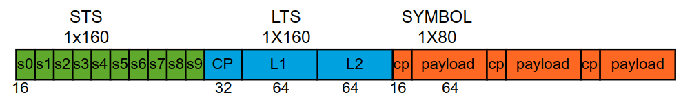

首先是10个短训练序列，每个短训练序列的长度是16，短训练序列的长度一共为160.
然后是长训练序列，长训练序列包括两个长度为64的训练序列和长度为32的CP，一共为160.
接下来是数据部分，数据每个OFDM符号长度由64的数据和16的CP组成。

## 短训练序列的格式
短训练序列在频域当中的数据如下：
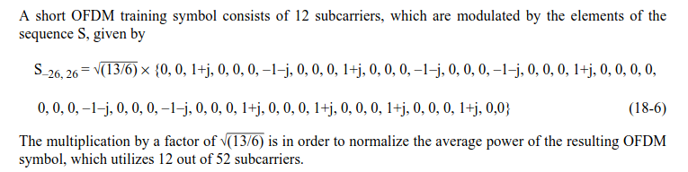
可以看到一共使用了53个子载波当中的12个作为数据，其余部分都为0。对于802.11a来说，一共使用到的子载波是64个，因此短训练序列的其余部分需要补零。
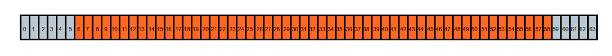
然后需要将短训练序列通过IFFT转换到时域当中，在时域当中，我们取IFFT转换过后的前16个点，并将这部分数据重复10次，最终组成长度为160的短训练序列。
```python
class OFDM():
    def __init__(self, K, Kon, CP):
        self.k = K
        self.kon = Kon
        self.cp= CP

ofdm_sts = OFDM(64, 53, 16)
s_k = np.sqrt(13/6)*np.array([0,0,1+1j,0,0,0,-1-1j,0,0,0,1+1j,0,0,0,-1-1j,0,0,0,-1-1j,0,0,0,1+1j,0,0,0,0,0,0,0,-1-1j,0,0,0,-1-1j,0,0,0,1+1j,0,0,0,1+1j,0,0,0,1+1j,0,0,0,1+1j,0,0])
def gen_sts(ofdm, data):
    xk = np.zeros(ofdm.k, dtype=complex)
    off = int(np.ceil((ofdm.k-ofdm.kon)/2)) # calculate the data sub-carrier start position
    xk[off:off+ofdm.kon] = data              # set data into used sub-carrier
    xk = np.fft.fftshift(xk)                # shift the ifft to switch the high frequency to negative
    xn = np.fft.ifft(xk)  # from freq domain to time domain
    s_preamble = np.tile(xn[:16], 10)
    return s_preamble
sts = gen_sts(ofdm_sts, s_k)
```

## 长训练序列格式
长训练序列在频域当中的数据如下：
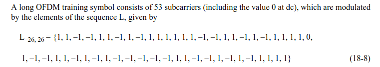
可以看到长训练序列一共使用了53个子载波，同段训练序列类似，也需要补零处理。

长训练序列同样需要转换到频域，长训练序列有两个经过IFFT转换之后的符号再加上长度为32的CP，CP的长度是长训练序列符号的一半。长训练序列具有良好的自相关特性，可以在之后进行符号同步和信道估计提供便利。
```python
ofdm_lts = OFDM(64, 53, 16)
l_k = np.array([1,1,-1,-1,1,1,-1,1,-1,1,1,1,1,1,1,-1,-1,1,1,-1,1,-1,1,1,1,1,0,1,-1,-1,1,1,-1,1,-1,1,-1,-1,-1,-1,-1,1,1,-1,-1,1,-1,1,-1,1,1,1,1])
def gen_lts(ofdm, data):
    xk = np.zeros(ofdm.k, dtype=complex)
    off = int(np.ceil((ofdm.k-ofdm.kon)/2)) # calculate the data sub-carrier start position
    xk[off:off+ofdm.kon] = data              # set data into used sub-carrier
    l_k_symbol = xk
    xk = np.fft.fftshift(xk)                # shift the ifft to switch the high frequency to negative
    xn = np.fft.ifft(xk)  # from freq domain to time domain
    s_preamble = np.hstack([xn[ofdm.k//2:], xn, xn])
    return s_preamble, l_k_symbol
lts, l_k_symbol = gen_lts(ofdm_lts, l_k)
```

## 数据域格式
在接下来就是数据域了，在我们这里并不是严格按照802.11a的标准来做的，复杂的通信协议当中的处理，许多内容都位于数据域当中。在这里我们只是以简单的QPSK映射过后的数据为例。
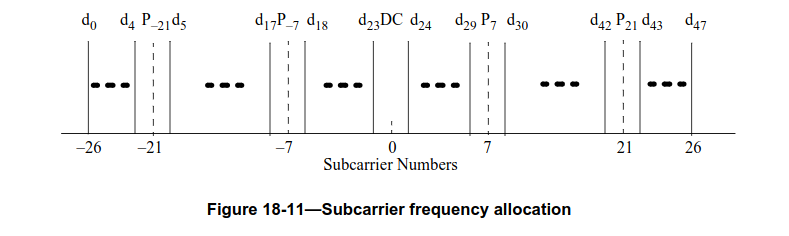
共有48个数据子载波，在子载波-21，-7，7，21为导频所在的位置，子载波0为DC，一共占据了53个子载波。在实际使用的时候，还需要对其他子载波填充0.

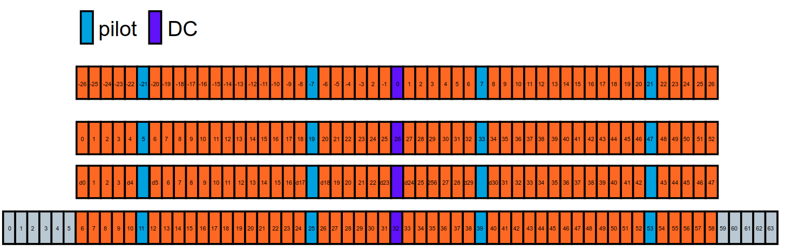

```python
ofdm_payload = OFDM(64, 53, 16)
def random_qam():
    qam = np.array([1+1j, 1-1j, -1+1j, -1-1j]) / np.sqrt(2)
    return np.random.choice(qam, size=48, replace=True)

def gen_payload(ofdm, data):
    # insert pilot
    src_data = np.hstack([data[:5], ofdm_pilot[0], data[5:18], ofdm_pilot[1], data[18:24], 0, data[24:30], ofdm_pilot[2], data[30:43], ofdm_pilot[3], data[43:48]])
    xk = np.zeros(ofdm.k, dtype=complex)
    off = int(np.ceil((ofdm.k-ofdm.kon)/2))     # calculate the data sub-carrier start position
    xk[off:off+ofdm.kon] = src_data             # set data into used sub-carrier
    xk = np.fft.fftshift(xk)                    # shift the ifft to switch the high frequency to negative
    xn = np.fft.ifft(xk)  # from freq domain to time domain
    payload = np.hstack([xn[-ofdm.cp:], xn])
    return payload

pilot_index = [5, 19, 33, 47]
sub_carrier_remove_index = [5, 19, 26, 33, 47 ]     # includes pilot and DC

data_payload1 = random_qam()
data_payload2 = random_qam()

payload_slot1 = gen_payload(ofdm_payload, data_payload1)
payload_slot2 = gen_payload(ofdm_payload, data_payload2)
```
最后将sts.lts,payload组合在一起就构成了OFDM的一个数据帧。
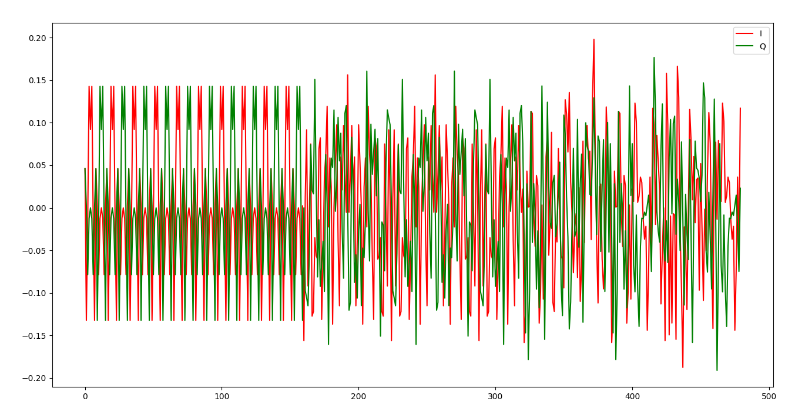

# 接收OFDM帧

## 短训练序列检测
短前导码持续时间为8us。在20MSPS 采样率下，它包含10个由16个I/Q 样本组成的重复序列，即总共160个样本。 短前导码还有助于接收机进行粗略的频偏校正.
使用短训练序列来检测OFDM帧的计算公式如下：
其中S[i]是以复数表示的⟨I,Q⟩样本，$\overline{S[i+16]}$是其共轭，N是相关窗口大小。如果输入信号每16个样本重复一次，则相关性达到1。如果相关性对于一定数量的连续样本保持较高，则可以声明检测到短训练序列。
$$
corr[i] = \frac{\left\lVert\sum_{i=0}^{N}{S[i]*\overline{S[i+16]}}\right\rVert}
{\sum_{i=0}^{N}{S[i]*\overline{S[i]}}}
$$
在下面的代码当中，我们实现了短训练序列的检测，并且粗略地提取出了一个OFDM符号的起始位置。
```python
D=16
L=64
Cn = np.zeros(16, dtype=complex)
Pn = np.zeros(16, dtype=complex)
s1 = np.zeros(16, dtype=complex)
s2 = np.zeros(16, dtype=complex)
Ci = np.zeros((len(rx_data) - D), dtype=complex)
Pi = np.zeros((len(rx_data) - D), dtype=complex)

packet_detect_threshold = 0.65
peak_len_threshold = 100

def ofdm_packet_detect(signal, amp_threshold, len_threshold):
    for i in range(len(signal) - 2*D):
        s1 = signal[i:i+D]
        s2 = signal[i+D: i+D*2]
        Ci[i] = np.sum(s1*s2.conj())
        Pi[i] = np.sum(abs(s1)**2)

    M_n = (abs(Ci)**2)/(abs(Pi)**2 + 0.0001)
    packet_start_idx = []

    above = (M_n > amp_threshold).astype(int)
    edges = np.diff(above) 
    edge_idx = np.flatnonzero(edges) # get the none zero data index
    edge_value = edges[edge_idx] 
    last_rise = 0

    for i,v in zip(edge_idx, edge_value): # iterate all change location
        
        if(v==-1 and last_rise !=0): # we are at the end of a metric peak
            if (i - last_rise) > len_threshold :
                print("detect wifi symbol")
                packet_start_idx.append(last_rise)
        if(v==1): # we are at the beginning of the metric peck
            last_rise = i

    return packet_start_idx

start_idx = ofdm_packet_detect(rx_data, packet_detect_threshold, peak_len_threshold)
```
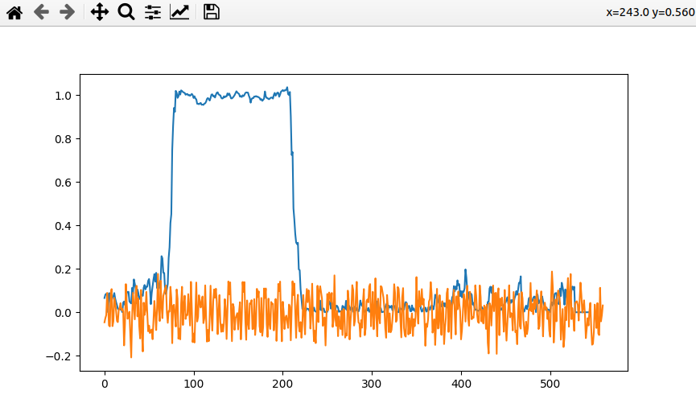

## 粗频偏校正与精频偏校正
- 粗频偏校正
  
    粗频偏校正可以通过短训练序列来进行校正，

    $$
    \alpha_{ST} = \frac{1}{16}\angle(\sum_{i=0}^{N-1}\overline{S[i]}S[i+16])
    $$

    其中 ∠(⋅) 是复数的相位且 N≤144(160−16)是所使用的短前导码的子集。直觉上，S[i]和S[i+16]之间的相位差代表16个样本的累积 CFO。
    根据上面的算子我们能够求出相差的相位。根据求出的相差，可以求出对应的频偏。
    $$
    f_{\Delta} = \frac{-1}{2\pi DTs}\angle(\alpha_{ST})
    $$
    然后就可以对频偏进行补偿。

    ```python
    # using 2,3 short training sequence for CFO
    s_cfo1 = rx_data[start_idx[0]+2*D:start_idx[0]+3*D]
    s_cfo2 = rx_data[start_idx[0]+3*D:start_idx[0]+4*D]

    z_coarse = np.sum(s_cfo1*np.conj(s_cfo2))
    coarse_cfo_est = (-1/(2*np.pi*D*TS))*np.angle(z_coarse)

    print(coarse_cfo_est)

    rx_with_coarse_cfo = rx_data * np.exp(-2j*np.pi*coarse_cfo_est*np.arange(len(rx_data))*TS)

    ```
    可以看到，蓝色的是发射端的数据，橙色是接收端的数据，绿色是经过粗频偏校正之后的数据。
    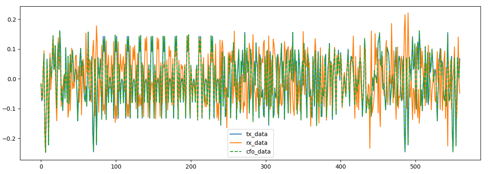

- 精频偏校正
借助长前导码内的长训练序列，可以获得对 CFO 的更精细估计。
 长前导码包含两个识别训练序列（每个64个采样点，20 MSPS），相位偏移可以计算为：

$$
\alpha_{LT} = \frac{1}{64}\angle(\sum_{i=0}^{63}\overline{S[i]}S[i+64])
$$


```python
# using ltc to for fine cfo, make sure thest est sample is in 2 of sts+cp
l_cfo1 = rx_with_coarse_cfo[start_idx[0]+11*D:start_idx[0]+11*D+L]
l_cfo2 = rx_with_coarse_cfo[start_idx[0]+11*D+L:start_idx[0]+11*D+2*L]
z_fine = np.sum(l_cfo1*np.conj(l_cfo2))
fine_cfo_est =  (-1/(2*np.pi*L*TS))*np.angle(z_fine)
rx_with_fine_cfo = rx_with_coarse_cfo * np.exp(-2j*np.pi*fine_cfo_est*np.arange(len(rx_with_coarse_cfo))*TS)
```

## 符号对齐
符号对齐对后续的处理很有帮助，在正确的时刻进行采样，我们才能获得正确的星座图，过早采样会导致星座图旋转，过晚采样可能导致我们根本接收不到良好的星座图。
在802.11a当中，使用两个LTS来进行符号的对齐，LTS具有良好的相关性，只有当LTS的符号完全对齐的时候，才会发现相关峰，因此，此时找到的相关峰的位置，就是一个LTS结束的位置。根据这个，我们就能够正确地完成符号对齐。
$$
Y[i] = \sum_{k=0}^{63}(S[i+k]\overline{H[k]})
$$

```python
def lts_detect_process_data(signal, amp_threshold):
    for i in range(len(signal) - L):
        sl1 = signal[i:i+L]
        Cli[i] = np.sum(sl1*lts[32:96].conj())
    above = (Cli > amp_threshold).astype(int)
    find_peak_idx = np.where(above >= amp_threshold)
    if len(find_peak_idx[0]) >= 2:
        print("detect 2 lts")
        # pop data from symbol
        lts_1 = signal[find_peak_idx[0][0]: find_peak_idx[0][0]+L]
        lts_2 = signal[find_peak_idx[0][1]: find_peak_idx[0][1]+L]
        data_payload =  signal[find_peak_idx[0][1]+L:]
        return lts_1, lts_2, data_payload
        

# channel estimation
lts_1, lts_2, data_payload = lts_detect_process_data(rx_with_fine_cfo, 0.6)
lts_1_fft = np.fft.fftshift(np.fft.fft(lts_1))
lts_2_fft = np.fft.fftshift(np.fft.fft(lts_2))
```

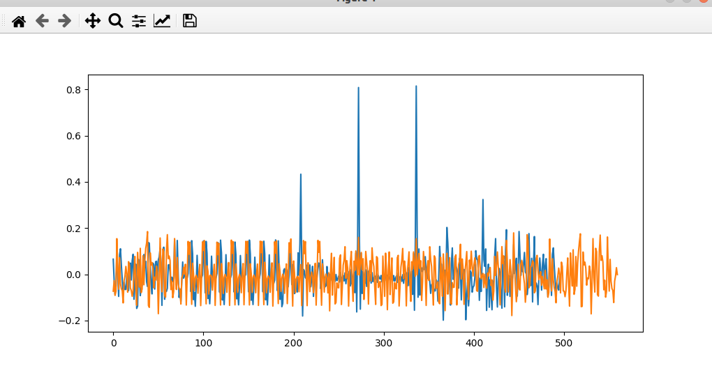

## 信道估计
- 均衡
    在前面完成了符号的对齐之后，接下来的就是在频域当中进行处理了。由于LTS是已知的，并且使用了53个子载波，因此我们可以使用LTS来进行信道的估计。
    我们可以看接收到的LTS与标准的LTS的差别：
    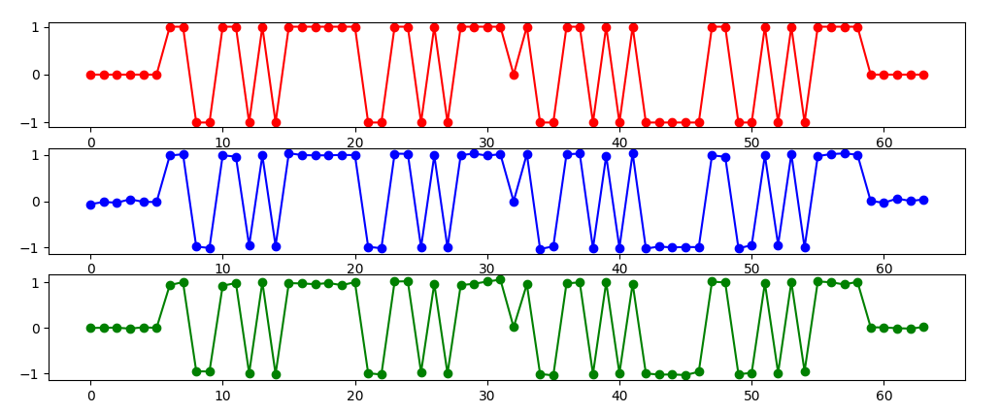
    其中 L[i] 是 LTS 序列的符号：
    $$
    H[i] = \frac{1}{2}(LTS_1[i] + LTS_2[i])\times L[i], i \in
    [-26, 26]
    $$

    有了信道响应之后，我们就可以使用信道估计来对每个之后的每个OFDM符号的子载波进行估计。
    $$
    Y[i] = \frac{X[i]}{H[i]}, i \in [-26, 26]
    $$

- 剩余频偏校正
    在802.11a的OFDM payload当中，除了数据之外，还有4个子载波用于承载导频，导频的值是有规律的，
    无论数据子载波调制如何，四个导频子载波（-21、-7、7、21）始终包含BPSK调制的伪随机二进制序列。

    导频子载波的极性随符号而变化。  对于 802.11a/g，导频模式为：
    $$
    \begin{split}p_{0,\ldots,126} = \{
        &1, 1, 1, 1,-1,-1,-1, 1,-1,-1,-1,-1, 1, 1,-1, 1,-1,-1, 1, 1,-1, 1, 1,-1, 1,\\
        &1, 1, 1, 1, 1,-1, 1, 1, 1,-1, 1, 1,-1,-1, 1, 1, 1,-1, 1,-1,-1,-1, 1,-1,\\
        &1,-1,-1, 1,-1,-1, 1, 1, 1, 1, 1,-1,-1, 1, 1,-1,-1, 1,-1, 1,-1, 1,\\
        &1,-1,-1,-1, 1, 1,-1,-1,-1,-1, 1,-1,-1, 1,-1, 1, 1, 1, 1,-1, 1,-1, 1,-1,\\
        &1,-1,-1,-1,-1,-1, 1,-1, 1, 1,-1, 1,-1, 1, 1, 1,-1,-1, 1,-1,-1,-1, 1, 1,\\
        &1,-1,-1,-1,-1,-1,-1,-1\}\end{split}
    $$
    则OFDM符号n处的导频子载波（从长前导码后的第一个符号从0开始）为
    $$
    P^{(n)}_{-21, -7, 7, 21} = \{p_{n\%127}, p_{n\%127}, p_{n\%127}, -p_{n\%127}\}
    $$

    符号 n 处的残余相位偏移可估计为：
    $$
    \theta_n = \angle(\sum_{i\in\{-21, -7, 7, 21\}}\overline{X^{(n)}[i]}\times P^{(n)}[i]\times H[i])
    $$
    最终得到的均衡和剩余频偏校正的结果为：
    $$
    Y^{(n)}[i] = \frac{X^{(n)}[i]}{H[i]}e^{j\theta_n}   
    $$


在下面的代码当中，我们实现了信道的估计，并且计算出了信道的响应，并且提取除了导频
```python
# channel estimation
lts_1, lts_2, data_payload = lts_detect_process_data(rx_with_fine_cfo, 0.6)
lts_1_fft = np.fft.fftshift(np.fft.fft(lts_1))
lts_2_fft = np.fft.fftshift(np.fft.fft(lts_2))

h_csi = 0.5*(lts_1_fft+ lts_2_fft) * l_k_symbol.conj()
plt.figure()
plt.plot(h_csi)
h_csi_no_pad = h_csi[6:6+ofdm_payload.kon]
h_csi_no_pilot = np.delete(h_csi_no_pad, sub_carrier_remove_index)
h_csi_pilot = h_csi_no_pad[pilot_index]


# equlizer data using chnanel estimation
rx_data_payload_1 = data_payload[ofdm_payload.cp:ofdm_payload.cp+ofdm_payload.k]
def freq_domain_process(data):
    rx_data_payload_1_f = np.fft.fftshift(np.fft.fft(data))
    rx_data_payload_1_no_pad = rx_data_payload_1_f[6:6+ofdm_payload.kon]
    rx_data_payload_1_no_pilot = np.delete(rx_data_payload_1_no_pad, sub_carrier_remove_index)
    pilot_value = rx_data_payload_1_no_pad[pilot_index]

    return rx_data_payload_1_no_pilot, pilot_value


rx_data_payload_1_no_pilot, pilot_value = freq_domain_process(rx_data_payload_1)
rx_data_payload_1_f_equalizer = rx_data_payload_1_no_pilot / h_csi_no_pilot

# Residual Frequency Offset Correction
def calculate_residual_cfo(pilot_value, csi):
    z = np.sum(pilot_value.conj() * ofdm_pilot * csi)
    return np.angle(z)

residual_angle= calculate_residual_cfo(pilot_value, h_csi_pilot)
rx_data_with_residual_cfo = rx_data_payload_1_f_equalizer*np.exp(1j*residual_angle)
```

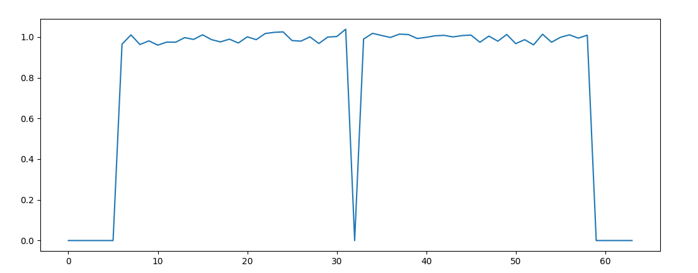