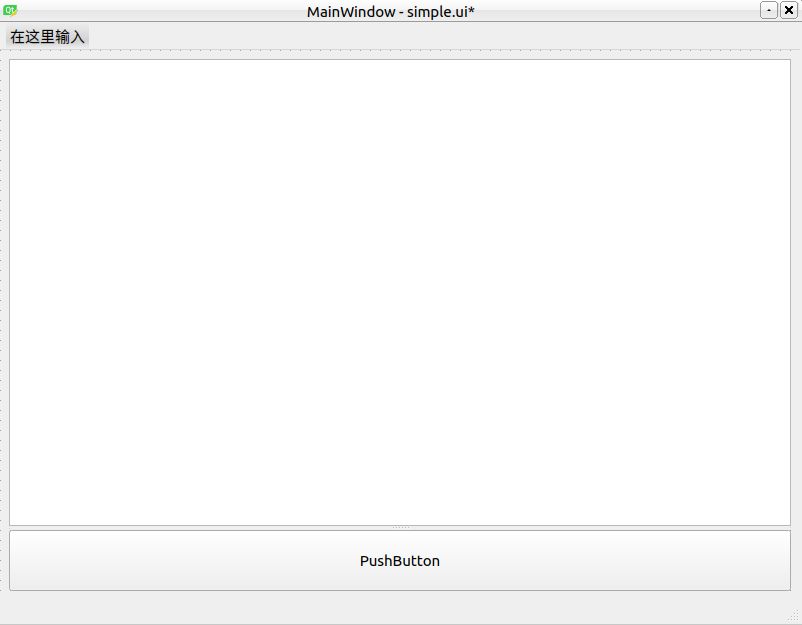
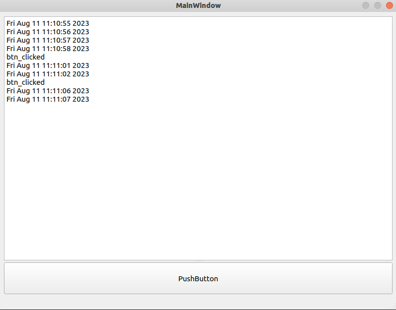
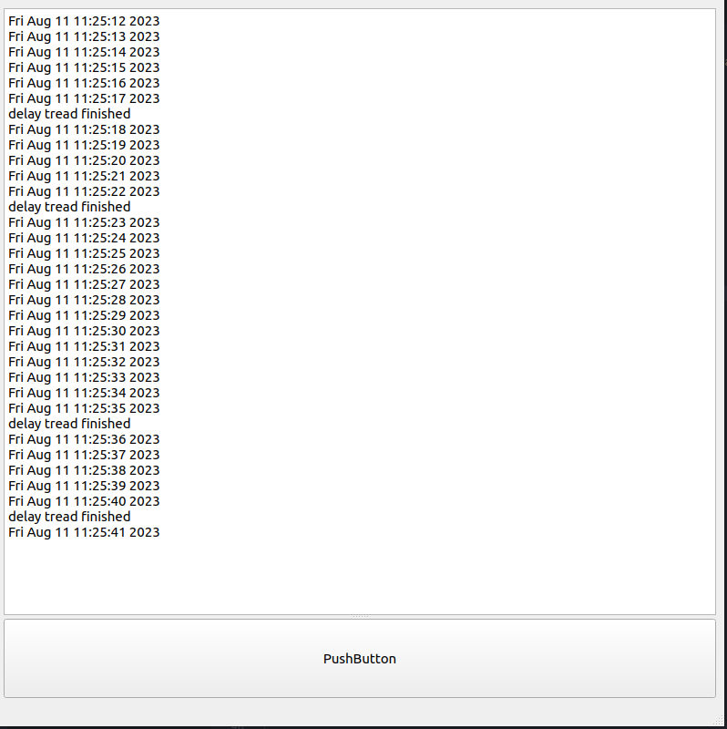

在之前学习了PYQT最基本的显示界面的方法，时间已经过去很久远了，因为不是做软件的，所以很多东西也就没有深入地去了解。
最近在制作一个原型，使用PYQT可以快速地显示界面，因此又稍微深入地了解了一下。
<!--more-->

# 界面制作
制作一个简单的界面，在设计界面的时候，要注意所有部件摆好布局之后，可以在空白处，右键然后选择布局，对整体进行一个栅格布局，这样生成的界面在之后拖动改变大小的时候，所有的部件也就会跟着改变了。


这个界面比较简单，就一个按钮，一个文本框。

# 问题来源
我们让文本框，每隔一秒打印一点东西，但是按下按钮，会延时等待3秒，我们先看看这样会发生什么。这个目的是为了模拟某些十分耗时的操作，如果耗时的操作也放在主线程当中，会导致界面很长时间不能得到响应，从而导致程序崩溃。
```python
import sys
from PyQt5.QtWidgets import QApplication, QMainWindow, QPushButton,  QPlainTextEdit
from Ui_simple import *
from PyQt5.QtCore import QThread, pyqtSignal, QTimer
import time

class MyMainWindow(QMainWindow, Ui_MainWindow):
    def __init__(self, parent=None):
        super(MyMainWindow, self).__init__(parent)
        self.setupUi(self)

        # bonding signal and slot
        self.pushButton.clicked.connect(self.delay)

        timer = QTimer(self)
        timer.timeout.connect(self.display_info)
        timer.start(1000)

    # display the user name and password into the editbox
    def display_info(self):
        current_time = time.ctime()
        self.plainTextEdit.appendPlainText(current_time)

    def delay(self):
        self.plainTextEdit.appendPlainText(str("btn_clicked"))
        time.sleep(3)


if __name__ == "__main__":
    # create an application
    app = QApplication(sys.argv)
    # initialize the window
    myWin = MyMainWindow()
    # display the window
    myWin.show()
    # exit the program
    sys.exit(app.exec_())
```


可以看到，在没有进入耗时操作之前，每隔一秒都会在文本框当中输出一个信号。当按下按钮之后，系统停滞了3秒，并且此时界面无法响应任何用户的输入。

# PYQT多线程
PYTQ当中可以使用多线程的方式来解决这个问题。我们可以自定义一个线程类，然后把子线程这个类在主线程当中例化。

```python
import sys
from PyQt5.QtWidgets import QApplication, QMainWindow, QPushButton,  QPlainTextEdit
from Ui_simple import *
from PyQt5.QtCore import QThread, pyqtSignal, QTimer
import time


class DelayThread(QThread):
    signal_subthread = pyqtSignal(object)

    def __init__(self,delay_valuie, parent=None):
        super(DelayThread, self).__init__(parent)
        # QThread.__init__(self)
        self.delay_valuie = delay_valuie
    
    def run(self):
        while True:
            if self.delay_valuie !=0 :
                time.sleep(self.delay_valuie)
                self.signal_subthread.emit(int(1))
            else:
                pass

class MyMainWindow(QMainWindow, Ui_MainWindow):
    def __init__(self, parent=None):
        super(MyMainWindow, self).__init__(parent)
        self.setupUi(self)

        # bonding signal and slot
        
        self.delay_thread = DelayThread(0)

        timer = QTimer(self)
        timer.timeout.connect(self.display_info)
        timer.start(1000)

        self.pushButton.clicked.connect(self.update_delay)
        self.delay_thread.signal_subthread.connect(self.delay_finished)

        self.delay_thread.start()


    # display the user name and password into the editbox
    def display_info(self):
        current_time = time.ctime()
        self.plainTextEdit.appendPlainText(current_time)

    def update_delay(self):
        self.delay_thread.delay_valuie = 5

    def delay_finished(self):
        self.delay_thread.delay_valuie =0
        self.plainTextEdit.appendPlainText(str("delay tread finished"))
        


if __name__ == "__main__":
    # create an application
    app = QApplication(sys.argv)
    # initialize the window
    myWin = MyMainWindow()
    # display the window
    myWin.show()
    # exit the program
    sys.exit(app.exec_())

```

可以看到加入多线程之后，不会影响主线程的使用。
多线程主要是要继承自QTread这个类，在这个类当中，可以声明信号作为类属性。想要完成子线程向主线程传递信息，可以通过信号的方式进行传递。
在我们这里定义信号的时候，是以最基础的pyqtSignal(object)这个类来的，这样我们能够将任意类型的数据传递给主进行。在主进程当中，可以来接收这些数据。
主进程想要修改子进程当中的数据，因为子进程已经例化到主进程当中，因此可以直接修改例化的这个对象的属性。