# 前言
最近开始整理和无人机相关的东西，在网上找了一圈，发现了两个比较好的开源项目，这两个开源项目都能够实现的DJI OcuSync 2.0 Droneid协议的解调。
[DroneSecurity](https://github.com/RUB-SysSec/DroneSecurity)
[dji_droneid](https://github.com/proto17/dji_droneid)
在参考了上述两个仓库之后,给了我很多启发，通过阅读上面的代码，也让我对DJI的Droneid帧有了更加深刻的认识。
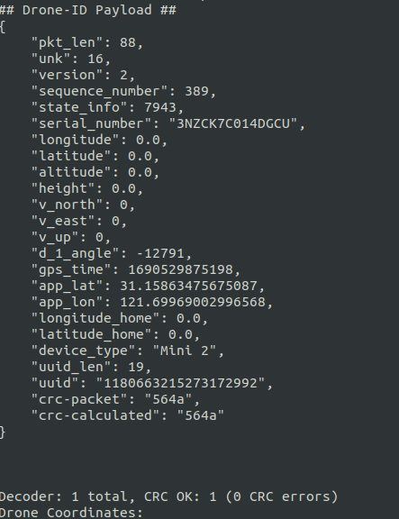
<!--more-->

# DroneID 数据帧
在DroneSecurity这个项目当中，作者详细地介绍了DJI无人机的DroneID的数据帧结构。
[ndss2023_f217_paper](https://www.ndss-symposium.org/wp-content/uploads/2023/02/ndss2023_f217_paper.pdf)
国内也有人对这篇论文进行了翻译，译文链接如下：
[文档翻译](https://bbs.kanxue.com/thread-276355.htm)
该信号的结构如下所示：
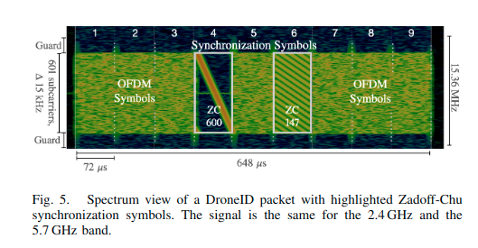
OcuSync和DroneID规范并非公开的。根据作者的分析，这些协议使用了与LTE类似的调制技术和参数。他们逐步逆向工程了所有后续的参数。一个数据包包含九个符号，其中包括两个Zadoff-Chu（ZC）同步符号（第4和第6个符号。其他符号是具有601个子载波（600个数据和1个直流）和15 kHz子载波间隔的OFDM数据符号。为了在下一步中应用快速傅里叶变换（FFT），载波被填充到下一个2的幂次方；这总共产生了1024个子载波，总带宽为15.36 MHz（包括保护带）。他们的记录显示，这些数据包每640毫秒重复广播一次。我们注意到一些无人机（Mavic 2和旧版OcuSync无人机）不发送第一个符号（第1个符号），这导致帧持续时间缩短为576微秒。其他参数保持不变。

有了上面的这些信息，即使我们没有无人机，在验证算法的时候，也可以根据这些结构生成自己的帧。

# Droneid 仿真
根据上面介绍的一个droneid数据帧，包含9个OFDM符号，关于OFDM，前面也通过学习有了了解。这为我们学习DroneID的解调提供了便利。

下面是一些常用的参数：
采样率为30.72M,占用的子载波是601个。子载波之间的频率是15KHz,根据采样率我们可以算在进行IFFT、FFT变换的时候需要的点数。
由于不同的符号所需要的循环前缀的长度是不一样的，因此我们需要给对应的符号不同的循环前缀。
在Droneid当中，很重要的一个OFDM符号就是第4个OFDM符号，该符号包含了一个ZC序列，使用这个符号，能够帮助我们定位这一个数据帧，尤其是在茫茫多的数据当中，通过使用这个数据帧在时域上和本地生成的ZC序列进行相关，能够快速定位数据帧。并且在之后的信道估计也可以使用这个序列。

```python
NCARRIERS = 601 
sample_rate = 30.72e6
TS = 1/sample_rate

# Step1: generate a droneid like frame
class OFDM():
    def __init__(self, K, Kon, CP):
        self.k = K
        self.kon = Kon
        self.cp= CP

# calculate fft_size, ofdm carrier is 15KHz
def get_fft_size(sample_rate):
    fft_size = int(sample_rate / 15e3)
    return fft_size

# calculate the cp length for different symbols
def get_cp_lengths(sample_rate):
    long_cp_len = int(np.round(1/192000 * sample_rate))
    short_cp_len = int(np.round(0.0000046875 * sample_rate))
    return long_cp_len, short_cp_len

fft_bins = get_fft_size(sample_rate)
long_cp_len, short_cp_len = get_cp_lengths(sample_rate)

# cyclic prefix for every ofdm symbol
cyclic_prefix_length_schedule = [
long_cp_len, 
short_cp_len,
short_cp_len,
short_cp_len,
short_cp_len,
short_cp_len,
short_cp_len,
short_cp_len,
long_cp_len]

# number of ofdm symbols per droneid frame
num_ofdm_symbols = len(cyclic_prefix_length_schedule)


zc600_offset = fft_bins*3 + short_cp_len*3 + long_cp_len    # ZC600 sequence is very important
frame_length = long_cp_len*2 + short_cp_len*7 + fft_bins*9  # frame total length in time domain


ofdm_zc_short_cp = OFDM(fft_bins, NCARRIERS, short_cp_len)  # ofdm parameter for short cp (symbol1~symbol7)
ofdm_zc_long_cp = OFDM(fft_bins, NCARRIERS, long_cp_len)    # ofdm parameter for long cp (symbol0 and symol8)

```

## ZC序列
### ZC序列的原理
在4G LTE系统中，PSS、SSS、cellRS、DMRS、SRS、PRACH、PUCCH等物理层信号，基本上都涉及到了ZC（Zadoff –Chu）序列信号。
在5G NR系统中，除了采用M序列来生成抵抗大频偏场景的PSS和SSS信号，其它信号也同样涉及到了Zadoff –Chu序列。
Zadoff –Chu序列，顾名思义，就是Zadoff 和Chu共同发现的序列。
ZC序列并不是一个二进制序列，而是一个欧拉复数序列。
也就是说，ZC序列并不是横坐标或纵坐标上一个个点的序列，也不是平面坐标上的任意一个个点的序列，而是复平面坐标上的单位圆上的一个个点组成的序列。
每个点对应一对（I, Q）的幅度值。

ZC序列的计算公式如下
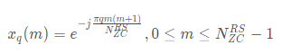
其中q是zc序列的根，不同的q值生成的ZC序列不同，在Droneid当中，使用ZC序列的根为600和147，其中最重要的是根值为600的这个序列。

用python实现ZC序列生成的公式如下：
```python
def zcsequence_t(u: int, seq_length: int, q: int=0) -> np.array:
    """
    Generate a Zadoff-Chu (ZC) sequence.
    Parameters
    ----------
    u : int
        Root index of the the ZC sequence: u>0.
    seq_length : int
        Length of the sequence to be generated. Usually a prime number:
        u<seq_length, greatest-common-denominator(u,seq_length)=1.
    q : int
        Cyclic shift of the sequence (default 0).
    Returns
    -------
    zcseq : 1D ndarray of complex floats
        ZC sequence generated.
    """

    zcseq = np.exp(-1j * np.pi * u * np.arange(seq_length) * (np.arange(seq_length)+1) / seq_length)

    return zcseq
```

###  ZC序列的性质
  在前面介绍了简单的介绍了一下ZC序列，ZC序列具有一些比较好的特性
  - 恒包络
    任意长度的ZC序列的信号的幅值是恒定的，这也意味着功率恒定，这个好处就是射频器件不用忽大忽小的改变能量。

  - 理想周期自相关 与 良好的互相关
    ZC序列循环移位N后，原序列只与移位后的序列得良好的相关峰值，其它位置的序列相关峰值为0。除此之外，两个根如果是互质的，生成的序列相关峰值几乎为零。

  - 傅立叶变换后仍是ZC序列
    这个性质，简直就是为OFDM系统量身打造，也省去多少运算量。既可以在时域相关，也可以在频域相关。   

  - 对于信道估计，ZC序列幅值恒定，其图形可看作一个单位圆。  

下面我们就生成一个实际的ZC序列来介绍一下ZC系列的这些特点
```python
def test_create_correlat_taps(sample_rate, root, ofdm):
    zcseq = zcsequence_t(root, NCARRIERS)   # create a zc sequence
    zcseq[NCARRIERS//2] = 0                 # this is DC
    zc_seqs, zc_taps =  ofdm_modulation(ofdm, zcseq)
    return zc_seqs, zc_taps, zcseq
_, test_zc_taps, test_zcseq = test_create_correlat_taps(sample_rate, 600, ofdm_zc_short_cp)
plt.figure()
plt.plot(test_zcseq.real, test_zcseq.imag, 'bo')
plt.figure()
plt.subplot(211)
plt.plot(test_zc_taps.real)
plt.subplot(212)
plt.plot(test_zc_taps.imag)


test_data = np.hstack([test_zc_taps[200:], test_zc_taps[:200]])
test_cfo = np.zeros(len(test_data))
def test_cross_correlation_to_find_peak(signal):
    temp_signal = signal
    for i in range(len(signal)):
        temp_sig = temp_signal[:len(test_zc_taps)]
        test_cfo[i] = np.abs(np.sum(test_zc_taps * temp_sig.conj()))
        # cross_acf_147[i] = np.abs(np.sum(zc_taps_147 * temp_sig.conj()))
        temp_signal = np.roll(temp_signal, -1)

test_cross_correlation_to_find_peak(test_data)
plt.figure()
plt.plot(test_cfo)
```
首先是该序列在频域当中的形式。可以看到在频域当中是zc序列是一个单位圆。在这里我们可以看到在中心位置有一个点，这是由于我们在实际使用ZC序列的时候，中心子载波为DC。
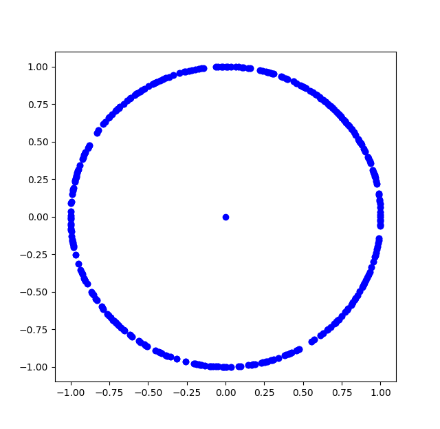

下面是时域当中的信号波形的实部和虚部：
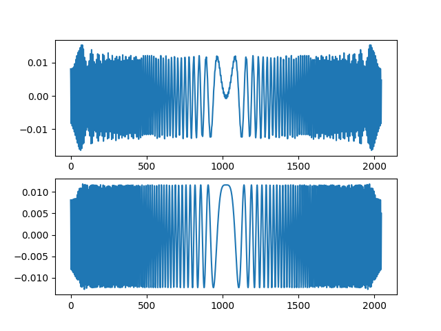
下面是该信号互相关出来的结果：
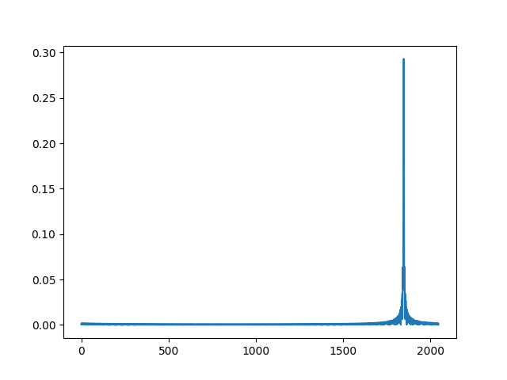

## 生成OFDM帧
OFDM这部分在这里就不多说了，在前面已经介绍过OFDM如何来处理了，下面是实际生成的一个可以进行仿真的OFDM在时域当中的序列，并且添加了频偏和噪声。
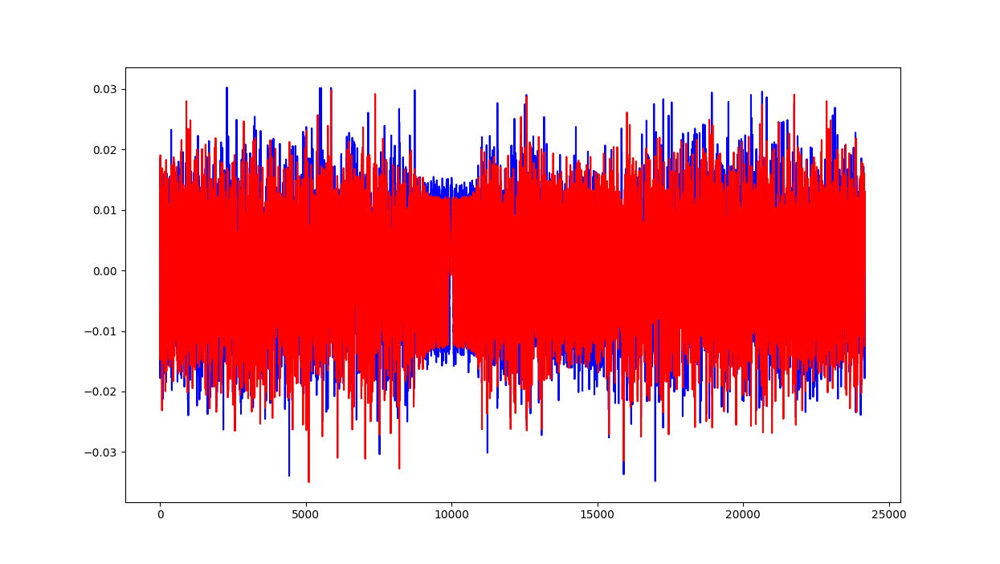
从这个帧当中，我们还是能够很容易地找到ZC600这个序列。
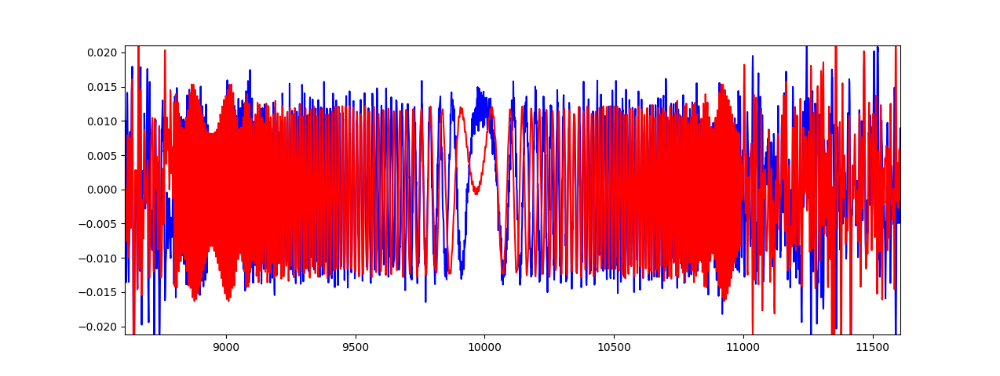

## OFDM解调
### 使用ZC序列进行相关峰检测
在一帧数据当中，首先需要进行对检测当前的数据当中是否存在droneid的帧，这可以通使用ZC序列来进行检测，前面介绍过ZC序列具有良好的自相关性。在本地我们生成一个ZC600的序列，对这个序列和采集到的数据进行相关，检测到一个明显的峰值，就说明当前采集到的数据当中存在droneid帧。
在实际的采集当中，这一步可以在FPGA当中完成，在上位机完成这个相关是比较耗时间的，尤其是在python当中，在前面也介绍了如何在FPGA当中实现实时互相关操作。
```python
cross_acf_600 = np.zeros(len(rx_data), dtype=complex)
threshold =0.2

def peak_detect(signal, amp_threshold):
    max_value = np.amax(signal)
    max_index = np.argmax(signal)
    if max_value > amp_threshold :
        return max_index
    else :
        print("no peak detect")
        return None

def cross_correlation_to_find_peak(signal, threshold):
    temp_signal = signal
    for i in range(len(signal)):
        temp_sig = temp_signal[:len(zc_taps_600)]
        cross_acf_600[i] = np.abs(np.sum(zc_taps_600 * temp_sig.conj()))
        # cross_acf_147[i] = np.abs(np.sum(zc_taps_147 * temp_sig.conj()))
        temp_signal = np.roll(temp_signal, -1)
    # plt.figure()
    # plt.plot(cross_acf_600)
    zc600_coarse_idx = peak_detect(cross_acf_600, threshold)

    return zc600_coarse_idx

zc600_coarse_idx = cross_correlation_to_find_peak(rx_data, threshold)
```
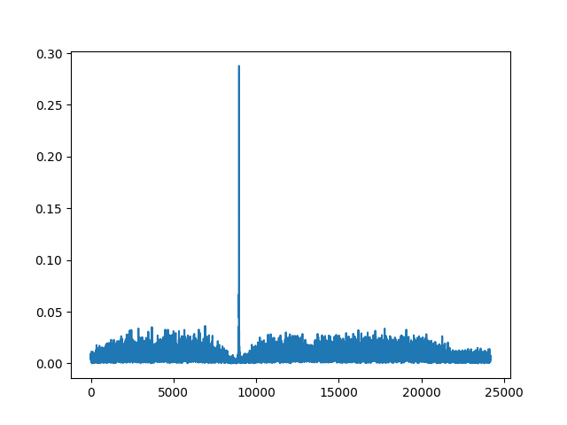
在这一步当中，只是为了来大致地定位一下这个ZC序列的位置，为接下来的整数倍频偏做准备。

### 整数倍频偏校正
在进行整数倍频偏校正的时候，我们使用的是ZC序列来进行校准，这样，前面在进行ZC序列的粗定位的时候，给我们提供了一个ZC序列的起始值，这个起始位置可能不太精确，但是足够包含大部分ZC序列的时域当中的点。
有前面ZC序列的性质可以知道，ZC序列具有恒包络，在频域上的点都在一个单位圆上面。而在中心载波，也就是0频的位置，我们给这个位置的载波的值为0，这样，中心载波的值相较于其他子载波的值就最下，如下图所示：
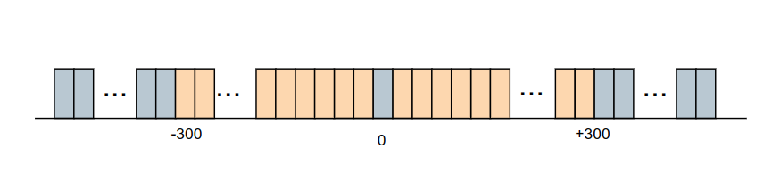
整数倍频偏校准的方法就是
- 粗略地获取到了一个ZC序列
- 将这个ZC序列转换到频域
- 比较当前频域中，中心部分的几个子载波的大小，找到最小的子载波所在的索引
- 比较最小的子载波所在的索引与标准的ZC序列的频域的DC位置索引，计算出的差值d, 整数被频偏为d*15KHz

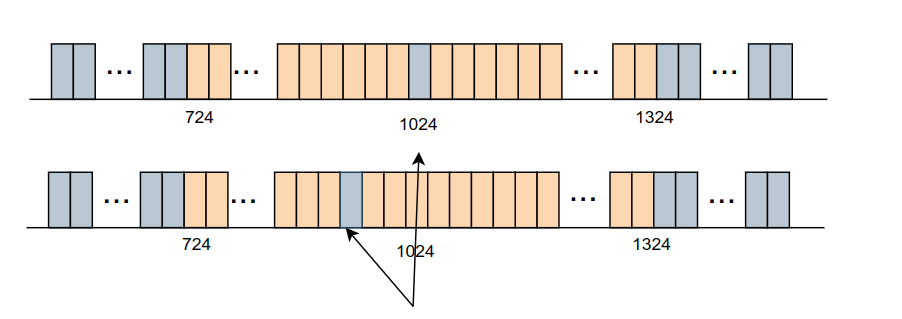

```python
def cfo_estimation_freq_domain(signal):
    f_d = np.fft.fftshift(np.fft.fft(signal))
    power_of_signal = 20*np.log10(abs(f_d))
    bin_count = 15; # How far left and right to look for the lowest carrier

    # Set all of the FFT bins on the outside to infinity so they can't possibly be the minimum value
    power_of_signal[:fft_bins//2 -bin_count] = np.inf
    power_of_signal[fft_bins//2 +bin_count:] = np.inf
    min_value = np.amin(power_of_signal)
    min_index = np.argmin(power_of_signal)
    print(min_index)
    integer_offset = (min_index - ((fft_bins // 2))) * 15e3
    # radians = 2 * np.pi * integer_offset / (sample_rate)
    print("integer_offset = %d" % integer_offset)

    return integer_offset

integer_offset = cfo_estimation_freq_domain(test_data_for_freq_domain_cfo)
data_with_integer_offset = cfo_correct(rx_data, integer_offset)
```

### 时间同步与小数倍频偏校正
[Schmidl & Cox算法](http://dspillustrations.com/pages/posts/misc/schmidlcox-synchronization-for-ofdm.html)当中，介绍了一种特殊的序列来进行序列的检测和频偏的校正，在当前的OFDM系统当中，虽然不具备Schmidl & Cox算法当中特定的数据帧，但是由于OFDM当中的CP的存在，使得我们依旧可以通过这种类似的方法来进行频偏的校正。
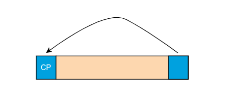
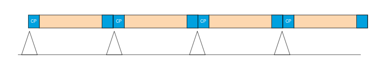

在我们的ofdm帧当中存在CP，我们可以通过对间隔 len_ofdm - len_cp 个点的len_cp个长度的时域点进行互相关操作，这样当CP与OFDM尾部对齐的时候，就能够检测到一个相关峰，我们可以利用这个来实现信号的精确的时间同步。
在我们的实现算法当中，我们不只计算一个OFDM的循环前缀的相关，我们一共计算9个OFDM符号的循环前缀相关，并求取这9个相关值的平均值，这样能够进一步优化我们的时间同步。最终我们提取出计算出来的最大的相关峰的索引值，这个索引值，就是实际一个OFDM符号开始的地方比较准确的估计。
```python
def find_sto_cp(signal):
    full_burst_len = np.sum(cyclic_prefix_length_schedule) + (fft_bins * num_ofdm_symbols);
    num_tests = len(signal) - full_burst_len
    scores_cp_sto = np.zeros(num_tests, dtype=complex)
    for i in range(num_tests):
        offset = i
        scores = np.zeros( num_ofdm_symbols, dtype=complex)

        for cp_idx in range(num_ofdm_symbols):
            cp_len = cyclic_prefix_length_schedule[cp_idx]

            window = signal[offset:offset+fft_bins+cp_len]

            left = window[:cp_len]
            right = window[-cp_len:]

            scores[cp_idx] = np.abs(np.sum(left*right.conj()))

            offset = offset + cp_len + fft_bins

        scores_cp_sto[i] = np.sum(scores[1:]) / (len(scores) - 1)
    
    start_offset = np.argmax(scores_cp_sto)
    return start_offset
true_start_index = find_sto_cp(data_with_integer_offset)
```
上面完成了比较准确地时间同步，接下来我们就可以利用这个信息，来提取出ZC序列的循环前缀和ZC序列OFDM符号的尾部，从而来计算出小数被频偏。
```python
burst = data_with_integer_offset[true_start_index:]

zc_start = long_cp_len + (fft_bins * 3) + (short_cp_len * 3)
# Extract out the full OFDM symbol (cyclic prefix included)
cfo_est_symbol = burst[zc_start - short_cp_len:zc_start + fft_bins]

# Get the cyclic prefix, and then the copy of the cyclic prefix that exists at the end of the OFDM symbol
cyclic_prefix = cfo_est_symbol[:short_cp_len]
symbol_tail = cfo_est_symbol[ - short_cp_len:]

# Calculate the frequency offset by taking the dot product of the two copies of the cyclic prefix and dividing out
# the number of samples in between each cyclic prefix sample (the FFT size)
offset_radians = np.angle(np.sum(cyclic_prefix*symbol_tail.conj())) / fft_bins
offset_hz = -offset_radians * sample_rate / (2 * np.pi)
burst_with_cp_cfo = cfo_correct(burst, offset_hz)
```

在执行完这一步之后，时域当中基本就处理完了，我们可以再一次利用找相关峰的操作，完成对频偏校正和时间同步之后的信号的相关峰检测，这能给我们一个更加精确的位置，这对之后进行ofdm符号的获取十分有帮助。


### OFDM符号获取
在前面完成了频偏的校正，并且获取了ofdm_frame比较准确的起始值之后，我们就可以去掉ofdm当中的所有CP，以获取每个符号了。
```python
symbol = np.zeros((9,fft_bins), dtype=complex)
symbol_f = np.zeros((9,fft_bins), dtype=complex)
def extract_symbols(signal, frame_start_idx, frame_end_idx ):
    symbol[0] = signal[frame_start_idx+long_cp_len: frame_start_idx +long_cp_len+fft_bins]
    symbol[8] = signal[frame_end_idx-fft_bins:frame_end_idx]
    for i in range(1, 8):
        symbol[i] = signal[frame_start_idx+long_cp_len+short_cp_len*i + fft_bins*i: frame_start_idx + long_cp_len + short_cp_len*i + fft_bins*(i+1)]
    
    return symbol

symbol = extract_symbols(burst_with_cp_cfo, frame_start_idx, frame_end_idx)

def symbol_dft(symbols):
    for i in range(9):
        symbol_f[i] = np.fft.fftshift(np.fft.fft(symbols[i]))
    return symbol_f

symbol_f = symbol_dft(symbol)
plt.figure()
plt.subplot(211)
plt.plot(symbol_f[3].real, symbol_f[3].imag, 'bo', label ="zcseq symbol")
plt.legend()
plt.subplot(212)
plt.plot(symbol_f[1].real, symbol_f[1].imag, 'ro', label ="normal data symbol")
plt.legend()
```
上面的代码当中，并没有删除DC和pad子载波，因此我们获取到的星座图会在中间位置有许多点。
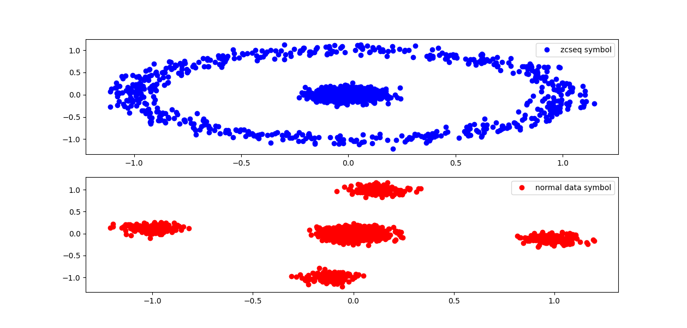
在上面也可以看到，ZC序列在频域当中还是一个近似的单位圆，而其他数据符号，具有一定的偏移。
接下来就需要进行信道的估计了和均衡了。

### 信道估计与均衡
在前面我们已经获取了接收到的ZC序列在疲于当中的所有数据，由于ZC序列我们是已知的，通过比较接收到的ZC序列的值与已知的准确的ZC序列的值，我们就能够完成信道的估计。
值得注意的是，在信道估计的时候，我们只是估计数据子载波对应的那些信道。对于pad和DC需要移除。
```python
def delete_unused_carriers(signal, ofdm):
    off = int(np.ceil((ofdm.k-ofdm.kon)/2)) # calculate the data sub-carrier start position
    data = signal[off:off+ofdm.kon]
    xk = np.delete(data, NCARRIERS//2)
    return xk

zcseq_600 = zcsequence_t(600, NCARRIERS)   # create a zc sequence
zcseq_600[NCARRIERS//2] = 0                 # this is DC
zc_correct_600 = np.delete(zcseq_600, NCARRIERS//2)

zcseq_147 = zcsequence_t(147, NCARRIERS)   # create a zc sequence
zcseq_147[NCARRIERS//2] = 0                 # this is DC
zc_correct_147 = np.delete(zcseq_147, NCARRIERS//2)

rx_zc_seq600 = delete_unused_carriers(symbol_f[3], ofdm_zc_short_cp)
rx_zc_seq147 = delete_unused_carriers(symbol_f[5], ofdm_zc_short_cp)

h_csi_600 = rx_zc_seq600 / zc_correct_600
h_csi_147 = rx_zc_seq147 / zc_correct_147
plt.figure()
plt.plot(h_csi_600, '-o')
```
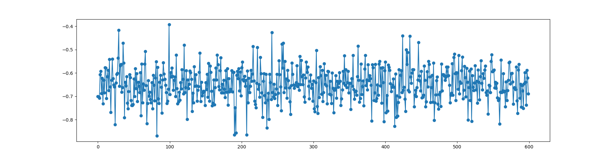

有了信道的响应之后，我们就可以对其他符号进行均衡了。
```python
symbol_f1 = delete_unused_carriers(symbol_f[1], ofdm_zc_short_cp)
symbol_f2 = delete_unused_carriers(symbol_f[2], ofdm_zc_short_cp)
symbol_f2_eq = (symbol_f2 / h_csi_600)
symbol_f1_eq = (symbol_f1 / h_csi_600)
plt.figure()
plt.subplot(211)
plt.plot(symbol_f2.real, symbol_f2.imag, 'bo', label="un eq")
plt.legend()
plt.subplot(212)
plt.plot(symbol_f2_eq.real, symbol_f2_eq.imag, 'bo', label="eq")
plt.legend()
```
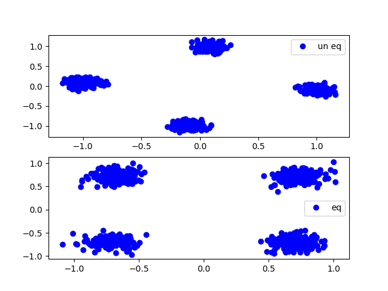

到这里在物理层上的所有这一系列操作都完成了，接下来就可以对星座图进行解隐射，并且进行后续的解码了。