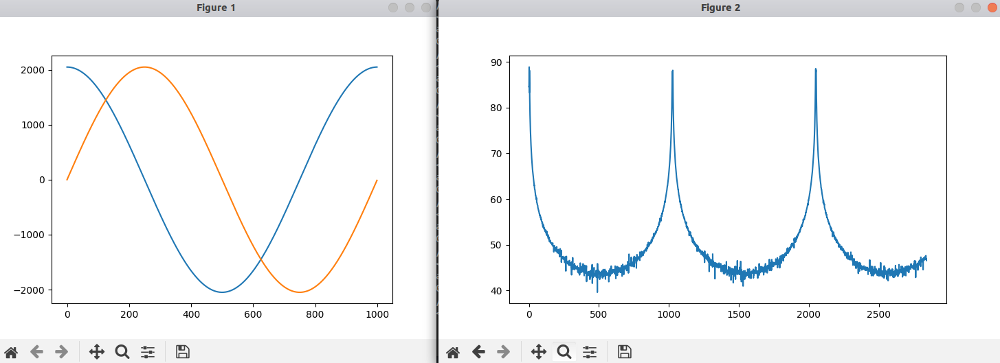
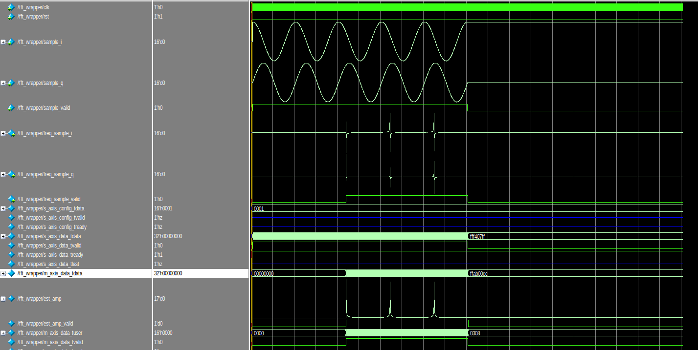

# 前言
在前面有使用过cocotb进行一些简单的操作仿真操作，了解了cocotb当中的基础使用方法，并且能够使用cocotb来关联modelsim/questasim 进行Vivado当中IP的仿真。
cocotb可以使用python来提供测试数据源，这对DSP算法的FPGA实现实很友好的，之前在FPGA上如何想要实现DSP的算法的验证，可能需要先从matlab生成测试数据，然后再将数据导入到仿真平台当中，在cocotb当中，我们可以使用numpy和scipy能够很容易地生成这些测试数据，并将这些数据灌入到我们自己的实现的HDL模块当中。
这篇博客，记录一下使用cocotb来完成仿真fft ip的功能仿真。
<!--more-->

# 仿真fft ip
结构目录如下图：
```bash
wcc@wcc-h:~/wcc_demo/cocotb/fft_ip$ tree -L 2
.
├── fft_ip
│   ├── fft_ip.cache
│   ├── fft_ip.hw
│   ├── fft_ip.ip_user_files
│   ├── fft_ip.runs
│   ├── fft_ip.sim
│   ├── fft_ip.srcs
│   ├── fft_ip.xpr
│   ├── vivado.jou
│   ├── vivado.log
│   └── vivado_pid15096.str
├── rtl
│   └── fft_wrapper.v
└── tb
    ├── Makefile
    ├── modelsim.ini
    ├── __pycache__
    ├── results.xml
    ├── sim_build
    ├── tb_fft_wrapper.py
    ├── transcript
    ├── vish_stacktrace.vstf
    ├── vsim.wlf
    └── wlftkVBf3W


```
## RTL 代码
其中rtl用来存放我们自己需要设计的RTL代码，tb文件存放仿真用的测试文件和Makefile,第一个目录则是对应的vivodo的工程目录。
在这个工程当中我们主要使用一个fft ip。

rtl 代码如下：
```verilog
module fft_wrapper(
    input   wire            clk         ,
    input   wire            rst         ,
    input   wire    [15:0]  sample_i    ,
    input   wire    [15:0]  sample_q    ,
    input   wire            sample_valid,
    
    output  wire    [15:0]  freq_sample_i      ,
    output  wire    [15:0]  freq_sample_q      ,
    output  wire            freq_sample_valid   
);


    wire [15 : 0] s_axis_config_tdata   ;
    wire s_axis_config_tvalid   ;
    wire s_axis_config_tready   ;
    wire [31 : 0] s_axis_data_tdata ;
    wire s_axis_data_tvalid ;
    wire s_axis_data_tready ;
    wire s_axis_data_tlast  ;
    wire [31 : 0] m_axis_data_tdata ;
    wire [15 : 0] m_axis_data_tuser ;
    wire m_axis_data_tvalid ;
    wire m_axis_data_tready ;
    wire m_axis_data_tlast  ;
    wire event_frame_started    ;
    wire event_tlast_unexpected ;
    wire event_tlast_missing    ;
    wire event_status_channel_halt  ;
    wire event_data_in_channel_halt ;
    wire event_data_out_channel_halt    ;

    wire full, empty ;

    assign s_axis_config_tdata = 1'b1;


    fifo_generator_0 your_instance_name (
        .clk(clk),      // input wire clk
        .din({sample_q, sample_i}),      // input wire [31 : 0] din
        .wr_en(sample_valid),  // input wire wr_en
        .rd_en(s_axis_data_tvalid&s_axis_data_tready),  // input wire rd_en
        .dout(s_axis_data_tdata),    // output wire [31 : 0] dout
        .full(full),    // output wire full
        .empty(empty)  // output wire empty
    );

    assign s_axis_data_tvalid = ~empty;

    xfft_0 u_xfft (
    .aclk(clk),                                                // input wire aclk
    .s_axis_config_tdata(s_axis_config_tdata),                  // input wire [15 : 0] s_axis_config_tdata
    .s_axis_config_tvalid(1'b1),                                // input wire s_axis_config_tvalid
    .s_axis_config_tready(),                                    // output wire s_axis_config_tready
    .s_axis_data_tdata(s_axis_data_tdata),                      // input wire [31 : 0] s_axis_data_tdata
    .s_axis_data_tvalid(s_axis_data_tvalid),                    // input wire s_axis_data_tvalid
    .s_axis_data_tready(s_axis_data_tready),                    // output wire s_axis_data_tready
    .s_axis_data_tlast(s_axis_data_tlast),                      // input wire s_axis_data_tlast
    .m_axis_data_tdata(m_axis_data_tdata),                      // output wire [31 : 0] m_axis_data_tdata
    .m_axis_data_tuser(m_axis_data_tuser),                      // output wire [15 : 0] m_axis_data_tuser
    .m_axis_data_tvalid(m_axis_data_tvalid),                    // output wire m_axis_data_tvalid
    .m_axis_data_tready(1'b1),                    // input wire m_axis_data_tready
    .m_axis_data_tlast(m_axis_data_tlast),                      // output wire m_axis_data_tlast
    .event_frame_started(event_frame_started),                  // output wire event_frame_started
    .event_tlast_unexpected(event_tlast_unexpected),            // output wire event_tlast_unexpected
    .event_tlast_missing(event_tlast_missing),                  // output wire event_tlast_missing
    .event_status_channel_halt(event_status_channel_halt),      // output wire event_status_channel_halt
    .event_data_in_channel_halt(event_data_in_channel_halt),    // output wire event_data_in_channel_halt
    .event_data_out_channel_halt(event_data_out_channel_halt)  // output wire event_data_out_channel_halt
    );

    assign freq_sample_valid = m_axis_data_tvalid;
    assign {freq_sample_q, freq_sample_i} = m_axis_data_tdata;


    //====================================================
    // internal signals and registers
    //====================================================
    reg     [16-1:0]   abs_acc_i           ;
    reg     [16-1:0]   abs_acc_q           ;
    reg                 abs_acc_valid       ;
    reg     [16-1:0]   acc_i_delay1     ;
    reg     [16-1:0]   acc_q_delay1     ;

    reg     [16-1:0]   max_abs         ;
    reg     [16-1:0]   min_abs         ;
    reg                 max_abs_valid   ;
    reg     [16-1:0]   acc_i_delay2     ;
    reg     [16-1:0]   acc_q_delay2     ;

    reg     [17-1:0]   est_amp         ;
    reg                 est_amp_valid   ;
    reg     [16-1:0]   acc_i_delay3     ;
    reg     [16-1:0]   acc_q_delay3     ;

    wire enable;
    assign enable = 1'b1;

    //====================================================
    // Amplitude estimation, step 1:
    // get the absolute value of i/q data
    //====================================================
    always @(posedge clk ) begin
        if (rst==1'b1) begin
            abs_acc_valid <= 1'b0;
        end else begin
            abs_acc_valid <= m_axis_data_tvalid; 
        end
    end

    always @(posedge clk ) begin
        if (rst==1'b1) begin
            abs_acc_i <= 'd0;
            abs_acc_q <= 'd0;
            acc_i_delay1 <= 'd0;
            acc_q_delay1 <= 'd0;
        end else if (enable == 1'b1) begin
            if (m_axis_data_tvalid == 1'b1) begin
                abs_acc_i <= freq_sample_i[15]? ~(freq_sample_i)+1 : freq_sample_i;
                abs_acc_q <= freq_sample_q[15]? ~(freq_sample_q)+1 : freq_sample_q;
                acc_i_delay1 <= freq_sample_i;
                acc_q_delay1 <= freq_sample_q;
            end 
        end else begin
            abs_acc_i <= 'd0;
            abs_acc_q <= 'd0;
            acc_i_delay1 <= 'd0;
            acc_q_delay1 <= 'd0;
        end
    end

    //====================================================
    // Amplitude estimation, step 2:
    // get the max and min value of |I|, |Q|
    //====================================================
    always @(posedge clk ) begin
        if (rst==1'b1) begin
            max_abs_valid <= 1'b0;
        end else if(enable == 1'b1)begin
            max_abs_valid <= abs_acc_valid; 
        end else begin
            max_abs_valid <= 1'b0;
        end
    end

    always @(posedge clk ) begin
        if (rst==1'b1) begin
            max_abs <= 'd0;
            min_abs <= 'd0;
            acc_i_delay2 <= 'd0;
            acc_q_delay2 <= 'd0;
        end else if(enable == 1'b1)begin
            if (abs_acc_valid == 1'b1) begin
                max_abs <= (abs_acc_i > abs_acc_q) ? abs_acc_i : abs_acc_q;
                min_abs <= (abs_acc_i < abs_acc_q) ? abs_acc_i : abs_acc_q;
                acc_i_delay2 <= acc_i_delay1;
                acc_q_delay2 <= acc_q_delay1;
            end
        end else begin
            max_abs <= 'd0;
            min_abs <= 'd0;
            acc_i_delay2 <= 'd0;
            acc_q_delay2 <= 'd0;
        end
    end   

    //====================================================
    // Amplitude estimation, step 3:
    // calculate the amplitude estimation 
    // mag = alpha*max(|I|, |Q|) + beta*min(|I|, |Q|);
    // alpha=1, beta=1/4
    //====================================================
    always @(posedge clk ) begin
        if (rst==1'b1) begin
            est_amp_valid <= 1'b0;
        end else if(enable == 1'b1)begin
            est_amp_valid <= max_abs_valid; 
        end else begin
            est_amp_valid <= 1'b0;
        end
    end

    always @(posedge clk ) begin
        if (rst==1'b1) begin
            est_amp <= 'd0;
            acc_i_delay3 <= 'd0;
            acc_q_delay3 <= 'd0;
        end
        else if (enable == 1'b1) begin
            if (max_abs_valid == 1'b1) begin
                est_amp <= max_abs + min_abs[16-1:2];
                acc_i_delay3 <= acc_i_delay2;
                acc_q_delay3 <= acc_q_delay2;
            end  
        end else begin
            est_amp <= 'd0;
            acc_i_delay3 <= 'd0;
            acc_q_delay3 <= 'd0;
        end
    end
endmodule
```

主要功能是使用FFT IP进行FFT IP的变换，FFT结束之后，求取变换之后的信号的模。并将FFT转换之后的结果输出给外部。
测试脚本如下：
在这里我们导入了numpy和matplotlib的库，这样方便我们生成测试数据，并且绘制具体的图形。

## 测试脚本

```python
# Simple tests for an fir_filter module
import cocotb
import random
from cocotb.clock import Clock
from cocotb.triggers import Timer
from cocotb.triggers import RisingEdge
from scipy.signal import lfilter
import numpy as np
import matplotlib.pyplot as plt

# as a non-generator
def wave(amp, f, fs, clks): 
    clks = np.arange(0, clks)
    sample = amp*np.exp(1j*2.0*np.pi*f/fs*clks)
    return sample

def predictor(signal,coefs):
    output = lfilter(coefs,1.0,signal)
    return output

async def  capture_output_data(dut):
    output_signal=[]
    await RisingEdge(dut.freq_sample_valid)
    while dut.freq_sample_valid.value == 1:
        tmp_i = dut.freq_sample_i.value.signed_integer
        tmp_q = dut.freq_sample_q.value.signed_integer
        output_signal.append(tmp_i + 1j*tmp_q) 
        await RisingEdge(dut.clk)

    fft_result = 20*np.log10(np.abs(output_signal))
    plt.figure()
    plt.plot(fft_result.real)
    plt.show()


@cocotb.test()
async def filter_test(dut):
    #initialize
    # dut.data_in.value = 0
    fs       = 100e6
    amp0     = 2048
    
    # nfft     = num_clks
    f0       = 1e5
    num_clks = int(fs//f0)
    f1       = 2e6
    coefs    = np.array([-1., -7., -4.,  4., 18., 32., 38., 32., 18.,  4., -4., -7., -1.])
    cnt      = 0

    # input data
    input_signal = wave(amp0, f0, fs,num_clks)
    plt.figure()
    plt.plot(input_signal.real)
    plt.plot(input_signal.imag)
    # plt.show()

    # start simulator clock
    cocotb.start_soon(Clock(dut.clk, 10, units="ns").start())
    output_signal = cocotb.start_soon(capture_output_data(dut))

    # Reset DUT
    dut.rst.value = 1
    dut.sample_valid.value = 0
    dut.sample_i.value = 0
    dut.sample_q.value = 0
    for _ in range(10):
        await RisingEdge(dut.clk)
    dut.rst.value = 0

    

    for _ in range(20):
        await RisingEdge(dut.clk)
    
    

    # run through each clock
    for samp in range(int(num_clks*5)):
        
        dut.sample_valid.value = 1
        # feed a new input in
        dut.sample_i.value  = int(input_signal[samp%num_clks].real)
        dut.sample_q.value  = int(input_signal[samp%num_clks].imag)
        await RisingEdge(dut.clk)

    dut.sample_valid.value = 0


    for _ in range(5000):
        await RisingEdge(dut.clk)

    plt.show()
```

在仿真脚本当中，我们首先设计采样率，输入的单音信号的频率，采样点的个数等，然后我们生成这个单音信号。接下来完成复位等操作，复位完成之后，等待一段时间，我们把数据送给我们的带仿真模块的数据输入端口。
与此同时我们使用了一些协程来检测待测模块的输出，并且我们将FFT转换之后的数据进行一个简单的求模。最终我们绘制出处理得到的结果。

## Makefile
```Makefile
# defaults
SIM ?= modelsim
WAVES ?= 1
TOPLEVEL_LANG ?= verilog


VERILOG_SOURCES += $(PWD)/../rtl/*.v
VERILOG_SOURCES += /opt/Xilinx/Vivado/2019.1/data/verilog/src/glbl.v
VERILOG_SOURCES += /opt/Xilinx/Vivado/2019.1/data/verilog/src/unisims/*.v
VHDL_SOURCES +=$(PWD)/../fft_ip/fft_ip.srcs/sources_1/ip/fifo_generator_0/synth/*.vhd
VHDL_SOURCES +=$(PWD)/../fft_ip/fft_ip.srcs/sources_1/ip/xfft_0/synth/xfft_0.vhd
# VERILOG_SOURCES = $(PWD)/tb/*.v
# use VHDL_SOURCES for VHDL files

# TOPLEVEL is the name of the toplevel module in your Verilog or VHDL file
TOPLEVEL = fft_wrapper


SIM_ARGS = -L fifo_generator_v13_2_4 -L unisims_ver -L unimacro_ver -L secureip -L xpm -L xfft_v9_1_2 work.glbl 


# MODULE is the basename of the Python test file
MODULE = tb_fft_wrapper

COCOTB_HDL_TIMEUNIT = 1ns
COCOTB_HDL_TIMEPRECISION = 1ps
# include cocotb's make rules to take care of the simulator setup
include $(shell cocotb-config --makefiles)/Makefile.sim
```

在Makefile当中，要做的和之前的类似，主要是指定要使用仿真工具，添加所有的待仿真的源文件，指定顶层文件，链接IP所在的库文件路径。

## 运行结果

在cocotb当中，我们生成了测试数据，并且使用matplotlib将测试数据进行了绘制，并且将FFT转换之后的数据进行了简单的求模操作，可以看到在每隔特定时间会出现一个峰值，这是由于我们在前面循环多次将数据灌入了我们的测试模块。

我们还可以从modelsim的仿真波形当中来看看仿真的具体过程。
