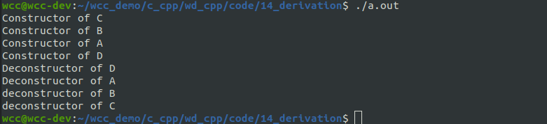

在C语言中重用代码的方式就是拷贝代码、修改代码。C++中代码重用的方式之一就是采用继承。继承是面向对象程序设计中重要的特征，可以说，不掌握继承就等于没有掌握面向对象的精华。通过继承，我们可以用原有类型来定义一个新类型，定义的新类型既包含了原有类型的成员，也能自己添加新的成员，而不用将原有类的内容重新书写一遍。原有类型称为“基类”或“父类”，在它的基础上建立的类称为“派生类”或“子类”。
## 继承和派生的定义
当一个派生类继承一个基类时，需要在派生类的类派生列表中明确的指出它是从哪个基类继承而来的。类派生列表的形式是在类名之后，大括号之前用冒号分隔，后面紧跟以逗号分隔的基类列表，其中每个基类前面可以有访问修饰限定符，其形式如下:
```cpp
class Derived
:public A
,protected B
,private C
{

};
```
<!--more-->

派生类的生成过程包含3个步骤:
- 吸收基类的成员
- 改造基类的成员
- 添加自己新的成员

下面是一个简单的例子：
```cpp
#include <iostream>
using std::endl;
using std::cout;

class Point2D{
public:
    Point2D(int x=0, int y=0)
    :_x(x)
    ,_y(y){
        cout << "Constructor of Point2D" << endl;
    }

    int get_x(){
        return _x;
    }

    int get_y(){
        return _y;
    }

private:
    int _x;
    int _y;
};


class Point3D
:public Point2D
{
public:
    Point3D(int x, int y, int z)
    :Point2D(x,y)
    ,_z(z){
        cout << "Constructor of Point3D" << endl;
    }

    void print_info(){
        cout <<"(x,y,z):" << "(" 
             <<get_x()<<"," <<get_y() <<","
             <<_z <<")" << endl;  
    }

private:
    int _z;

};

void test(){

    Point3D pt1(1,2,3);
    pt1.print_info();

}

int main(int argc, char * argv[]){
    test();

    return 0 ;
}
```

在上面的例子当中，Point3D通过public的方式继承Point2D，在Point3D的类当中将会把基类当中成员继承到本类当中，所以在派生类当中，也存在_x,_y等私有成员和get_x,get_y等方法。
在使用派生类生成对象的时候，需要执行派生类的构造函数：
在派生类的构造函数当中，我们需要通过调用父类的构造函数来初始化由父类继承而来的数据成员。

不管基类与派生类有没有显示定义构造函数，当创建派生类对象的时候，会调用派生类自己的构造函数；为了完成从基类这里吸收过来的数据成员的初始化，必须要调用基类的构造函数（默认情况下，会调用基类的无参构造函数，而如果基类没有显示定义默认的构造函数，或者基类的默认构造函数没有提供的话，此时会报错）；而如果每次在派生类的构造函数的初始化列表中，显示的写出基类的构造函数，此时肯定就没有问题。
必须将基类构造函数放在派生类构造函数的初试化列表中，以调用基类构造函数完成基类数据成员的初始化

## 派生类对基类数据成员和成员函数的访问权限
- 不管以什么方式进行派生，派生类当中都不能直接访问基类的私有的数据成员
- 不管以什么方式进行派生，派生类当中除了基类的私有成员不能访问了，其他都可以访问。
- 对于派生类的对象而言，只能访问公有继承的基类的public的成员，其他不能访问。
- 友元关系不能被继承
- 构造函数和析构函数不能被继承
- 基类当中的operator new与operator delete， operator=不能被继承。


## 多基继承
和前面所讲的单基派生类似，总参数表中包含了后面各个基类构造函数需要的参数。

多基继承和单基继承的派生类构造函数完成的任务和执行顺序并没有本质不同，唯一一点区别在于：首先要执行所有基类的构造函数，再执行派生类构造函数中初始化表达式的其他内容和构造函数体。各基类构造函数的执行顺序与其在初始化表中的顺序无关，而是由定义派生类时指定的基类顺序决定的。
析构函数的调用顺序和构造函数相反。

```cpp
#include <iostream>
using std::endl;
using std::cout;

class A{
public:
    A(){
        cout << "Constructor of A" << endl;
    }
    ~A(){
        cout << "Deconstructor of A" << endl;
    }

};


class B{
public:
    B(){
        cout << "Constructor of B" << endl;
    }

    ~B(){
        cout << "deconstructor of B" << endl;
    }

};

class C{
public:
    C(){
        cout << "Constructor of C" << endl;
    }

    ~C(){
        cout << "deconstructor of C" << endl;
    }

};

class D
:public C
,public B
,public A
{
public:
    D()
    :C()
    ,B()
    ,A(){
        cout << "Constructor of D" << endl; 
    }

    ~D(){
        cout << "Deconstructor of D" << endl;
    }
};


void test(){

    D pt1;

}

int main(int argc, char * argv[]){
    test();

    return 0 ;
}
```


虽然多基继承能够使得派生类具有多个基类的特性，但是使用多基继承的时候容易产生二义性。

```cpp
#include <iostream>
using std::endl;
using std::cout;

class A{
public:
    A(){
        cout << "Constructor of A" << endl;
    }
    void print_info(){
        cout << "This is the fuction of class A" << endl;
    }
    ~A(){
        cout << "Deconstructor of A" << endl;
    }

};


class B{
public:
    B(){
        cout << "Constructor of B" << endl;
    }

    void print_info(){
        cout << "This is the fuction of class B" << endl;
    }

    ~B(){
        cout << "deconstructor of B" << endl;
    }

};

class C{
public:
    C(){
        cout << "Constructor of C" << endl;
    }

    void print_info(){
        cout << "This is the fuction of class C" << endl;
    }

    ~C(){
        cout << "deconstructor of C" << endl;
    }

};

class D
:public C
,public B
,public A
{
public:
    D()
    :C()
    ,B()
    ,A(){
        cout << "Constructor of D" << endl; 
    }

    ~D(){
        cout << "Deconstructor of D" << endl;
    }
};


void test(){

    D pt1;

    pt1.A::print_info();
    pt1.B::print_info();
    pt1.C::print_info();

    pt1.print_info(); // error

}

int main(int argc, char * argv[]){
    test();

    return 0 ;
}
```
在上面的代码当中，ABC三个基类都有一个print方法。在生成的子类当中应该是能够访问这个print方法的，但是现在这个print方法如果不指定作用域将无法判断其的具体实现。