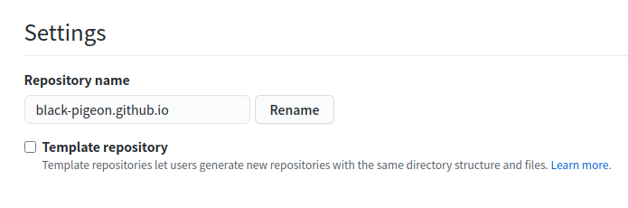
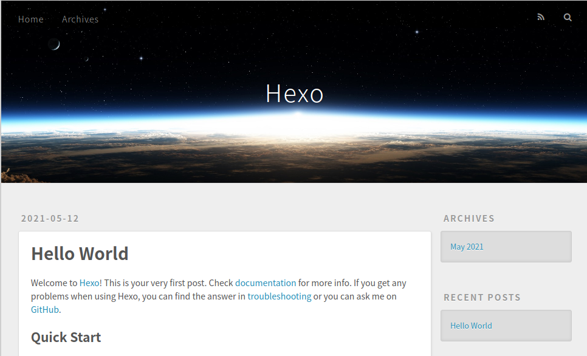
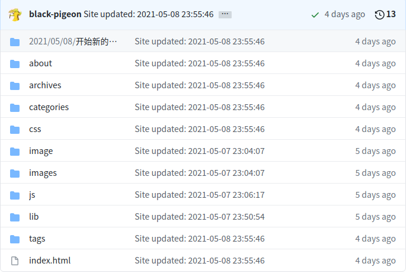

这是基于github pages和hexo搭建的一个博客，搭建这个博客也参考了许多人的搭建过程。搭建博客的过程还是挺有趣的。

在之后就可以在自己的博客上面写一些东西了。

这篇博客的目的就是来记录一下博客的搭建过程，博客的后续安排如下：


# 1. 创建一个github仓库
要想使用到 ithub pages，首先需要在github上创建一个仓库，创建仓库的时候，需要注意，仓库的名称需要遵循特定的格式。必须是`username.github.io`这种格式，其中username就是用户在github上注册的时候所设置的名字。

有了自己的仓库之后就可以进行之后的操作了。

# 2. 安装nodejs环境和hexo
## 2.1 安装nodejs
由于想要使用hexo来搭建博客，因此首先需要安装 [nodejs](https://nodejs.org/en/)。

安装nodejs可以采用以下步骤。

- 添加源
```bash
curl -sL https://deb.nodesource.com/setup_12.x | sudo -E bash -
```
- 安装nodejs
```bash
sudo apt install nodejs
```
- 确认是否版本为12.x以上
```bash
node  --version
npm  --version
```

## 2.2 安装hexo
[hexo](https://hexo.io/zh-cn/)能够很方便地来管理博客，即使像我这种不会前端地小白也能玩一玩。
使用以下命令安装hexo
```bash
npm install -g hexo-cli
```
安装完成之后可以使用`hexo -v`来查看一下版本。
到这里需要安装的工具都安装好了，接下来就可以来搭建自己的博客了。

## 2.3 使用hexo生成一个博客文件夹
首先使用hexo init来生成一个博客的源文件的文件夹。
```bash
hexo init myblog
```
在之后进入到这个文件夹当中，可以看一下当前的文件夹的结构
```bash
cd myblog 
npm install
```
- node_modules: 依赖包
- public：存放生成的页面
- scaffolds：生成文章的一些模板
- source：用来存放你的文章
- themes：主题
- **_config.yml: 博客的配置文件**
-  ...

在这个文件夹当中最重要的一个文件就是_config,yml文件，该文件会保存我们的配置信息，在之后会使用到。
这个时候我们就可以使用hexo的本地调试功能，来看看当前生成的博客长啥样了。
```bash
hexo g
hexo server
```
在浏览器中打开打开localhost:4000，就可以看到当前的博客了，大概长这样。

按下ctrl+c可以退出本地调试。

### 2.4 部署博客到github
使用hexo来管理博客十分简单。打开配置文件`_config.yml`,直接拉到最后，将deploy选项下面的地址设置为前面创建的的github仓库即可。

```yml
# Deployment
## Docs: https://hexo.io/docs/one-command-deployment
deploy:
  type: git
  repo: https://github.com/black-pigeon/black-pigeon.github.io.git
  branch: master
```
设置完成之后，就可以来部署博客了，这里需要使用到`deploy-git`,也就是部署的命令，需要先安装这个命令。
```bash
npm install hexo-deployer-git --save
```
然后就可以使用hexo很方便地来部署博客了。
```bash
hexo clean
hexo generate
hexo deploy
```
`hexo clean`用来清除之前生成的博客，`hexo generate`生成静态网页，也可以使用简写`hexo g`。`hexo deploy`是用来部署的命令，使用这个命令就能把hexo生成的网页文件部署到github上，也可以使用`hexo d`。


<br>

博客的搭建到这里就完成了一小步了，后续还有其他的操作，后续会使用到next主题，对next主题进行配置。还有如何发布文章等操作。
